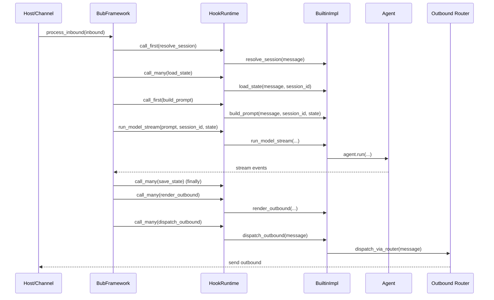

# 一次 Inbound Turn 的生命周期

> 定位：这一章解释 Bub 最核心的一条运行时主链。重点不是逐行讲 `process_inbound()`，而是说明：为什么一条 inbound 消息必须被拆成 `resolve_session -> load_state -> build_prompt -> run_model -> save_state -> render_outbound -> dispatch_outbound` 这些阶段，这种阶段化生命周期在解决什么问题，又把复杂度放到了哪里。  
> 前置依赖：建议先读完《为什么 Bub 的核心不是 Agent，而是一条 Turn Pipeline》和《HookRuntime：Bub 的真实执行语义》。  
> 适用场景：适合第一次进入 Bub 核心源码、准备接入新宿主、准备替换默认 prompt/model/outbound 行为，或者想判断“改 `framework.py` 会波及什么”的开发者。

本章的核心设计问题是：**Bub 为什么不把一条消息简单交给某个 `Agent.run(message)`，而是强制让它经过 `resolve_session -> load_state -> build_prompt -> run_model -> save_state -> render_outbound -> dispatch_outbound` 这条阶段化 turn lifecycle。**

这个问题决定了 Bub 的框架形状。只要 lifecycle 的边界划错，后面关于 hook、state、宿主复用、工具执行、错误处理和 outbound 路由的讨论都会失去共同坐标。

## 核心设计问题

在第 2 章里已经说过，Bub 的第一公民不是 `Agent`，而是一次 turn。到了这一章，问题要更进一步：**为什么这个 turn 不是一个黑盒，而是一条被显式拆开的阶段链。**

当前源码把这个主链固定在 [framework.py](/Users/liyingqi/PycharmProjects/Agent_Python/learn_agent/bub/src/bub/framework.py) 的 `BubFramework.process_inbound()` 里。它的真实顺序是：

```text
resolve_session
-> load_state
-> build_prompt
-> _run_model
-> save_state
-> render_outbound
-> dispatch_outbound
```

其中 `_run_model` 内部又会进入 `HookRuntime.run_model_stream()`，以 `run_model_stream` 为主、`run_model` 为兼容路径。

也就是说，项目文档和 `AGENTS.md` 里常写的 `run_model`，在当前代码里更准确的含义是“模型执行阶段”，而不是单一 hook 名。这个细节不影响主链判断，但它提醒读者：**Bub 的 lifecycle 是稳定的，具体 hook 名称则在演化。**

## 这个问题为什么存在

如果 Bub 只是一个单宿主、单 agent 的聊天壳，最直觉的写法确实是：

```python
reply = await agent.run(message)
channel.send(reply)
```

这种写法的问题，不在于“太简单”，而在于它没法回答 Bub 真正要面对的几个系统级问题：

1. 这条消息属于哪个 session。
2. session 相关的 state 应该在模型运行前如何装入、在运行后如何回收。
3. prompt 到底来自原始内容、上下文前缀、命令模式还是多模态附件。
4. 模型输出在送到宿主前，是否需要先转成 outbound envelope。
5. 如果没有任何插件显式渲染 outbound，系统是否还能给出最小可发送结果。
6. 如果模型执行阶段报错，错误应该通知谁，state 是否仍要清理。

这些问题都不是默认 Agent 内部逻辑能够独立解决的，因为它们横跨：

- 输入宿主
- session/state
- 模型执行
- 输出宿主
- 框架级错误处理

因此 Bub 的选择不是“把 Agent 做大一点”，而是把一次 turn 显式拆成多个阶段，并让每个阶段都能被 hook 覆盖。

与更直觉的 `agent.run(message)` 方案相比，这种做法的核心收益是：**生命周期边界先于默认智能体存在。**  
默认 Agent 可以替换，channel 可以替换，outbound 渲染可以替换，但整条 turn 的骨架仍然稳定。

## 真实实现的边界与结构

这一章最重要的实现边界有三条。

### 1. `BubFramework.process_inbound()` 是 lifecycle orchestrator

[framework.py](/Users/liyingqi/PycharmProjects/Agent_Python/learn_agent/bub/src/bub/framework.py) 不直接做 prompt 工程、模型推理和渠道发送细节，但它掌握生命周期顺序、兜底策略和异常边界。

它负责的不是“做功能”，而是“决定功能在什么时候发生”。

### 2. `BuiltinImpl` 提供默认阶段实现

[hook_impl.py](/Users/liyingqi/PycharmProjects/Agent_Python/learn_agent/bub/src/bub/builtin/hook_impl.py) 给这条主链填入默认行为：

- `resolve_session`：优先显式 `session_id`，否则退回 `channel:chat_id`
- `load_state`：进入 `lifespan`，塞入 `session_id`、`_runtime_agent`、`context`
- `build_prompt`：处理命令模式、上下文前缀、时间戳、多模态 media
- `run_model_stream`：委托给默认 `Agent.run()`
- `save_state`：退出 `lifespan`
- `render_outbound`：把模型输出包装回 `ChannelMessage`
- `dispatch_outbound`：交给 framework 绑定的 router

这再次说明，lifecycle 属于 core，默认行为属于 builtin。

### 3. 生命周期之外仍有两条辅助边界

- `_run_model()`：处理 stream 包装、文本累计、error event 观察
- `_collect_outbounds()`：处理 outbound batch flatten 和 fallback outbound

它们不新增阶段，但负责把“模型阶段”和“出站阶段”之间的灰色地带收住。这是 Bub 当前实现里很关键的工程边界。

## 关键数据流 / 控制流 / 状态流

先看一条 inbound turn 的总体序列图：



这张图里有两个地方需要特别注意：

- `save_state` 不在最终 dispatch 之后，而是在模型阶段的 `finally` 中执行。
- framework 不直接把模型文本发给宿主，而是先经过 `render_outbound` 和 `dispatch_outbound`。

下面分三条流来看。

### 1. 控制流：阶段顺序不是装饰性的，而是有约束关系

#### `resolve_session`

第一步先定 session。默认实现位于 `BuiltinImpl.resolve_session()`：

```python
session_id = field_of(message, "session_id")
if session_id is not None and str(session_id).strip():
    return str(session_id)
channel = str(field_of(message, "channel", "default"))
chat_id = str(field_of(message, "chat_id", "default"))
return f"{channel}:{chat_id}"
```

如果 hook 没有返回值，framework 还会再走一次 `_default_session_id()` fallback。  
这意味着 session 解析在 Bub 里不是插件的专属责任，而是 framework 有兜底。

#### `load_state`

framework 先创建一个初始 state：

```python
state = {"_runtime_workspace": str(self.workspace)}
```

然后把所有 `load_state` 结果按优先级合并进去。builtin 默认实现还会：

- 进入 `lifespan.__aenter__()`
- 注入 `session_id`
- 注入 `_runtime_agent`
- 如果消息有 `context_str`，注入 `context`

这里的关键不是 state 内容本身，而是**state 在模型运行前被完整装载出来，并贯穿后续所有阶段。**

#### `build_prompt`

默认 `build_prompt()` 不只是“拿 message.content”。

它有三个分支：

1. 内容以 `,` 开头，直接标记 `message.kind = "command"` 并返回命令文本。
2. 普通文本消息，给内容前面加 `context_str` 和 UTC 时间戳。
3. 如果有 `media`，把文本和 `image_url` 组合成多模态 content parts。

这说明 prompt 构造在 Bub 里不是 Agent 内部私事，而是 lifecycle 的一个显式阶段。

#### `_run_model`

framework 自己不关心具体模型 provider，但它关心模型阶段的三个公共行为：

- 通过 `HookRuntime.run_model_stream()` 取得 stream
- 如有 router，先 `wrap_stream(...)`
- 遍历 event，把 `text` 累积成最终 `model_output`，把 `error` 事件上报给 `on_error`

如果没有任何插件返回 model stream，framework 会：

1. 触发 `notify_error(stage="run_model", error=RuntimeError(...))`
2. 返回 prompt 本身，或原始 inbound content

这是一条很强的兜底路径：**即便模型阶段失效，turn 仍尽量产生可继续传播的文本结果。**

#### `save_state`

这是当前 lifecycle 里最容易被忽略的一步。`save_state` 写在模型阶段的 `finally` 里：

```python
try:
    model_output = await self._run_model(...)
finally:
    await self._hook_runtime.call_many("save_state", ...)
```

这意味着：

- 模型执行成功时会保存/清理
- 模型执行失败时也会保存/清理
- `render_outbound` 或 `dispatch_outbound` 失败时，不会回滚这一阶段

默认 builtin 的 `save_state()` 主要做的是 `lifespan.__aexit__(...)`。  
`tests/test_builtin_hook_impl.py` 里的 `test_load_state_and_save_state_manage_lifespan_and_context` 明确验证了这一点：异常信息会通过 `sys.exc_info()` 传给 `__aexit__`。

#### `render_outbound`

模型文本不会直接发送。默认 `render_outbound()` 会把它包装成 `ChannelMessage`，并保留：

- `session_id`
- `channel`
- `chat_id`
- `output_channel`
- `kind`

这一步的作用是把“模型产物”转成“宿主可分发消息”。  
如果你改这里，会直接影响所有 channel 看到的 envelope 形状。

#### `dispatch_outbound`

framework 对每个 outbound 调 `call_many("dispatch_outbound")`，默认 builtin 实现里再调用 `framework.dispatch_via_router(message)`。

这说明 dispatch 也是一个可覆盖阶段，不是 framework 里写死的最后一步发送。

### 2. 数据流：文本并不是唯一产物，envelope 才是阶段间通用载体

从输入到输出，数据形状至少经历四次变化：

| 阶段 | 输入形状 | 输出形状 | 当前默认意义 |
| --- | --- | --- | --- |
| inbound | `Envelope` / `ChannelMessage` | `session_id` | 识别会话归属 |
| state 装载 | `Envelope + session_id` | `State` | 形成运行时共享上下文 |
| prompt 构造 | `Envelope + State` | `str | list[dict]` | 形成模型可消费输入 |
| outbound 渲染 | `model_output + metadata` | `Envelope` | 形成宿主可分发消息 |

这正是 Bub 把 lifecycle 显式拆开的原因之一：每个阶段操作的是不同的数据边界。

如果把它们都塞进 `Agent.run()`，这些边界要么会隐身进一个大对象，要么会在多个模块间重复实现。

### 3. 状态流：共享 state 是主链的中轴，不是边角料

当前 turn 里，state 的流向是：

```text
framework 初始 state
-> 多个 load_state 叠加
-> build_prompt 读取
-> _run_model / Agent 读取
-> save_state 读取
-> render_outbound 读取
```

默认 builtin 至少依赖这些 key：

- `_runtime_workspace`
- `session_id`
- `_runtime_agent`
- `context`

这说明 Bub 的共享 state 不是只给 memory 层看的附属信息，而是 turn pipeline 的中轴。

这也意味着，改这里会影响什么非常直接：**只要改变 `load_state` 的合并规则、删改默认 key 或变更初始 state，后续 prompt、agent、tape、outbound 都可能一起受影响。**

## 与主流做法相比，这里的选择是什么

这章最值得比较的对象，是“agent-centric 消息处理”。

| 问题 | 直觉方案：`agent.run(message)` | Bub 当前选择：显式 turn lifecycle |
| --- | --- | --- |
| session 解析 | 往往内嵌在 agent 或 host | 先做独立阶段，framework 有兜底 |
| state 装载与清理 | 常与 memory/runtime 对象绑死 | 显式拆成 `load_state` / `save_state` |
| prompt 构造 | 常埋在 agent 内部 | 单独阶段，可被外部插件覆盖 |
| outbound | 常直接返回字符串给 host | 先 `render_outbound` 再 `dispatch_outbound` |
| 失败路径 | 由 agent 决定 | framework 统一管 turn 级异常和兜底 |

更直觉的另一种对比，是 middleware 链。middleware 也能形成阶段顺序，但 Bub 没完全走这条路，因为：

- 它需要某些阶段是 first-result，某些阶段是 many-result。
- 它需要 `save_state` 带 `finally` 语义，而不是普通前后包裹。
- 它需要 `render_outbound` 和 `dispatch_outbound` 作为两个独立边界，而不是一个 response middleware。

所以 Bub 这里不是“做了一条普通中间件链”，而是做了一条**带阶段语义和不同合并规则的 turn pipeline**。

## 适用边界与失败模式

### 这个设计在解决什么问题

它解决的是“同一条消息从进入系统到离开系统的跨边界一致性问题”：

- 宿主可以不同
- 默认 Agent 可以不同
- prompt 构造方式可以不同
- outbound 发送方式可以不同

但整个 turn 的顺序、兜底和错误边界必须稳定。

### 它依赖哪些前提

1. inbound 消息至少能提供足够的 envelope 元数据，例如 `channel`、`chat_id`、`content`。
2. framework 能接受共享 `State` 作为跨阶段载体，而不是强 schema 对象。
3. 模型执行结果最终可以归结为文本累计，再进入 outbound 渲染。
4. 宿主发送逻辑可以被抽象成 router，而不是必须嵌在模型阶段内部。
5. 插件作者接受某些阶段返回“无值”时由 framework 继续 fallback。

### 它把复杂度放到了哪里

这条 lifecycle 没有消灭复杂度，而是把复杂度集中在三个地方：

- `process_inbound()`：统一定义顺序、兜底和异常边界
- `_run_model()`：统一定义 stream 消费与错误事件处理
- `_collect_outbounds()`：统一定义 outbound flatten 与 fallback envelope

代价是：framework 仍然很薄，但它已经成为系统行为最敏感的文件之一。  
改这里不是局部优化，而是全局架构变更。

### 它不适合哪些情况

- 你要做的是显式多节点工作流，而不是单条 turn 的稳定处理链。
- 你需要每个阶段单独持久化、单独重试、单独回放。
- 你希望模型输出天然就是最终 API response，而不需要 outbound envelope 再加工。
- 你不能接受共享 state 和 fallback 策略对结果形状产生实质影响。

### 典型失败模式

1. 把 prompt 构造逻辑直接塞进 Agent，而忘了这会绕过 `build_prompt` 阶段。  
   结果是命令模式、`context_str`、多模态 media 都可能失效或重复实现。

2. 在 `render_outbound` 里丢失 `channel` / `chat_id` / `output_channel`。  
   结果是消息文本存在，但宿主无法正确路由。

3. 把 `save_state` 挪到 dispatch 之后。  
   结果是 outbound 失败时，`lifespan` 或持久化清理无法保证执行。

4. 误以为没有模型输出就是整个 turn 失败。  
   当前 framework 实际上会触发错误观察后返回 prompt/content 兜底，行为比“直接抛错退出”更保守。

## 取舍分析

这条 lifecycle 的真正价值，不在于“流程看起来清楚”，而在于它把 Bub 的系统边界按阶段固定住了。

这种设计得到了三个关键结果：

- 默认 Agent 被降为模型执行阶段的默认实现，而不是总控。
- state、prompt、outbound 都成为框架级问题，而不是某个对象内部私事。
- 宿主复用建立在同一条 turn pipeline 上，而不是建立在“不同宿主各自调用一个 agent”之上。

但它也带来了非常现实的成本：

- `framework.py` 成为高杠杆文件，理解和修改门槛都高。
- fallback 路径较多，阅读时必须同时看到正常路径和兜底路径。
- 共享 state、模型文本累计、outbound envelope 这些边界之间存在隐式契约，不是强类型保证。

## 得到了什么

- 一条跨宿主可复用、跨默认实现可覆盖的稳定消息主链。
- 一套明确的阶段边界：session、state、prompt、model、outbound 各自独立。
- 一种更适合 Bub 场景的失败策略：尽量保留清理动作，尽量生成最小可发送结果。

## 放弃了什么

- 放弃了 `agent.run(message)` 那种表面上更简单的中心模型。
- 放弃了把“模型输出就是最终响应”的直接路径。
- 放弃了每个阶段都完全显式声明式可组合的纯中间件风格。
- 放弃了强类型状态对象带来的局部可读性，转而依赖 runtime 约定。

## 版本演化说明

从当前源码看，这条生命周期已经相对稳定，但其中“模型执行阶段”的具体实现正在继续向流式接口收敛。

有两点需要读者注意：

1. 仓库里的目录说明、`AGENTS.md` 和一些文档仍会把阶段写成 `run_model`。这在当前代码里更适合理解为“模型执行阶段的总称”，因为真正的一等 hook 已经是 `run_model_stream`，`run_model` 只是兼容入口。
2. 本章讨论的主链以 [framework.py](/Users/liyingqi/PycharmProjects/Agent_Python/learn_agent/bub/src/bub/framework.py) 当前实现为准；而 outbound stream 的细节边界已经不再是早期文档里那种直接 `dispatch_event(...)` 的表述，而是通过 router 的 `wrap_stream(...)` 先处理，再在 turn 结束后进入 `render_outbound` / `dispatch_outbound`。

换句话说，**Bub 的 turn lifecycle 作为骨架已经定型，但“模型阶段如何表现为流”和“宿主如何观察流”这两块仍然在沿着当前抽象继续收敛。**
