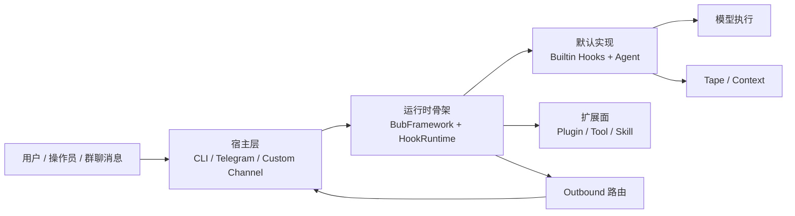

# 第 1 章 Bub 在解决什么问题

> 定位：这一章不讲实现细节，先把整本书的“问题坐标”定下来。它要回答的是：Bub 这套框架到底在解决哪一类系统问题，哪些问题并不是它的目标。  
> 前置依赖：无。  
> 适用场景：适合第一次接触 Bub、准备判断它值不值得继续读、或者准备评估是否要基于它做二次开发的读者。

本章的核心设计问题是：**Bub 到底是什么样的框架；它为什么不是另一个聊天壳、另一个 Agent SDK、另一个 bot 框架，或者另一个工作流编排器。**

先别急着看抽象定义。可以先想两个很具体的场景：

- 你在终端里运行 `uv run bub run "summarize this repo"`，希望它接住输入、组织上下文、跑模型、再把结果发回终端。
- 你在一个 Telegram 群里 `@` 到它，群里同时还有别的人和别的 agent 在说话，你希望它能识别会话、别打断别人、把回复发回正确的地方。

这两个场景表面上很不一样，但 Bub 想解决的其实是同一个问题：**一条消息进入系统以后，怎样在真实环境里被稳定处理完。**

如果先抓住这件事，后面很多设计就好理解了。否则 Bub 很容易让人读成“插件很多、类型很松、什么都做成 hook”，读起来就会比较吃力。

## 核心设计问题

第一次看 Bub，很容易把它理解成下面四种东西之一：

- 一个带工具调用的命令行 Agent
- 一个 Telegram 机器人框架
- 一个 LLM 插件系统
- 一个把 prompt、tool、memory 组装起来的轻量 Agent SDK

这些理解都不算全错，但都只抓到了一部分。

结合 [README.md](/Users/liyingqi/PycharmProjects/Agent_Python/learn_agent/bub/README.md)、[docs/index.md](/Users/liyingqi/PycharmProjects/Agent_Python/learn_agent/bub/docs/index.md)、[framework.py](/Users/liyingqi/PycharmProjects/Agent_Python/learn_agent/bub/src/bub/framework.py) 和 [manager.py](/Users/liyingqi/PycharmProjects/Agent_Python/learn_agent/bub/src/bub/channels/manager.py) 一起看，更准确的说法是：

**Bub 是一个面向真实消息环境的、hook-first 的 agent runtime。**

这里“runtime”这个词很关键。它强调的不是“帮你定义一个 Agent 类”，而是“帮你把一次消息处理完整跑通”。换句话说，Bub 更关心下面这条链能不能稳定成立：

```text
消息进来
-> 找到正确 session
-> 装入运行状态
-> 组织 prompt / context
-> 执行模型或工具
-> 生成可发送结果
-> 发回正确宿主
```

所以本章先给一个直白判断：

- Bub 不是“让 Agent 看起来更聪明”的框架。
- Bub 更像“让 Agent 能在真实环境里活下去”的运行时外壳。

## 这个问题为什么存在

这一节不先讲代码，先讲 Bub 为什么会长成现在这个样子。

### 1. Bub 的出发点不是单人聊天，而是“共处”

[README.md](/Users/liyingqi/PycharmProjects/Agent_Python/learn_agent/bub/README.md) 开头有一句很重要的话：Bub started in group chats。

这句话的分量很重，因为它等于提前告诉你：Bub 的原始问题，不是“给一个用户做一个聊天助手”，而是“让 agent 和真人、和别的 agent 一起待在混乱环境里，还能继续工作”。

这种环境会天然带来几类麻烦：

- 输入来源不止一个，今天是 CLI，明天可能是 Telegram，后面还可能接别的 channel。
- 对话上下文不总是完整的，很多消息只是半句、转发、追问或者插话。
- 会话不是单线程的，多个任务可能同时进行。
- 回复不一定只是返回一段字符串，还可能需要流式展示、带路由信息、带错误信息。
- 默认行为不能写死，因为接入新宿主或新插件后，很多阶段都可能需要覆盖。

换句话说，Bub 的难点不是“如何让模型说一句好话”，而是“如何让系统把一条消息接住、处理完、送回去，而且这个过程在不同宿主里尽量一致”。

### 2. 更直觉的做法，为什么不够

把问题说清楚以后，就更容易理解它为什么没走几条更直觉的路。

#### 路线一：以 `Agent` 为中心

最直觉的写法是：

```python
reply = await agent.run(message)
```

这当然能工作，但很快会遇到一个问题：  
`message` 从哪来、属于哪个 session、状态怎么装、错误怎么发、输出怎么路由，这些问题最后都会慢慢堆进 `Agent` 或它周围的一层壳里。

对只做单宿主 demo 的系统，这样没什么问题。  
但对 Bub 这种想同时跑 CLI、群聊、多插件覆盖的系统，这会让 `Agent` 变成一个过重的中心对象。

#### 路线二：先做一个 bot 框架

另一种常见路线是：先把 Telegram bot 或 CLI 助手做顺，再慢慢往里加模型、记忆和工具。

这条路的问题是，宿主太容易变成内核。  
一旦框架从一开始就围绕 Telegram 或终端交互来设计，后面再想把“同一套运行主线”复用到别的宿主，成本会很高。

#### 路线三：直接做 workflow / DAG 编排器

还有一种更“工程化”的做法，是直接把问题建模成节点和边，做成一个显式流程系统。

这种做法更擅长处理审批流、确定性多步骤流程、节点重试和可视化编排。  
但 Bub 当前更关心的是“消息触发的一次 turn 能不能被稳定完成”，而不是“如何把业务步骤都画成一张图”。

所以 Bub 最终没有先定义 Agent，也没有先定义宿主，更没有先定义 DAG。  
它先定义的是：**一条消息进入系统以后，必须经过哪些稳定阶段。**

这就是后面整本书都会围绕 turn pipeline 展开的原因。

## 真实实现的边界与结构

上面讲的是问题背景。接下来要落到源码，看 Bub 这个判断到底落在什么地方。

### 1. 从文档上看，Bub 对自己的定义很一致

[README.md](/Users/liyingqi/PycharmProjects/Agent_Python/learn_agent/bub/README.md)、[docs/index.md](/Users/liyingqi/PycharmProjects/Agent_Python/learn_agent/bub/docs/index.md) 和 [docs/features.md](/Users/liyingqi/PycharmProjects/Agent_Python/learn_agent/bub/docs/features.md) 基本反复强调同几件事：

- hook-first
- small core
- builtins are default plugins
- one pipeline across CLI / Telegram / custom channel
- context comes from tape, not session accumulation

这不是宣传词和实现脱节的情况。当前源码确实围绕这几条组织。

### 2. 从 core 看，Bub 关心的是“运行骨架”

[framework.py](/Users/liyingqi/PycharmProjects/Agent_Python/learn_agent/bub/src/bub/framework.py) 里的 `BubFramework` 非常值得先看，因为它能最快告诉你 Bub 的核心到底放在哪里。

它主要做的事情是：

- 创建 plugin manager
- 注册 hook 契约
- 加载 builtin 和外部插件
- 执行 `process_inbound()`
- 绑定 outbound router

更重要的是它没有做什么：

- 没有把 Telegram 写死在 core
- 没有把默认 Agent 当成唯一中心
- 没有把上下文直接累积在一个长期 session 对象里
- 没有把“发消息”写成模型执行器内部动作

可以把它理解成：**BubFramework 负责搭舞台，不负责表演全部节目。**

### 3. 从 channel 管理看，Bub 天然把自己放在多宿主场景里

如果你想知道 Bub 眼里的“真实环境”到底是什么意思，看 [manager.py](/Users/liyingqi/PycharmProjects/Agent_Python/learn_agent/bub/src/bub/channels/manager.py) 就很直接。

`ChannelManager` 不是某个具体渠道的实现，它更像一个宿主协调器。它负责：

- 收集当前可用的 channel
- 接收不同 channel 的消息
- 按 `session_id` 管理 handler 和 task
- 把 inbound 统一送进 `framework.process_inbound()`
- 再把 outbound 路由回对应 channel

这里有个很有帮助的小例子：

- 如果消息来自 CLI，它最终还是会走 `process_inbound()`。
- 如果消息来自 Telegram，它也还是会走 `process_inbound()`。

也就是说，Bub 不是“给 CLI 一套逻辑、给 Telegram 再写一套逻辑”，而是“宿主不同，但 runtime 主线尽量相同”。

### 4. 从类型定义看，Bub 不是强 schema 系统

[types.py](/Users/liyingqi/PycharmProjects/Agent_Python/learn_agent/bub/src/bub/types.py) 里有两个很醒目的定义：

```python
type Envelope = Any
type State = dict[str, Any]
```

这两个类型第一眼看上去甚至有点“松”。但它们其实是在告诉你 Bub 的一个明确边界：

- 它不是强类型 RPC 框架
- 它不是统一 schema 驱动的企业流程引擎
- 它接受不同宿主、不同插件以较低摩擦接入

代价当然也很明显：很多边界要靠约定维护，而不是靠类型系统兜底。  
这件事后面还会专门展开，但在第 1 章里先要建立一个直觉：**Bub 优先保的是运行时可接入性，不是静态约束的一致性。**

下面这张图可以把 Bub 当前在解决的问题边界画出来：



这张图最想表达的是一句很朴素的话：  
**用户不是直接在跟一个裸 `Agent` 打交道，而是在跟一整套运行时打交道。**

## 关键数据流 / 控制流 / 状态流

这一章不展开实现细节，但还是要先给读者一个“系统是怎么动起来的”直觉。否则只谈定位，很容易显得空。

### 1. 控制流：Bub 的主线是“一次消息处理”

从 [manager.py](/Users/liyingqi/PycharmProjects/Agent_Python/learn_agent/bub/src/bub/channels/manager.py) 和 [framework.py](/Users/liyingqi/PycharmProjects/Agent_Python/learn_agent/bub/src/bub/framework.py) 连接起来看，当前主线可以粗略理解成：

```text
宿主消息
-> ChannelManager 收到消息
-> BubFramework.process_inbound()
-> HookRuntime 驱动一轮 turn
-> 产出 outbound
-> 回到具体宿主
```

这条链的重点是：**Bub 的主线不是“进入某个 Agent 对象”，而是“进入一轮 runtime turn”。**

### 2. 数据流：消息和状态都不是强封装对象

当前 Bub 里，输入输出更多是 envelope 风格的数据边界：

- inbound 通常是 `ChannelMessage` 或其他 `Envelope`
- runtime 中间态是 `State`
- outbound 仍然是 envelope，再交给 channel

这意味着 Bub 的数据流更像“在一条运行链路上逐步加工消息”，而不是“不断调用一个大对象的方法”。

### 3. 状态流：session 和 context 属于 runtime，不属于某个 Agent 私有内存

这一点也很关键。

在 Bub 里：

- session 是 runtime 阶段解析出来的
- state 是 hook 阶段逐步装配出来的
- context 不是某个 agent 对象天然携带的内存，而是运行时在需要时组装的工作集

所以，如果你后面看到 Bub 在讲 session、tape、prompt、channel，不要把它们当外围功能。  
它们其实都是“Bub 在解决什么问题”这件事的组成部分。

## 与主流做法相比，这里的选择是什么

为了帮助建立判断，这里不比较细节实现，只比较“它把自己定义成了什么”。

| 方案 | 它最擅长的问题 | Bub 和它的关系 |
| --- | --- | --- |
| 单宿主 bot 框架 | 固定交互面的消息处理 | Bub 不是单宿主框架，channel 只是承载面 |
| Agent SDK | 构造和运行单个 agent | Bub 借用了 Agent，但 core 不是 Agent SDK |
| Workflow / DAG 编排器 | 显式流程、节点依赖、审批/重试 | Bub 不是图编排系统，主线是一轮消息 turn |
| API-first 推理网关 | 统一模型 API、路由、计费、协议代理 | Bub 不以 provider 代理为中心，而以 runtime 协作为中心 |

如果用更通俗的话说：

- 你想要“一个好用的 Agent 类”，Bub 不是最直接的答案。
- 你想要“一个能在真实环境里接住消息并跑完整流程的 runtime”，Bub 才开始变得有意义。

## 适用边界与失败模式

到这里，基本可以做选择判断了。

### 它适合什么

Bub 更适合下面这类需求：

- 你希望同一套运行内核既能跑 CLI，也能跑聊天渠道，未来还能继续加宿主。
- 你希望默认能力先能工作，但未来可以按阶段替换。
- 你关心的不只是模型推理，而是 session、context、outbound、宿主复用这一整套运行问题。
- 你面对的不是单次 demo，而是“agent 要和真人一起长期共处”的环境。

### 它不适合什么

Bub 不适合下面这类需求：

- 你只想要一个极简的模型调用 SDK。
- 你要做强类型、强审批、强治理的企业流程系统。
- 你要做以 DAG 为中心的工作流平台。
- 你要做 API-first 的多模型网关，重点是吞吐、路由、协议兼容和计费。
- 你要求所有共享状态都有严格、统一、静态可验证的 schema。

### 典型失败模式

这一节可以帮助读者少走一点弯路。

#### 失败模式一：把 Bub 当成“一个带插件的 Agent 类库”

这样做最容易导致所有定制都往 `Agent` 或工具层里堆。  
结果是 session、channel、outbound、state 这些真正的一等边界被忽略掉。

#### 失败模式二：把 Bub 当成“另一个 bot 框架”

这样会过度盯着 Telegram 或 CLI 的局部体验，而看不到它真正有价值的地方其实是“多宿主共用一条 runtime 主线”。

#### 失败模式三：把 Bub 当成“通用 workflow 平台”

这样就会期待它天然提供节点审批、显式 DAG、流程可视化和强控制流表达。  
而这些并不是 Bub 当前的中心能力。

#### 失败模式四：只改默认 Agent，却以为自己改了系统定义

如果你准备二次开发，这里有个很实用的判断标准：

- 改 `Agent`，主要是在改默认执行风格。
- 改 `framework`、`channels`、`hookspecs`，才是在改 Bub 对问题本身的定义。

这也是为什么这本书前几章会先讲 runtime 和生命周期，而不是先讲默认 Agent。

## 取舍分析

把 Bub 定义成“面向真实消息环境的 agent runtime”，而不是更窄的一类框架，会带来很清楚的收益，也会带来很清楚的阅读成本。

收益在于：

- CLI、Telegram、插件、工具、技能、上下文系统可以被组织进同一套运行骨架。
- 默认 Agent 不会吞掉整个系统。
- 多宿主复用从一开始就是一等需求，而不是后补功能。

成本在于：

- 第一次读代码时，不容易马上找到一个单一主角。
- 你必须接受核心是 runtime 主线，而不是某个类。
- 你也必须接受它不是那种强类型、强治理、强流程可视化的系统。

换句话说，Bub 不是试图做“最直觉”的框架，而是在保住自己真正的问题定义。

## 得到了什么

- 一个清晰的问题定义：Bub 解决的是 agent 在真实消息环境中的运行问题。
- 一个清晰的系统边界：宿主、runtime、默认实现、扩展面、上下文系统被分开了。
- 一个清晰的阅读入口：后面可以围绕 turn pipeline、HookRuntime、tape、channel、tool、skill 继续展开。
- 一个清晰的采用判断：如果你的问题不是“共处型 runtime”，就没必要优先选 Bub。

## 放弃了什么

- 放弃了“继承一个 Agent 类就能理解全局”的低门槛直觉。
- 放弃了围绕单一宿主体验做局部最优。
- 放弃了 DAG / workflow 平台那种显式流程表达力。
- 放弃了强类型 runtime contract 带来的静态安全感。

这些不是附带损失，而是为了保住 Bub 当前问题边界而主动接受的代价。

## 版本演化说明

从当前仓库状态看，Bub 对“自己在解决什么问题”这件事其实是比较稳定的。变化更多发生在运行细节的收敛上，而不是问题定义本身。

最明显的一处演化痕迹，是模型阶段的命名：

- [README.md](/Users/liyingqi/PycharmProjects/Agent_Python/learn_agent/bub/README.md) 的 `How It Works` 里仍写 `run_model`
- [docs/index.md](/Users/liyingqi/PycharmProjects/Agent_Python/learn_agent/bub/docs/index.md)、[docs/features.md](/Users/liyingqi/PycharmProjects/Agent_Python/learn_agent/bub/docs/features.md) 和当前源码已经明确把 `run_model_stream` 作为主接口

这说明 Bub 的运行时正在从“返回一段文本”进一步收敛到“流式优先”的模型阶段。

还有一点也值得读者建立习惯：当文档和源码有细小差异时，优先相信当前实现。  
就第 1 章这个问题而言，真正稳定的中心不是某个具体 hook 名字，而是下面这组判断：

- hook-first runtime
- one turn pipeline
- multi-host reuse
- builtins as replaceable defaults

也就是说，Bub 在演化的，不是“它在解决什么问题”，而是“它怎样把这个问题的运行细节继续收紧和说清楚”。  
这也是为什么后面章节会继续往 runtime、lifecycle、hook、tape、channel 这些方向展开，而不是从 API 用法开始。
