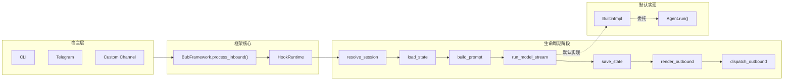

# 第 2 章 为什么 Bub 的核心不是 Agent，而是一条 Turn Pipeline

> 定位：这一章解释 Bub 为什么把“一次 inbound 到 outbound 的完整处理链路”设为运行时核心，而不是 `Agent` 对象。它要说清楚这种选择对扩展方式、宿主复用和复杂度分布意味着什么。  
> 前置依赖：读过第 1 章即可。最好对 `BubFramework`、builtin plugin、Channel、Tool、Skill 有基本印象，知道 HookRuntime 大致在做什么。  
> 适用场景：适合第一次进入 Bub 源码、准备替换默认 Agent、准备新增宿主渠道，或者在纠结“该改框架还是改 Agent”的读者。

本章的核心设计问题是：**为什么 Bub 不把 `Agent` 当成运行时第一公民，而是把 `resolve_session -> load_state -> build_prompt -> run_model -> save_state -> render_outbound -> dispatch_outbound` 这条 turn pipeline 当成系统主线。**

先别急着看抽象定义，可以先想两个很具体的情景：

- 你是一个插件作者，想把默认的模型执行器整个替换掉，改接自己家的 LLM 调用栈。你最想知道的是：“我需要覆盖哪一个点，才能让 CLI 和 Telegram 继续按原来的方式收发消息？”
- 你是一个宿主接入者，想把 Bub 嵌到一个新 channel 里。你最想知道的是：“我需要把消息喂给谁，才能让它像在 CLI 里一样，把一整轮对话处理完？”

这两个问题表面上在问不同的东西，但它们有同一个预设：**系统里应该有一个足够稳定的“主入口”，让人只改它周围就能完成扩展。**

在很多框架里，这个主入口就是 `Agent` 本身。而在 Bub 里，这个主入口其实是一条 turn pipeline —— 一次消息从进入到离开系统要穿过的那条链路。如果先抓住这点，后面很多“看起来很散”的结构就会突然变得有秩序。

## 核心设计问题

如果只看今天主流的 agent 工程写法，最直觉的建模一般是下面两种：

- 以 `Agent` 类为中心：消息来了就交给 `agent.run()`，框架做一点外围 I/O 包装。
- 以工作流图为中心：消息进入图，按节点编排 prompt、tool、memory、output。

Bub 走的是第三条路，把**一次 turn 的生命周期**当成最稳定的抽象。

这个选择想回答的是一个很具体的问题：**当系统要同时面对不同宿主、不同出站方式、不同会话语义、不同插件覆盖关系时，什么才是全局稳定的共同部分？**

Bub 给出的答案不是“一个智能体对象”，而是“一次消息处理链路”。  
换句话说，它赌的是：在所有这些差异里，真正每次都一样的是“消息要穿过的那条链”，不是“谁来思考”。

[README.md](/Users/liyingqi/PycharmProjects/Agent_Python/learn_agent/bub/README.md) 里其实已经把这件事写得很直白：*Every inbound message goes through one turn pipeline*。源码也完全印证这一点 —— 真正的 orchestrator 在 [framework.py](/Users/liyingqi/PycharmProjects/Agent_Python/learn_agent/bub/src/bub/framework.py)，而不是 [builtin/agent.py](/Users/liyingqi/PycharmProjects/Agent_Python/learn_agent/bub/src/bub/builtin/agent.py)。

这不是命名偏好，而是架构中心的选择。它直接决定了三件事：

1. 运行时先处理“消息如何进入、如何离开”，再处理“模型如何思考”。
2. `Agent` 在当前实现里是默认模型执行器，不是 Bub 的总控对象。
3. 扩展 Bub 时，最稳定的入口不是“继承 Agent”，而是“接管某个生命周期阶段”。

## 这个问题为什么存在

要理解 Bub 为什么要做这个选择，先要回到它所处的环境。

Bub 的问题背景不是单机单用户的“我对一个 agent 连续聊天”，而更接近“人和 agent 在真实消息环境里共处”。这种环境会带来四类要求：

- 消息可能来自 CLI，也可能来自 Telegram，未来还可能来自别的 channel。
- 会话身份不一定等于一个内存中的 agent 实例，它更可能是 `channel + chat_id`。
- 回复不只是“返回一段文本”，还包括流式渲染、路由到不同 output channel、错误回传。
- 模型执行只是中间阶段，前后还有 session 解析、state 装载、prompt 构造、state 保存、outbound 渲染和 dispatch。

一旦场景长这样，`Agent` 就不再天然适合做系统核心。可以想一下，如果真把 `Agent` 放在中心，下面这些问题会挤到哪里去：

- session 怎么定
- channel 元数据怎么进 prompt
- 错误要不要立刻回 channel
- 没有模型输出时怎么办
- CLI 和 Telegram 的差异放哪里
- 替换默认模型循环时，是否还要保留原本的 outbound 行为

答案很残酷：它们最终会全部堆到 `agent.run()` 的周围。`Agent` 会变成一个过度膨胀的宿主协调器，什么都得知道，什么都得管。

Bub 没走这条路。它选择把这些问题提升成一等 runtime 问题，然后把“思考”压缩成其中一个阶段。

## 真实实现的边界与结构

上面讲的是设计立场。接下来要落到源码，看这条立场在代码里具体落在哪几处。可以分三步看：core 的类型、framework 的控制流、builtin 的 Agent 绑定方式。

### 1. 从类型定义看，core 根本不知道什么是 Agent

先看 [types.py](/Users/liyingqi/PycharmProjects/Agent_Python/learn_agent/bub/src/bub/types.py)：

```python
type Envelope = Any
type State = dict[str, Any]

@dataclass(frozen=True)
class TurnResult:
    session_id: str
    prompt: str
    model_output: str
    outbounds: list[Envelope] = field(default_factory=list)
```

这里最值得注意的不是弱类型本身，而是它暴露出的事实：**framework 关心的是 envelope、state、turn result，完全没有 agent 这个概念。**

再看 [hookspecs.py](/Users/liyingqi/PycharmProjects/Agent_Python/learn_agent/bub/src/bub/hookspecs.py)。Bub 定义的一等生命周期阶段是：

- `resolve_session`
- `load_state`
- `build_prompt`
- `run_model_stream` / `run_model`
- `save_state`
- `render_outbound`
- `dispatch_outbound`
- 以及 `system_prompt`、`provide_channels`、`provide_tape_store`、`build_tape_context`

这里没有“agent 生命周期”这种 hookspec，也没有 `before_agent_run` / `after_agent_run` 之类的中心扩展点。换句话说，**Bub 的公共契约天然是 turn stage，不是 agent object。**

### 2. 从控制器实现看，framework 编排的是阶段，不是 Agent

[framework.py](/Users/liyingqi/PycharmProjects/Agent_Python/learn_agent/bub/src/bub/framework.py) 的 `process_inbound()` 是全系统的主链路。忽略异常处理和默认兜底后，它的核心控制流大致是这样：

```python
session_id = await self._hook_runtime.call_first("resolve_session", message=inbound)
state = {"_runtime_workspace": str(self.workspace)}
for hook_state in reversed(await self._hook_runtime.call_many("load_state", ...)):
    state.update(hook_state)

prompt = await self._hook_runtime.call_first("build_prompt", ...)
model_output = await self._run_model(inbound, prompt, session_id, state)

await self._hook_runtime.call_many("save_state", ...)
outbounds = await self._collect_outbounds(...)
for outbound in outbounds:
    await self._hook_runtime.call_many("dispatch_outbound", message=outbound)
```

重点有三个：

- framework 从头到尾都在调用 hook stage。
- `Agent` 没有在这个函数里直接出现。
- `_run_model()` 也不是 `self.agent.run()`，而是继续通过 `HookRuntime.run_model_stream()` 去找第一个可用实现。

这意味着 `BubFramework` 的中心职责是**编排阶段**，而不是**持有并驱动一个智能体对象**。可以把它理解成一个不关心“谁在思考”的调度者：它只关心该到第几步了。

### 3. 默认 Agent 只是 builtin plugin 提供的一个 `run_model_stream`

再看 [builtin/hook_impl.py](/Users/liyingqi/PycharmProjects/Agent_Python/learn_agent/bub/src/bub/builtin/hook_impl.py) 最关键的一段：

```python
class BuiltinImpl:
    def __init__(self, framework: BubFramework) -> None:
        self.framework = framework
        self.agent = Agent(framework)

    @hookimpl
    async def run_model_stream(self, prompt, session_id, state):
        return await self.agent.run(session_id=session_id, prompt=prompt, state=state)
```

这段代码小，但信息密度很高：

- `Agent` 的创建发生在 builtin plugin 内，不是 `BubFramework` 内。
- framework 默认能跑起来，是因为 builtin plugin 实现了 `run_model_stream`。
- 如果外部插件注册了更高优先级的 `run_model_stream`，默认 Agent 可以被整体替换。

这就是本章最核心的源码证据：**Agent 是默认 hook 实现，不是 runtime core。**  
换个角度说，如果你拆掉 builtin，Bub 仍然能在约定好的 hook stage 上跑；但是如果你拆掉 `process_inbound()`，整套东西就散架了。真正不可替换的是 turn pipeline，不是 Agent。

## 关键数据流、控制流与状态流

下面这张图把 Bub 当前的真实边界画出来，便于把前面三段源码证据连起来看：



### 控制流

假设一条 Telegram 消息进入系统，控制流大致是这样走的：

1. Telegram channel 把消息封装成 `ChannelMessage` 或其他 `Envelope`，交给 `ChannelManager`。
2. `ChannelManager` 调用 `BubFramework.process_inbound()`，一轮 turn 正式开始。
3. `HookRuntime.call_first("resolve_session")` 决定这条消息属于哪个 session。
4. `HookRuntime.call_many("load_state")` 让多个插件各贡献一段 state 片段，framework 再合并。
5. `build_prompt` 生成本轮 prompt。
6. `_run_model()` 通过 `run_model_stream` 找到当前有效的模型执行器。
7. `save_state` 在 `finally` 中总会执行，哪怕模型阶段抛错。
8. `render_outbound` 把模型输出变成 outbound envelope。
9. `dispatch_outbound` 负责真正发出去。

整条链路里，Agent 只占第 6 步，而且还是通过 hook 接入。换句话说，Agent 在 Bub 眼里跟 `build_prompt` 这类阶段是同一个量级的角色，只是它恰好比较重。

### 状态流

Bub 的 `State` 是一个共享字典。当前 builtin 会在 `load_state()` 里塞入：

- `session_id`
- `_runtime_agent`
- `context`

framework 自己则先塞入：

- `_runtime_workspace`

这里想表达的是一个很重要的事情：**全局运行时信息不挂在某个 agent 对象上集中暴露，而是以共享 state 的形式贯穿各 hook 阶段。** `build_prompt`、`system_prompt`、`run_model_stream`、工具执行都能看到同一份 state。

这样做的好处很明显 —— 任何阶段都能按需读写共享上下文，不用再走“从 agent 拿”这条路。但代价也同样明显：大部分契约落在隐式 key 上，没人强制谁能读谁能写。

如果你改 [framework.py](/Users/liyingqi/PycharmProjects/Agent_Python/learn_agent/bub/src/bub/framework.py) 里 `state` 的初始化或合并顺序，会影响所有 hook、tools 和默认 Agent。这是一个真正的系统级改动，不是局部调整。

### 出站流

Bub 没有把“模型产物如何显示”放进 Agent。它把这件事切成了三段：

- `_run_model()` 只负责消费 stream、拼接文本、观察 error event。
- stream 是否被宿主包装，由 `OutboundChannelRouter.wrap_stream()` 决定。
- 最终发消息，由 `dispatch_outbound` + `dispatch_via_router()` 决定。

这就是为什么 CLI 可以流式渲染、Telegram 可以走聊天消息发送，但 framework 始终不需要知道自己跑在哪个宿主里。“怎么显示”被留给了宿主层，“是否产出”被留给了 Agent，“什么时候产出”被留给了 pipeline。

## 与主流做法相比，这里的选择是什么

这里比较的是模式，不是某个具体框架的 API 细节。

| 模式 | 第一公民 | 适合解决的问题 | 主要代价 |
|---|---|---|---|
| Agent-centric | `Agent` 对象 | 单智能体行为封装、局部推理闭环 | session、channel、outbound 很容易泄漏进 agent |
| Graph-centric | 节点/边 | 显式编排、多阶段确定性流程 | 运行时覆盖和插件替换成本更高 |
| Bub 的选择 | turn pipeline | 多宿主复用、生命周期覆盖、插件式替换 | 隐式 state 和 hook 语义更重 |

那么 Bub 为什么没选更直觉的 Agent-centric 写法？

原因是：在 Bub 的问题域里，“稳定共同部分”不是“一个会思考的对象”，而是“每条消息都要经过的系统边界”。如果把 `Agent` 放在中心，下面这些东西最终都会变成它的副作用附着物：

- channel 元数据
- session 计算
- outbound route
- state persistence
- error observer
- 宿主特定流包装

Bub 反过来做：把这些外层问题提升成 runtime 主线，再把“智能”压缩进 `run_model_stream` 这个阶段。这样默认 Agent 可以很复杂，但 framework 不会被 Agent 绑死。

## 这个设计依赖哪些前提

这条路不是免费成立的，它至少依赖五个前提：

1. **一次 turn 是有意义的稳定边界。**  
   如果你的系统天然是长事务、审批流、事件溯源工作流，单 turn 可能太薄。
2. **模型执行可以被压成一个生命周期阶段。**  
   Bub 默认 Agent 内部其实是多步 loop，但对 framework 来说它只是一个 `run_model_stream` 阶段。
3. **宿主层可以提供足够的消息元数据。**  
   比如 `channel`、`chat_id`、`session_id`、`context_str`。没有这些，上游就没法统一进入 pipeline。
4. **插件愿意接受弱约束共享状态。**  
   `State = dict[str, Any]` 意味着大量扩展靠约定而不是编译器保证。
5. **默认能力可以接受“通过 builtin plugin 提供”的组织方式。**  
   否则你会更倾向把 Agent、Memory、Tool runtime 都塞回 core。

## 它把复杂度放到了哪里

Bub 没有消灭复杂度，它只是重新分配了复杂度。值得一个一个看看这些复杂度最后落到哪里。

### 1. 落到 HookRuntime

优先级、`call_first` / `call_many`、sync/async 兼容、错误吞吐都集中在 [hook_runtime.py](/Users/liyingqi/PycharmProjects/Agent_Python/learn_agent/bub/src/bub/hook_runtime.py)。

这意味着：**想真正读懂 Bub，不能只看 hookspec 的名字，必须看 HookRuntime 的执行语义。**  
否则很容易出现“写了 hook 但没生效”“以为会兜底但没兜底”这种细碎坑，而且调起来不直观。

### 2. 落到共享状态契约

`_runtime_workspace`、`_runtime_agent`、`session_id`、`context` 这些 key 没有 schema 保护。它们横跨 framework、builtin hooks、tools、agent。

这让 Bub 很容易扩展，但也让大型扩展更容易发生隐式耦合。一个典型表现是：你读某段代码时看到 `state["context"]`，却很难一眼说清这个 key 是哪里先写进去的。

### 3. 落到 builtin adapter

[builtin/hook_impl.py](/Users/liyingqi/PycharmProjects/Agent_Python/learn_agent/bub/src/bub/builtin/hook_impl.py) 同时做了不少“默认 glue work”：

- 读取 `AGENTS.md`
- 构造 CLI 命令
- 提供 channels
- 生成默认 outbound
- 把 `run_model_stream` 委托给 Agent

这不算坏事，但说明“默认行为”并不只存在于 Agent 里。  
换句话说，如果你只替换 [builtin/agent.py](/Users/liyingqi/PycharmProjects/Agent_Python/learn_agent/bub/src/bub/builtin/agent.py)，这些外围语义并不会自动跟着换。

### 4. 落到渠道管理与出站路由

真正的 UI / transport 复杂度被放在 `ChannelManager` 和 `OutboundChannelRouter` 一侧，而不是塞进 framework 或 agent。  
这让 core 更薄，但也意味着新增宿主时，channel 层不是一张薄薄的 HTTP adapter，而是一个承担会话和并发治理责任的组件。

## 适用边界与失败模式

这一节是给做选型和做二次开发的读者用的：它并不适合所有系统。

### 适合的情况

- 你想让同一套 agent runtime 进入多个宿主。
- 你希望替换某个生命周期阶段，而不是继承一大坨 Agent 基类。
- 你接受 prompt、memory、outbound、session 作为统一 runtime 问题处理。
- 你更看重“运行时可覆盖性”，而不是“类型上绝对收敛”。

### 不适合的情况

- 你要做强类型、强校验、强治理的企业工作流平台。
- 你要做以 API schema 为中心的纯服务化推理网关。
- 你要做显式多阶段工作流编排，每一步都要独立审计、重试和审批。
- 你需要对 tool 权限、资源隔离、审批节点做框架级统一收口 —— Bub 当前没有把这些做成 core。

### 典型失败模式

下面这些坑不一定是设计缺陷，但都是“误读了 Bub 核心是什么”之后容易踩到的。

1. **插件替换了 `run_model_stream`，但忘了复用现有 system prompt / tape / tools 语义。**  
   结果是默认 Agent 的许多行为一起消失。  
   改这里会影响什么：所有依赖 `BuiltinImpl.agent.run()` 的默认行为都会变。

2. **多个扩展约定同一个 state key，却没有公共契约。**  
   结果是行为漂移很难定位。  
   改这里会影响什么：任何读取 `state` 的 hook、tool、skill 装配逻辑。

3. **把“改 Agent”当成“改 Bub 核心”。**  
   结果是 channel、outbound、session、state 问题被错误地堆进 Agent，慢慢又回到 Agent-centric 的老路。

4. **把 `process_inbound()` 当普通业务函数修改。**  
   这是最危险的改动，因为它是全局主线。  
   改这里会影响什么：所有 channel、所有 plugin、所有 outbound 行为、相当一部分测试基线。

## 取舍分析

Bub 在这里的关键取舍，不是“要不要有 Agent”，而是“Agent 是不是核心抽象”。

它的答案很明确：**不是。**

这样做的直接好处是：

- framework 可以稳定围绕 turn lifecycle 组织。
- builtin Agent 可以被整体替换。
- channel、prompt、state、outbound 都被提升为一等 runtime 问题。
- 宿主复用不必先复用一个庞大的 Agent 基类。

但代价同样明确：

- HookRuntime 的语义必须认真理解，否则系统很难改对。
- State / Envelope 的弱类型让扩展边界更松，也更容易错位。
- 默认行为分散在 framework、builtin hooks、agent、channel，而不是集中在一个显眼入口里。
- 对习惯 Agent-centric 框架的读者来说，第一次读 Bub 会觉得“主角不明显”。

## 得到了什么

- 一个真正以消息生命周期为中心的 runtime。
- 一个可以跨 CLI、Telegram 和未来渠道复用的内核。
- 一个允许用 hook 替换局部阶段、不必重写整个 Agent 的扩展模型。
- 一个把模型执行、状态持久化、出站分发统一纳入同一条主链的架构。

## 放弃了什么

- 放弃了把 `Agent` 变成单一总控入口带来的“直觉一致性”。
- 放弃了强类型 runtime contract，扩展更多依赖约定。
- 放弃了把所有默认行为都收束进单个类，阅读成本转移到跨模块理解。
- 放弃了天然适配工作流图、审批链和强治理平台那套组织方式。

## 版本演化说明

从当前仓库状态看，Bub 的这条设计线是在逐步收敛，而不是发散。

可以直接看到两类证据：

- 当前主链明显集中在 [framework.py](/Users/liyingqi/PycharmProjects/Agent_Python/learn_agent/bub/src/bub/framework.py)、[hookspecs.py](/Users/liyingqi/PycharmProjects/Agent_Python/learn_agent/bub/src/bub/hookspecs.py)、[hook_runtime.py](/Users/liyingqi/PycharmProjects/Agent_Python/learn_agent/bub/src/bub/hook_runtime.py)、[builtin/hook_impl.py](/Users/liyingqi/PycharmProjects/Agent_Python/learn_agent/bub/src/bub/builtin/hook_impl.py) 几个文件里。
- `docs/read-v2` 和相关阅读材料都把旧的、偏分散的读法重组为“消息主链路与 Hook 管线”。

这里可以做一个谨慎的判断：**Bub 当前不是在从 Agent-centric 走向 turn-centric，而是已经把 turn-centric 作为核心共识，并在文档和结构上持续对齐它。**

这是基于源码和文档组织的推断，不是对作者动机的臆测。源码能直接证明的是：今天真正稳定的一等抽象，确实是 turn pipeline，而不是 Agent。
