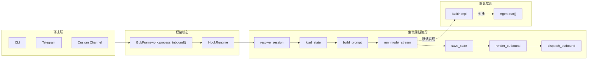

# 第 2 章 为什么 Bub 的核心不是 Agent，而是一条 Turn Pipeline

> 定位：解释 Bub 为什么把“一次 inbound 到 outbound 的完整处理链路”而不是 `Agent` 对象设为运行时核心，并说明这种选择如何影响扩展方式、宿主复用和复杂度分布。  
> 前置依赖：已理解 Bub 要解决的基本问题，知道它有 `BubFramework`、builtin plugin、Channel、Tool、Skill 这些层；最好已读过 HookRuntime 的基本执行语义。  
> 适用场景：适合第一次进入 Bub 源码、准备替换默认 Agent、准备新增宿主渠道，或在“该改框架还是改 Agent”之间做边界判断的读者。

本章的核心设计问题是：**为什么 Bub 不把 `Agent` 当成运行时第一公民，而是把 `resolve_session -> load_state -> build_prompt -> run_model -> save_state -> render_outbound -> dispatch_outbound` 这条 turn pipeline 当成系统主线。**

这不是命名偏好，而是架构中心的选择。它决定了三个关键事实：

1. 运行时先处理“消息如何进入系统、如何离开系统”，再处理“模型如何思考”。
2. `Agent` 在当前实现里是默认模型执行器，不是 Bub 的总控对象。
3. 扩展 Bub 时，最稳定的入口不是“继承 Agent”，而是“接管某个生命周期阶段”。

## 核心设计问题

如果只看今天主流的 agent 工程写法，最直觉的建模通常是下面两种：

- 以 `Agent` 类为中心：消息来了就交给 `agent.run()`，框架负责在外围做一些 I/O 包装。
- 以工作流图为中心：消息进入图，按节点编排 prompt、tool、memory、output。

Bub 选择的不是这两种中心，而是把**一次 turn 的生命周期**做成最稳定的抽象。这个选择背后解决的是一个很具体的问题：**当系统要同时面对不同宿主、不同出站方式、不同会话语义、不同插件覆盖关系时，什么才是全局稳定的共同部分？**

Bub 给出的答案不是“一个智能体对象”，而是“一次消息处理链路”。

`README.md` 已经把这件事写得很直白：Every inbound message goes through one turn pipeline。当前源码也完全印证这一点，核心 orchestrator 在 `src/bub/framework.py`，而不是 `src/bub/builtin/agent.py`。

## 这个问题为什么存在

Bub 的问题背景不是单机单用户的“我对一个 agent 连续聊天”，而是更接近“人和 agent 在真实消息环境里共处”。这会带来四类要求：

- 消息可能来自 CLI，也可能来自 Telegram，未来还可能来自别的 channel。
- 会话身份不一定等于一个内存中的 agent 实例，它更可能是 `channel + chat_id`。
- 回复不只是“返回一段文本”，还包括流式渲染、路由到不同 output channel、错误回传。
- 模型执行只是中间阶段，前后还有 session 解析、state 装载、prompt 构造、state 保存、outbound 渲染和 dispatch。

一旦场景是这样，`Agent` 就不再天然适合作为系统核心。因为如果把 `Agent` 放在中心，这些问题最终都会被挤压进 `agent.run()` 周围：

- session 怎么定
- channel 元数据怎么进 prompt
- 错误要不要立刻回 channel
- 没有模型输出时怎么办
- CLI 和 Telegram 的差异放哪里
- 替换默认模型循环时，是否还要保留原本的 outbound 行为

这时 `Agent` 会变成一个过度膨胀的宿主协调器。Bub 没走这条路。

## 真实实现的边界与结构

### 1. 从类型定义看，core 并不知道什么是 Agent

先看 `src/bub/types.py`：

```python
type Envelope = Any
type State = dict[str, Any]

@dataclass(frozen=True)
class TurnResult:
    session_id: str
    prompt: str
    model_output: str
    outbounds: list[Envelope] = field(default_factory=list)
```

这里最重要的不是弱类型本身，而是它暴露的事实：**framework 关心的是 envelope、state、turn result，而不是 agent 对象。**

再看 `src/bub/hookspecs.py`。Bub 定义的一等生命周期阶段是：

- `resolve_session`
- `load_state`
- `build_prompt`
- `run_model_stream` / `run_model`
- `save_state`
- `render_outbound`
- `dispatch_outbound`
- 以及 `system_prompt`、`provide_channels`、`provide_tape_store`、`build_tape_context`

这里没有“agent 生命周期”这个 hookspec。也没有 `before_agent_run` / `after_agent_run` 这样的中心扩展点。**Bub 的公共契约天然是 turn stage，不是 agent object。**

### 2. 从控制器实现看，framework 直接编排的是阶段，不是 Agent

`src/bub/framework.py` 的 `process_inbound()` 是全系统的主链路。它做的事情可以压缩为下面这段真实控制流：

```python
session_id = await self._hook_runtime.call_first("resolve_session", message=inbound)
state = {"_runtime_workspace": str(self.workspace)}
for hook_state in reversed(await self._hook_runtime.call_many("load_state", ...)):
    state.update(hook_state)

prompt = await self._hook_runtime.call_first("build_prompt", ...)
model_output = await self._run_model(inbound, prompt, session_id, state)

await self._hook_runtime.call_many("save_state", ...)
outbounds = await self._collect_outbounds(...)
for outbound in outbounds:
    await self._hook_runtime.call_many("dispatch_outbound", message=outbound)
```

注意这里的关键点：

- framework 从头到尾都在调用 hook stage。
- `Agent` 没有在这个函数里直接出现。
- `_run_model()` 也不是 `self.agent.run()`，而是继续通过 `HookRuntime.run_model_stream()` 找第一个可用实现。

这说明 `BubFramework` 的中心职责是**编排阶段**，不是**持有并驱动一个智能体对象**。

### 3. 默认 Agent 只是 builtin plugin 提供的 `run_model_stream`

再看 `src/bub/builtin/hook_impl.py`：

```python
class BuiltinImpl:
    def __init__(self, framework: BubFramework) -> None:
        self.framework = framework
        self.agent = Agent(framework)

    @hookimpl
    async def run_model_stream(self, prompt, session_id, state):
        return await self.agent.run(session_id=session_id, prompt=prompt, state=state)
```

这个片段非常关键。它说明：

- `Agent` 的创建发生在 builtin plugin 内，而不是 `BubFramework` 内。
- framework 默认使用 Agent，是因为 builtin plugin 实现了 `run_model_stream`。
- 如果外部插件注册了更高优先级的 `run_model_stream`，默认 Agent 可以被整体替换。

这就是本章最核心的源码证据：**Agent 是默认 hook 实现，不是 runtime core。**

## 关键数据流、控制流与状态流

下面这张图把 Bub 的真实边界画出来：



### 控制流

一条消息进入 Bub 时，控制流是这样的：

1. Host 把消息封装成 `Envelope` 或 `ChannelMessage`。
2. `BubFramework.process_inbound()` 触发 turn。
3. `HookRuntime.call_first("resolve_session")` 决定 session identity。
4. `HookRuntime.call_many("load_state")` 收集多个 state 片段，framework 合并。
5. `build_prompt` 生成本轮 prompt。
6. `_run_model()` 通过 `run_model_stream` 找到当前有效的模型执行器。
7. `save_state` 总会在 `finally` 中执行。
8. `render_outbound` 把模型输出变成 outbound envelope。
9. `dispatch_outbound` 负责真正发出去。

这条链路里，Agent 只占第 6 步，而且还是通过 hook 接入。

### 状态流

Bub 的 `State` 是一个共享字典。当前 builtin 会在 `load_state()` 里塞入：

- `session_id`
- `_runtime_agent`
- `context`

framework 自己先塞入：

- `_runtime_workspace`

这意味着“全局运行时信息”不是挂在某个 agent 对象上统一暴露，而是以共享 state 的形式贯穿各 hook 阶段。这样做的效果是：

- `build_prompt`、`system_prompt`、`run_model_stream`、工具执行都能看到同一份 state。
- 但复杂度也被转移到了隐式 key 契约上。

如果你改 `src/bub/framework.py` 里 `state` 的初始化或合并顺序，会影响所有 hook、tools 和默认 Agent。这是一个真正的系统级改动。

### 出站流

Bub 没有把“模型产物如何显示”放进 Agent。相反：

- `_run_model()` 只负责消费 stream、拼接文本、观察 error event。
- stream 是否被宿主包装，由 `OutboundChannelRouter.wrap_stream()` 决定。
- 最终发消息，由 `dispatch_outbound` + `dispatch_via_router()` 决定。

这就是为什么 CLI 可以流式渲染，Telegram 可以走聊天消息发送，但 framework 仍然不需要知道自己跑在哪个宿主里。

## 与主流做法相比，这里的选择是什么

这里比较的是模式，不是某个具体框架的 API 细节。

| 模式 | 第一公民 | 适合解决的问题 | 主要代价 |
|---|---|---|---|
| Agent-centric | `Agent` 对象 | 单智能体行为封装、局部推理闭环 | session、channel、outbound 往往泄漏进 agent |
| Graph-centric | 节点/边 | 显式编排、多阶段确定性流程 | 运行时覆盖和插件替换成本更高 |
| Bub 的选择 | turn pipeline | 多宿主复用、生命周期覆盖、插件式替换 | 隐式 state 和 hook 语义更重 |

Bub 为什么不选更直觉的 Agent-centric 写法？

因为在 Bub 的问题域里，稳定共同部分不是“一个会思考的对象”，而是“每条消息都要经过的系统边界”。把 `Agent` 放在中心，会导致下面这些东西变成副作用式附着物：

- channel 元数据
- session 计算
- outbound route
- state persistence
- error observer
- 宿主特定流包装

Bub 反过来做：把这些外层问题收拢成 runtime 主线，把“智能”压缩进 `run_model_stream` 这个阶段。这样默认 Agent 可以很复杂，但 framework 不会被 Agent 绑死。

## 这个设计依赖哪些前提

这个选择不是免费成立的，它依赖至少五个前提：

1. **一次 turn 是有意义的稳定边界。**  
   如果你的系统天然是长事务、审批流、事件溯源工作流，单 turn 可能太薄。

2. **模型执行可以被压成一个生命周期阶段。**  
   Bub 默认 Agent 内部有多步 loop，但对 framework 来说，它仍然是一个 `run_model_stream` 阶段。

3. **宿主层可以提供足够的消息元数据。**  
   比如 `channel`、`chat_id`、`session_id`、`context_str`。否则上游无法统一进入 pipeline。

4. **插件愿意接受弱约束共享状态。**  
   `State = dict[str, Any]` 意味着很多扩展靠约定而不是编译器保证。

5. **默认能力可以接受“通过 builtin plugin 提供”的组织方式。**  
   否则你会更倾向把 Agent、Memory、Tool runtime 都塞回 core。

## 它把复杂度放到了哪里

Bub 没有消灭复杂度，只是重新分配了复杂度。

### 1. 放到 HookRuntime

优先级、`call_first` / `call_many`、sync/async 兼容、错误吞吐都集中在 `src/bub/hook_runtime.py`。

这带来的后果是：**理解 Bub，不能只看 hookspec 名称，必须看 HookRuntime 的执行语义。**

### 2. 放到共享状态契约

`_runtime_workspace`、`_runtime_agent`、`session_id`、`context` 这些 key 没有强 schema 保护。它们横跨 framework、builtin hooks、tools、agent。  
这会让 Bub 很容易扩展，但也让大型扩展更容易发生隐式耦合。

### 3. 放到 builtin adapter

`src/bub/builtin/hook_impl.py` 同时做了很多“默认 glue work”：

- 读取 `AGENTS.md`
- 构造 CLI 命令
- 提供 channels
- 生成默认 outbound
- 把 `run_model_stream` 委托给 Agent

这不是坏事，但说明“默认行为”并不只存在于 Agent 里。  
如果你只替换 `src/bub/builtin/agent.py`，你不会自动替换这些外围语义。

### 4. 放到渠道管理与出站路由

真正的 UI/transport 复杂度被放在 `ChannelManager` 和 `OutboundChannelRouter` 一侧，而不是放进 framework 或 agent。  
这让 core 更薄，但也意味着新增宿主时，channel 层不是薄薄一层 HTTP adapter，而是一个有会话与并发治理责任的组件。

## 适用边界与失败模式

这个设计不适合所有系统。

### 适合的情况

- 你要让同一套 agent runtime 进入多个宿主。
- 你希望替换某个生命周期阶段，而不是继承一大坨 Agent 基类。
- 你接受 prompt、memory、outbound、session 作为统一 runtime 问题来处理。
- 你更看重“运行时可覆盖性”，而不是“类型上绝对收敛”。

### 不适合的情况

- 你要做强类型、强校验、强治理的企业工作流平台。
- 你要做以 API schema 为中心的纯服务化推理网关。
- 你要做显式多阶段工作流编排，且每一步都需要独立审计、重试和审批。
- 你需要对 tool 权限、资源隔离、审批节点做框架级统一收口。Bub 当前没有把这些做成 core。

### 典型失败模式

1. **插件替换了 `run_model_stream`，但忘了复用现有 system prompt / tape / tools 语义。**  
   结果是默认 Agent 的许多行为一起消失。  
   改这里会影响什么：所有依赖 `BuiltinImpl.agent.run()` 的默认行为都会变。

2. **多个扩展约定同一个 state key，却没有公共契约。**  
   结果是行为漂移很难定位。  
   改这里会影响什么：任何读取 `state` 的 hook、tool、skill 装配逻辑。

3. **开发者误以为“改 Agent 就等于改 Bub 核心”。**  
   结果是 channel、outbound、session、state 问题被错误地堆进 Agent。

4. **把 `process_inbound()` 当成普通业务函数修改。**  
   这是最危险的改动之一，因为它是全局主线。  
   改这里会影响什么：所有 channel、所有 plugin、所有 outbound 行为、很多测试基线。

## 取舍分析

Bub 这里的关键取舍，不是“要不要有 Agent”，而是“Agent 是不是核心抽象”。

它的答案很明确：**不是。**

这样做的直接结果是：

- framework 可以稳定围绕 turn lifecycle 组织。
- builtin Agent 可以被整体替换。
- channel、prompt、state、outbound 都被提升为一等 runtime 问题。
- 宿主复用不需要先复用一个庞大的 Agent 基类。

但代价同样明确：

- HookRuntime 语义必须被认真理解，否则系统很难改对。
- State/Envelope 的弱类型让扩展边界更松，也更脆。
- 默认行为分散在 framework、builtin hooks、agent、channel，而不是集中在一个显眼入口里。
- 对习惯 Agent-centric 框架的读者来说，第一次读 Bub 会觉得“主角不明显”。

## 得到了什么

- 一个真正以消息生命周期为中心的 runtime。
- 一个可以跨 CLI、Telegram 和未来渠道复用的内核。
- 一个允许用 hook 替换局部阶段而不是重写整个 Agent 的扩展模型。
- 一个把模型执行、状态持久化、出站分发统一纳入同一条主链的架构。

## 放弃了什么

- 没有把 `Agent` 变成单一的总控入口，因此少了某种表面上的“直觉一致性”。
- 没有提供强类型 runtime contract，扩展时更多依赖约定。
- 没有把所有默认行为收束进单个类，阅读成本转移到了跨模块理解上。
- 没有天然适配工作流图、审批链和强治理平台那套组织方式。

## 版本演化说明

从当前仓库状态看，Bub 的这条设计线是在逐步收敛而不是发散。

可以直接看到两类证据：

- 当前主链已经明显集中在 `src/bub/framework.py`、`src/bub/hookspecs.py`、`src/bub/hook_runtime.py`、`src/bub/builtin/hook_impl.py` 这几个文件里。
- `docs/read-v2` 和相关阅读材料都把旧的、偏分散的阅读方式重组为“消息主链路与 Hook 管线”。

这里可以做一个谨慎判断：**Bub 当前不是在从 Agent-centric 走向 turn-centric，而是已经把 turn-centric 作为核心共识，并在文档和结构上持续对齐它。**

这是一种基于现有源码和文档组织方式的推断，不是对作者动机的臆测。源码能直接证明的是：今天真正稳定的一等抽象，确实是 turn pipeline，而不是 Agent。
