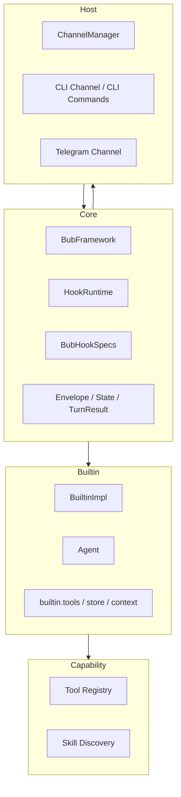

# 第 3 章 Core、Builtin、Host、Capability 的分层边界

> 定位：这一章解释 Bub 如何组织自己的系统边界。重点不是证明它有一套教科书式分层架构，而是回答：为什么仓库看起来分散，但主线没有失控；为什么有些东西属于 core，有些则被明确留在 builtin、host 或 capability 层。  
> 前置依赖：建议先读完《Bub 在解决什么问题》和《为什么 Bub 的核心不是 Agent，而是一条 Turn Pipeline》。  
> 适用场景：适合准备继续深入读 HookRuntime、默认 Agent、Tool / Skill、ChannelManager 的读者，也适合准备做二次开发、但还不确定“该改哪一层”的开发者。

本章的核心设计问题是：**Bub 的系统边界到底如何组织，哪些职责被压进 core，哪些故意留在 builtin、host、tool、skill 这些层；以及这种分层为什么不是更直觉的“一个大一统 Agent 框架”。**

如果这个问题不先说清楚，Bub 的源码很容易被误读成“模块很多、职责很散、没有统一中心”。这种表面印象并不完全错，但它忽略了一个更重要的事实：**Bub 的中心不是把所有东西放进一个对象，而是把不同责任面拆开，并让它们通过 runtime 主线重新组合。**

## 核心设计问题

在第 1 章里，我们已经给 Bub 下过一个基本定义：它不是聊天壳，不是单宿主 bot 框架，也不是工作流编排器，而是一个面向真实消息环境的 agent runtime。第 2 章又进一步说明了，它的核心不是 `Agent`，而是一条 turn pipeline。

接下来必须回答的就是：**既然 core 不是 Agent，那 Bub 到底如何组织剩下的东西？**

这个问题在仓库里会表现为几个具体困惑：

- 为什么 `framework.py` 这么薄，却像全局核心？
- 为什么 `builtin/` 下面既有 `agent.py`，也有 `hook_impl.py`、`tools.py`、`store.py`？
- 为什么 `channels/` 看起来像适配层，但又负责不少并发和会话控制？
- 为什么工具和技能不挂在 builtin 里统一管理，而是分散在 `src/bub/tools.py` 和 `src/bub/skills.py`？

这些问题的答案共同指向同一件事：**Bub 不是按“代码依赖最少”来做分层，而是按“什么必须稳定、什么必须可替换、什么必须依附宿主、什么只是能力面”来划边界。**

## 这个问题为什么存在

### 1. 如果没有分层，Bub 会迅速退化成一个巨大的默认实现

从源码上看，Bub 今天至少同时承担了四类责任：

- 运行时主线：接消息、走生命周期、产出 outbound
- 默认执行器：模型调用、工具循环、tape 接入
- 宿主接入：CLI、Telegram、未来新渠道
- 能力扩展：tools、skills、subagent、plugin

如果把这些都塞进一个中心对象，最自然的结果会是：

- `Agent` 知道所有宿主细节
- 宿主知道所有工具和 prompt 装配细节
- 默认实现与框架契约耦死
- 每新增一个能力，都要修改 core

这不是抽象层次的问题，而是工程扩张的问题。Bub 从一开始就面对多宿主、长对话、工具调用、扩展覆盖这些需求，所以它必须把“稳定骨架”和“默认能力”拆开。

### 2. 更直觉的“层次化做法”为什么不够

更直觉的分层通常有两种。

第一种是 **monolithic batteries-included framework**：  
核心框架自带默认 Agent、默认 memory、默认 tool、默认 host，扩展只是附加点。

第二种是 **严格分层 / hexagonal 风格**：  
domain 在内、adapter 在外，每层只通过明确定义的接口交互，尽量不共享弱类型状态。

这两种都比 Bub 当前的结构更“整齐”。但它们对 Bub 这个问题域都各有不适配之处：

- monolithic 方案会让默认能力过度中心化，难以替换。
- 严格分层方案要求很强的接口稳定性和数据契约，而 Bub 当前明确接受 `Envelope = Any`、`State = dict[str, Any]` 这种弱约束边界。

所以 Bub 采取的是第三种做法：**保留一个极薄的 core，然后把默认行为、宿主适配和能力表面拆到不同责任面上，再通过 hook runtime 和 turn pipeline 组合回来。**

这不是最整齐的架构，但它很符合 Bub 要解决的问题：多宿主、可替换、可扩展、运行时优先。

## 真实实现的边界与结构

这一章的“分层”不是在描述物理目录树，而是在描述当前代码中确实存在的四类稳定责任面。

### 1. Core：只保留运行骨架和最小契约

这一层最核心的文件是：

- `src/bub/framework.py`
- `src/bub/hook_runtime.py`
- `src/bub/hookspecs.py`
- `src/bub/types.py`
- `src/bub/envelope.py`

其中 `framework.py` 的 `BubFramework` 是 orchestrator，但它本身非常克制。它主要负责：

- 建立 plugin manager
- 注册 hookspec
- 加载 builtin 与外部插件
- 运行 `process_inbound()`
- 为宿主绑定 outbound router
- 暴露 channels / system prompt / tape context 的装配入口

它**不直接拥有**：

- 默认 Agent 的实现细节
- 某个具体宿主
- 具体工具列表
- 技能发现逻辑

这说明 Bub 的 core 不是“功能中心”，而是“组合中心”。

### 2. Builtin：默认能力集合，而不是内核

`src/bub/builtin/` 目录下的内容本质上是“默认 runtime 组件包”。

最关键的是两个文件：

- `src/bub/builtin/hook_impl.py`
- `src/bub/builtin/agent.py`

`BuiltinImpl` 通过 hook 的方式提供默认行为：

- `resolve_session`
- `load_state`
- `build_prompt`
- `run_model_stream`
- `system_prompt`
- `provide_channels`
- `provide_tape_store`

而默认 Agent 则只负责模型执行和工具推进，不负责框架骨架。

也就是说，builtin 层在 Bub 里不是 core 的延长线，而是**通过同一套插件契约接入 core 的默认实现**。  
这一点在 `src/bub/framework.py` 的 `_load_builtin_hooks()` 中体现得很清楚：builtin 也是 plugin，只是先注册。

### 3. Host：宿主适配层，不只是 I/O 壳

这一层主要在：

- `src/bub/channels/`
- `src/bub/channels/manager.py`
- `src/bub/builtin/cli.py`

Host 层在 Bub 里承担两类责任：

1. 把外部消息世界接入同一条 inbound pipeline
2. 处理宿主相关的会话与输出行为

`ChannelManager` 不是纯转发器。它还负责：

- 按 `session_id` 建立 handler
- 根据 channel 是否需要 debounce 选择缓冲策略
- 管理 session 粒度的 in-flight task
- 通过 `bind_outbound_router()` 把 outbound 再路由回具体宿主

这说明 Host 层不是“最外层皮肤”，而是 Bub 运行边界的一部分。

### 4. Capability：能力表面，而不是业务层

这一层不是一个单独 package，而是两种能力面：

- Tool surface：`src/bub/tools.py` + `src/bub/builtin/tools.py`
- Skill surface：`src/bub/skills.py`

它们有一个共同点：都不是 runtime 主线，但都直接影响默认 Agent 能做什么。

Tool 层负责：

- 注册运行时工具
- 维护 `REGISTRY`
- 提供模型可见名和运行时名之间的映射

Skill 层负责：

- 从 project / global / builtin roots 发现技能
- 校验 `SKILL.md` frontmatter
- 生成技能提示块

这里特意不用“业务层”这个词，是因为这些能力并不是 Bub 的业务对象模型，它们更像是**可被 runtime 消费的能力表面**。

下面这张图更接近 Bub 当前的真实边界：



这张图有两个需要特别强调的点：

- Core 并不“拥有” Builtin，而是允许 Builtin 作为默认实现挂上来。
- Capability 并不直接属于 Host 或 Core，而是主要被 Builtin Agent 消费。

## 关键数据流 / 控制流 / 状态流

### 1. 控制流：Core 负责主线，Builtin 负责默认执行，Host 负责承载与回送

当前主控制流可以压缩为：

```text
Host inbound
-> ChannelManager.listen_and_run()
-> BubFramework.process_inbound()
-> HookRuntime 调度 turn stages
-> BuiltinImpl 默认实现其中若干阶段
-> Agent 处理 run_model_stream
-> Host outbound router
```

这条链说明四层边界是如何协作的：

- Core 决定顺序
- Builtin 决定默认语义
- Host 决定承载方式
- Capability 决定默认执行器的能力面

### 2. 数据流：弱类型边界穿透多层

从 `src/bub/types.py` 可知：

- `Envelope = Any`
- `State = dict[str, Any}`

这意味着 Bub 的分层不是靠强类型 DTO 串起来的，而是靠运行时约定串起来的。

比如 `framework.py` 初始化 `state` 时塞入 `_runtime_workspace`，`BuiltinImpl.load_state()` 又加入 `session_id`、`_runtime_agent`、`context`。之后：

- Host 会用 message 元数据参与 routing
- Builtin Agent 会读取 state 继续执行
- tools 也会通过 `ToolContext.state` 看到这些值

这说明 Bub 的层与层之间，存在真实的共享状态穿透。  
所以这套分层不是严格隔离层，而是**职责清晰但边界松耦合的运行层**。

### 3. 状态流：Core 不保管业务状态，只保管装配点

`BubFramework` 自己并不保留 session 状态树。它只负责：

- 在本轮 turn 里初始化 state
- 调度 `load_state`
- 调度 `save_state`

真正的状态装配和消费，发生在 builtin / tool / tape 等层。

这也是一个重要边界：

- Core 保留“何时装配状态”的控制权
- Builtin 保留“默认装配什么”的实现权

改这里会影响什么：

- 改 `framework.py` 的 state 初始化或合并顺序，会影响所有 hook、tool、agent、host 侧行为。
- 改 `builtin/hook_impl.py` 的 `load_state()`，主要影响默认运行时的上下文语义，不直接改变 core 契约。

## 与主流做法相比，这里的选择是什么

这一章最适合比较两类对照对象：**monolithic batteries-included 框架** 和 **严格分层架构**。

| 方案 | 优点 | 对 Bub 问题域的局限 |
|---|---|---|
| Monolithic batteries-included | 入口集中，默认体验统一 | 默认能力容易和 core 绑死，替换成本高 |
| 严格分层 / 强接口契约 | 边界清晰，可静态约束 | 对多宿主、多插件、弱类型 state 的现实约束不友好 |
| Bub 当前做法 | core 薄、默认能力可替换、宿主和能力面可独立演化 | 需要开发者主动理解责任边界，且边界更多依赖约定 |

Bub 的选择很明确：

- Core 极薄
- Builtin 不神圣
- Host 有自己的运行责任
- Capability 不归并进单一“Agent 插件系统”

这不是传统意义上的“漂亮分层”，而是一种**可替换性优先的责任分层**。

它的优点在于，很多事情都能替换而不动 core：

- `tests/test_framework.py` 证明了高优先级 plugin 可以覆盖同名 channel
- `tests/test_tools.py` 证明了 tools 作为独立注册表存在
- `tests/test_skills.py` 证明了 skills 有单独的发现与覆盖优先级

这些测试都在说明一件事：Bub 的边界不是装饰性的，而是回归保护的一部分。

## 适用边界与失败模式

### 1. 适合的情况

这套分层适合：

- 你要同时维护 runtime 骨架、默认能力、多个宿主和扩展生态
- 你希望默认行为可工作，但不想把它们永久塞进 core
- 你接受“职责清晰但边界不强类型”的工程现实

### 2. 不适合的情况

这套分层不适合：

- 你要求所有层之间只通过严格 schema 交互
- 你希望每个层都能在编译期完全独立验证
- 你希望 Host 只是无状态 I/O adapter
- 你希望 Tool、Skill 都统一收编进一个插件模型，而不是保留多种能力面

### 3. 典型失败模式

第一个失败模式，是把 builtin 当成 core。  
这样改 `builtin/agent.py` 或 `builtin/hook_impl.py` 时，很容易误以为自己在“修改框架契约”，实际上往往只是在修改默认语义。

第二个失败模式，是把 channels 当成纯 adapter。  
这样会低估 `ChannelManager` 里真实存在的 session、debounce、quit、task 管理责任，结果新增宿主时把并发问题漏掉。

第三个失败模式，是把 tools 和 skills 当成 Agent 私有实现细节。  
实际上它们是能力表面，虽然主要被默认 Agent 消费，但它们本身有独立的注册与发现语义。

第四个失败模式，是误把这套结构理解成严格分层架构。  
当前 Bub 明确存在跨层共享弱类型状态、hook 级别的隐式契约、runtime 装配式依赖。  
如果按严格分层系统去期待它，就会觉得“边界不干净”；这不是错觉，而是 Bub 有意接受的工程现实。

## 取舍分析

从设计上看，Bub 这一章最核心的取舍是：

**不用一个中心对象统一吞掉所有责任，而是把运行骨架、默认能力、宿主接入、能力表面拆成四个责任面。**

这样做的直接收益是：

- Core 不会因为默认能力变多而持续膨胀
- Builtin 可以更大胆地演化默认行为
- Host 可以按宿主特性承担会话与输出治理
- Tool / Skill 可以作为独立能力面持续扩展

但代价同样明显：

- 读代码时需要先建立责任地图，否则会觉得“代码散”
- 不是每一层都有强类型边界
- 有些概念是分布式存在的，比如默认语义分散在 `framework.py`、`hook_impl.py`、`agent.py`、`channels/manager.py`

## 得到了什么

- 一个适合 Bub 问题域的责任分层，而不是把一切都堆进 Agent
- 一个能解释仓库结构的阅读地图
- 一个有利于后续章节展开的边界框架：core、builtin、host、capability
- 一个更容易指导二次开发的判断标准：改哪里，会影响哪一层

## 放弃了什么

- 放弃了 monolithic 框架那种“一眼就能看到所有默认行为”的集中性
- 放弃了严格分层带来的强接口安全感
- 放弃了把 Tool / Skill 都揉成统一插件类型的表面整齐
- 放弃了 Host 只做薄适配层的简洁假设

## 版本演化说明

从当前仓库看，这套边界已经基本稳定，但表述方式仍在收敛。

可以看到两类演化痕迹：

1. `README.md` 和 `docs/index.md` 都强调 small core、builtins are default plugins、one pipeline across channels，这说明“core 薄 + builtin 非核心”已经是明确共识。
2. 但 `docs/architecture.md` 里仍混有一些旧的流事件表述，例如 `dispatch_event(...)` / `channel.on_event(...)`，而当前源码实际已经转向 `wrap_stream(...)` 模型。这说明宿主边界的具体实现方式还经历过一轮整理。

这两点放在一起，可以得出一个比较稳妥的判断：

**Bub 的四类责任面已经稳定，但它们之间的具体交互形式仍在逐步收敛。**

这是一种基于当前源码、测试和文档交叉得到的判断。  
源码能直接证明的是：core、builtin、host、capability 这几类责任确实存在；不能直接证明的是作者是否一开始就明确用这四个词来命名它们。  
所以“Core、Builtin、Host、Capability”是一本书对 Bub 的结构化概括，而不是仓库源码里显式写出的官方术语。
