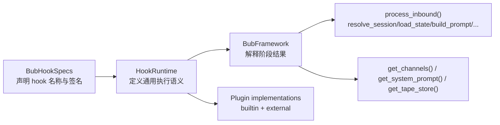

# 第 4 章 HookRuntime：Bub 的真实执行语义

> 定位：这一章解释 Bub 的 hook 体系到底由谁定义行为。重点不是介绍有哪些 hooks，而是说明：在当前实现里，真正决定优先级、first-result、批量收集、sync/async 兼容、错误观察和模型兼容路径的，不是 `@hookspec` 注解本身，而是 `HookRuntime` 与 `BubFramework` 的组合。  
> 前置依赖：建议先读完《为什么 Bub 的核心不是 Agent，而是一条 Turn Pipeline》和《Core、Builtin、Host、Capability 的分层边界》。  
> 适用场景：适合准备实现或覆盖插件、准备替换默认 `run_model_stream`、准备新增 bootstrap hook，或者正在排查“为什么我的 hook 没按预期执行”的开发者。

本章的核心设计问题是：**Bub 明明使用了 pluggy 注册 hooks，为什么真正的运行时语义却不是由 pluggy 默认调用器和 `@hookspec(firstresult=True)` 直接决定，而是由 `src/bub/hook_runtime.py` 和 `src/bub/framework.py` 重新定义。**

这个问题不先说清楚，Bub 的扩展机制很容易被误读成“一个普通 pluggy 插件系统”。这会直接导致三个常见误判：

- 以为 `hookspecs.py` 上的装饰器参数就是最终行为。
- 以为 later plugin 只是注册顺序变化，不影响系统级覆盖策略。
- 以为所有 hook 的失败、同步性和返回值合并规则都统一交给 pluggy。

当前源码并不是这样工作的。**Bub 用 pluggy 主要做注册、发现和标记；真正的执行语义由 `HookRuntime` 自己掌握，而具体返回值如何解释，又进一步落在 `BubFramework` 的各个消费点上。**

## 核心设计问题

如果只看 `src/bub/hookspecs.py`，你会看到一组很标准的 hook 契约：

- `resolve_session`
- `load_state`
- `build_prompt`
- `run_model` / `run_model_stream`
- `save_state`
- `render_outbound`
- `dispatch_outbound`
- `system_prompt`
- `provide_channels`
- `provide_tape_store`

更直觉的理解是：既然用了 pluggy，那么 hook 的运行语义应该由 pluggy 默认决定，`firstresult=True` 也应该是第一层真相。

但 Bub 当前的关键判断恰恰相反：**hook 名称和签名是公共契约，hook 的优先级、执行方式、同步约束、兼容路径和错误策略则是 runtime policy。**

这意味着：

- `hookspecs.py` 定义的是“可以接什么口”
- `HookRuntime` 定义的是“这些口怎么跑”
- `BubFramework` 定义的是“跑出来的结果怎么解释”

这三层合起来，才是 Bub 的真实执行语义。

## 这个问题为什么存在

如果 Bub 只是一个普通插件系统，直接调用 pluggy 默认 hook caller 就够了。但 Bub 不是。它至少同时要求下面几件事成立：

1. builtin 必须可被覆盖，但 builtin 本身仍然要作为默认实现存在。
2. 同一套 hook 体系里既有 turn 期间的异步调用，也有 CLI/bootstrap 阶段的同步调用。
3. 模型执行正在从 `run_model` 向 `run_model_stream` 收敛，但历史兼容不能马上消失。
4. `on_error` 必须是观察者语义，不能因为一个观察者失败就阻断整个错误上报。
5. hook 实现应该允许只声明自己真正关心的参数，而不是被迫吃下统一签名。

如果完全依赖 pluggy 的默认执行器，这五件事很难同时处理得这么细。

更直觉的另一种做法，是把这些语义都塞回 `BubFramework.process_inbound()` 里，按 hook 名一个个写特殊逻辑。Bub 也没有这么做，因为那会让 framework 重新变成一个内嵌规则表，扩展时必须反复改 core。

Bub 的选择是第三种：**用一个单独的 `HookRuntime` 封装“通用 hook 调度规则”，再让 `BubFramework` 只保留少量阶段级解释逻辑。**

这不是纯粹的抽象洁癖，而是工程分工：

- 通用调用规则放进 `HookRuntime`
- 阶段级业务解释留在 `BubFramework`
- 默认行为留在 builtin plugin

## 真实实现的边界与结构

这一章最重要的边界不是目录边界，而是三类源码职责边界。

| 层 | 关键文件 | 负责什么 | 不负责什么 |
| --- | --- | --- | --- |
| 契约层 | `src/bub/hookspecs.py` | 定义 hook 名称、参数形状、粗粒度意图 | 不定义 Bub 的最终执行顺序和合并规则 |
| 调度层 | `src/bub/hook_runtime.py` | 定义优先级、`call_first`、`call_many`、sync/async 兼容、错误观察、模型 hook 兼容 | 不负责 turn 生命周期本身 |
| 解释层 | `src/bub/framework.py` | 决定在具体阶段如何消费 hook 结果，例如 `load_state` 合并、`system_prompt` 拼接、channels 去重 | 不直接规定所有 hook 的通用调用方式 |

这三层关系可以画成下面这样：



### 1. `hookspecs.py` 只声明契约，不等于最终行为

`src/bub/hookspecs.py` 里很多 hook 被标记为 `@hookspec(firstresult=True)`。如果这是一个完全依赖 pluggy 默认语义的系统，这个标记会非常关键。

但在 Bub 当前实现里，它只代表“这个 hook 倾向于 first-result 风格”，不是最终的执行来源。最典型的例子就是 `load_state`：

```python
@hookspec(firstresult=True)
def load_state(self, message: Envelope, session_id: str) -> State:
    ...
```

而 `src/bub/framework.py` 在真实运行时里用的是：

```python
for hook_state in reversed(
    await self._hook_runtime.call_many("load_state", message=inbound, session_id=session_id)
):
    if isinstance(hook_state, dict):
        state.update(hook_state)
```

也就是说，`load_state` 在契约层看起来像 first-result，在运行时却是多实现聚合再合并。这不是文档笔误，而是当前实现的真实分工：**hookspec 装饰器不是 Bub 运行语义的唯一真相。**

这对二次开发非常重要。只盯着 `hookspecs.py` 会误判很多行为，尤其是覆盖顺序和返回值合并方式。

### 2. `HookRuntime` 明确把执行顺序从 pluggy 默认顺序反过来

`src/bub/hook_runtime.py` 最关键的一段代码是：

```python
def _iter_hookimpls(self, hook_name: str) -> list[Any]:
    hook = getattr(self._plugin_manager.hook, hook_name, None)
    if hook is None or not hasattr(hook, "get_hookimpls"):
        return []
    return list(reversed(hook.get_hookimpls()))
```

这意味着 Bub 明确采用“后注册者优先执行”的策略。

结合 `BubFramework.load_hooks()` 的注册顺序：

1. builtin 先注册
2. entry point 插件后注册

最终效果就是：**外部插件天然拥有覆盖 builtin 的优先级。**

这不是 incidental behavior，而是系统级 override policy。`tests/test_hook_runtime.py` 里的 `test_call_first_respects_priority_and_returns_first_non_none` 和 `tests/test_framework.py` 里的 duplicate channel / system prompt 测试都在验证这件事。

### 3. `HookRuntime` 不是只做优先级，它还定义了四种基础调度语义

#### `call_first(...)`

- 按优先级执行
- 遇到 `None` 继续向下找
- 返回第一个非 `None` 值

这直接服务于：

- `resolve_session`
- `build_prompt`
- `provide_tape_store`
- `build_tape_context`

#### `call_many(...)`

- 按优先级执行所有实现
- 收集所有返回值
- 不吞普通异常

这直接服务于：

- `load_state`
- `save_state`
- `render_outbound`
- `dispatch_outbound`

#### `call_first_sync(...)` / `call_many_sync(...)`

- 给 bootstrap 和 CLI 初始化阶段使用
- 如果返回的是 awaitable，则发 warning 并跳过

这不是一个小优化，而是 Bub 对“启动阶段必须同步可控”的明确要求。`test_call_many_sync_skips_async_impl` 就在验证这条规则。

#### `notify_error(...)` / `notify_error_sync(...)`

- 只对 `on_error` 走观察者语义
- 观察者失败会被记录，但不会阻断其他观察者

这和普通 hook 的错误策略完全不同。普通 hook 抛异常会直接中断流程，只有 `on_error` 被特殊对待。

### 4. `run_model_stream()` 不是普通 hook 调用，而是兼容层

`HookRuntime.run_model_stream()` 是一个专门的适配器，而不是简单地 `call_first("run_model_stream")`。它的逻辑大意是：

```python
for _, plugin in reversed(self._plugin_manager.list_name_plugin()):
    if hasattr(plugin, "run_model_stream"):
        return await self.call_first("run_model_stream", ...)
    elif hasattr(plugin, "run_model"):
        async def iterator():
            result = await self.call_first("run_model", ...)
            yield StreamEvent("text", {"delta": result})
        return AsyncStreamEvents(iterator(), state=StreamState())
```

这段代码说明了三件事：

1. `run_model_stream` 是当前的一等模型接口。
2. `run_model` 是兼容路径，不是并列主路径。
3. Bub 把“兼容旧 hook 的成本”集中在 runtime，而不是要求所有上层调用方关心两套接口。

这也是为什么第 6 章会把“流式优先的模型执行”单独拆出来讲。就本章而言，关键点是：**模型 hook 的兼容语义并不写在 hookspec 注解里，而是写在 HookRuntime 里。**

## 关键数据流 / 控制流 / 状态流

### 1. 控制流：`process_inbound()` 如何依赖 HookRuntime

`src/bub/framework.py` 的主链路不是直接调 pluggy，而是调 `HookRuntime`：

```text
process_inbound()
-> call_first("resolve_session")
-> call_many("load_state")
-> call_first("build_prompt")
-> run_model_stream(...)
-> call_many("save_state")
-> call_many("render_outbound")
-> call_many("dispatch_outbound")
```

这里最关键的不是阶段名字，而是每个阶段选了哪种调用语义。

| 阶段 | Framework 调用方式 | 实际含义 |
| --- | --- | --- |
| `resolve_session` | `call_first` | 最高优先级的非空实现决定 session |
| `load_state` | `call_many` + `reversed(...).update(...)` | 多插件共同装载状态，高优先级值最终覆盖低优先级值 |
| `build_prompt` | `call_first` | 只要有更高优先级插件产出 prompt，就不再向下找 |
| `run_model_stream` | `HookRuntime.run_model_stream()` | 优先走流式 hook，否则适配 legacy `run_model` |
| `save_state` | `call_many` | 所有持久化实现都参与，而且在 `finally` 中执行 |
| `render_outbound` | `call_many` | 多实现可共同产出 outbound batch |
| `dispatch_outbound` | `call_many` | 每个 outbound 都广播给所有 dispatcher |

### 2. 状态流：`load_state` 的合并规则不在 hookspec，在 framework

`load_state` 是最能说明“运行时语义分布在两层”的例子。

调用顺序是：

1. `HookRuntime.call_many("load_state")` 按高优先级到低优先级返回一个列表
2. `BubFramework.process_inbound()` 再对这个列表 `reversed(...)`
3. 从低优先级到高优先级依次 `state.update(...)`

等价伪代码如下：

```python
states = [high, mid, low]  # HookRuntime 返回
for partial in [low, mid, high]:
    state.update(partial)
```

这样最终冲突 key 会由高优先级插件覆盖。

这套设计解决的问题是：**既要让多个插件共同注入 state，又要保留明确的覆盖方向。**

更直觉的另一种做法，是只允许一个 `load_state` 实现返回完整 state。这么做更简单，但 Bub 放弃了，因为它会让 state provider 失去可组合性。

### 3. `system_prompt` 和 `provide_channels` 说明“相同优先级规则，不同结果解释”

`get_system_prompt()` 用的是：

```python
return "\n\n".join(
    result
    for result in reversed(self._hook_runtime.call_many_sync("system_prompt", prompt=prompt, state=state))
    if result
)
```

这意味着：

- `HookRuntime.call_many_sync("system_prompt")` 先按高优先级到低优先级收集
- `BubFramework` 再反转
- 拼接顺序最终变成低优先级在前，高优先级在后

`tests/test_framework.py` 的 `test_get_system_prompt_uses_priority_order_and_skips_empty_results` 明确验证结果是 `low\n\nhigh`。

这和 `load_state` 很像，但目的不同：

- `load_state` 反转是为了让高优先级值最后覆盖
- `system_prompt` 反转是为了让高优先级提示更靠近最终用户 prompt

同样，`get_channels()` 也是先 `call_many_sync("provide_channels")`，再在 framework 侧按“第一个同名 channel 胜出”做去重。因此高优先级插件提供的同名 channel 会覆盖低优先级版本。

这进一步说明：**HookRuntime 定义的是基础执行顺序，framework 仍然保留每个消费点自己的解释权。**

### 4. 参数流：Bub 允许 hook 只声明自己关心的参数

`HookRuntime._kwargs_for_impl()` 用 `impl.argnames` 过滤参数：

```python
return {name: kwargs[name] for name in impl.argnames if name in kwargs}
```

这带来两个直接效果：

- 插件作者可以省略不关心的参数
- framework 可以给 hook 调用方传更多上下文，而不强迫所有实现同步改签名

这是一个很实际的可演化设计。它降低了 hook API 演化的阻力，但也把一部分兼容性风险留给了运行时：如果插件没有声明某个新参数，它就永远感知不到这个上下文。

## 与主流做法相比，这里的选择是什么

这一章最合适的对比对象，不是某个具体框架，而是“直接使用 pluggy 默认语义”的普通插件系统。

| 问题 | 直接使用 pluggy 默认调用器 | Bub 当前选择 |
| --- | --- | --- |
| 优先级 | 通常以 pluggy 既有顺序为主 | 统一在 `HookRuntime` 中反转为“后注册优先” |
| first-result 语义 | 主要由 `@hookspec(firstresult=True)` 驱动 | 由 `call_first(...)` / `call_many(...)` 的实际调用点决定 |
| sync/async 混用 | 往往要求调用方自己约束 | 由 `call_first_sync` / `call_many_sync` 明确跳过 awaitable |
| 错误观察 | 通常没有单独观察者语义 | `on_error` 被单独做成 fault-isolated observer |
| 模型 hook 兼容 | 调用方自己处理新旧接口 | `HookRuntime.run_model_stream()` 统一适配 `run_model` |

如果换一种更直觉的做法，例如把所有 hook 变成标准 middleware 链，确实可以把“谁先谁后、谁包裹谁”写得更显式。但 Bub 也会失去两个东西：

- 对内置默认实现的简单覆盖能力
- 对“同一个 hook 多实现并存”的低成本支持

所以 Bub 这里的选择不是“更先进”，而是**更偏向 override-friendly，而不是更偏向 declarative pipeline。**

## 适用边界与失败模式

这套设计很适合 Bub 当前的问题域，但并不适合所有插件系统。

### 适用边界

- 你需要 builtin 作为默认值，但又希望外部插件天然拥有覆盖权。
- 你接受 runtime policy 写在 wrapper 里，而不是完全交给底层插件框架。
- 你需要在同一套 hook 体系中同时处理 async turn hooks 和 sync bootstrap hooks。
- 你需要兼容旧 hook，而不想让所有调用方同时背两套接口。

### 不适合的情况

- 你希望 hookspec 注解就是唯一可信的执行语义。
- 你需要强类型、强声明式、低隐式规则的插件治理系统。
- 你希望每个 hook 的组合方式都能从声明层一眼看出，而不是要同时读 runtime 和 framework。
- 你不能接受注册顺序对系统行为产生实质影响。

### 典型失败模式

1. 只看 `hookspecs.py`，不看 `HookRuntime` 和 `framework.py`。  
   最常见后果就是误判 `load_state`、`system_prompt`、`provide_channels` 的真实行为。

2. 在 sync hook 上返回 awaitable。  
   当前实现会 warning 并跳过，而不是等待它完成。CLI 命令注册、channel 提供、tape context 提供都受这条规则影响。

3. 误以为所有 hook 失败都会像 `on_error` 一样被隔离。  
   实际上只有 `on_error` 是 observer-safe；普通 hook 异常会中断流程并向上冒泡。

4. 同时实现 `run_model_stream` 和 `run_model`，却没有意识到前者是主路径。  
   `hookspecs.py` 的文档字符串写了“不应同时实现”，但当前 runtime 没有硬性阻止，只是优先走流式路径。这是一处约定优先、而非强约束的设计。

5. 修改 `_iter_hookimpls()` 或 `call_first()`，却把它当成局部优化。  
   这会改变全系统 override 规则，影响 builtin 覆盖、channels 去重、system prompt 顺序、state 合并方向和模型 hook 选择。

## 取舍分析

HookRuntime 这套设计解决的核心问题，不是“如何更优雅地调用 hook”，而是“如何把 Bub 需要的运行时政策从底层插件库和上层业务阶段里剥离出来”。

它的直接收益是：

- Bub 可以统一定义“后注册者优先”的覆盖规则。
- framework 不必为每个 hook 重复写一遍同步性和兼容处理。
- `run_model_stream` 可以平滑吸收 `run_model` 的历史包袱。
- `on_error` 可以拥有和普通 hook 不同的容错语义。

代价同样明确：

- 理解 Bub 不能只看 hookspec，还要同时读 runtime 和 framework。
- 真实语义分布在多层，阅读门槛高于“声明即行为”的系统。
- 某些 hook 的装饰器元信息和实际消费方式之间存在张力，`load_state` 是最明显的例子。
- 注册顺序成为一等架构事实，而不是实现细节。

## 得到了什么

- 一个以 Bub 自己的问题域为中心的 hook 执行模型，而不是 pluggy 默认模型的直接投影。
- 一套对 builtin 覆盖友好、对历史接口兼容友好、对 sync/async 混合环境友好的 runtime 语义。
- 一种比较稳定的分工方式：contracts 在 `hookspecs.py`，policies 在 `hook_runtime.py`，stage interpretation 在 `framework.py`。

## 放弃了什么

- 放弃了“只看 hookspec 就能完全理解行为”的简单性。
- 放弃了“声明层就是单一真相”的一致性。
- 放弃了对插件执行顺序的弱依赖，转而把注册顺序变成实质性的覆盖机制。
- 放弃了更强的静态约束，例如禁止某些 hook 同时实现、禁止 sync path 出现 awaitable。

## 版本演化说明

从当前仓库状态看，HookRuntime 已经不是一个薄薄的工具类，而是 Bub 运行时语义的正式承载点。

有三条证据比较清楚：

1. `docs/extension-guide.md` 已经直接把 `call_first`、`call_many`、priority reversal、sync/async 规则写成扩展指南的一部分，说明这些语义不再是内部偶然实现。
2. `tests/test_hook_runtime.py` 和 `tests/test_framework.py` 不是在测“hook 能不能被调用”，而是在测优先级、跳过 awaitable、错误观察、system prompt 顺序和 channel 覆盖，这说明语义已经进入回归保护面。
3. `run_model_stream` 兼容层被固定在 `HookRuntime`，说明模型执行语义正在以流式接口为中心收敛。

同时也要看到，当前实现里仍有两处需要读者特别小心：

- `hookspecs.py` 中 `load_state` 的 `firstresult=True` 与真实聚合行为并不一致。对读者来说，源码的最终真相在 `HookRuntime + BubFramework`，不在单一装饰器参数。
- `docs/architecture.md` 关于 stream outbound 仍写着 `dispatch_event(...)` / `channel.on_event(...)`，而当前 `framework.py` 实际走的是 `OutboundChannelRouter.wrap_stream(...)`。这不影响本章关于 HookRuntime 的主判断，但说明 Bub 的运行时语义必须以当前源码和测试为准。

这两点都不是小瑕疵，而是阅读 Bub 时必须建立的习惯：**先找真正定义行为的代码，再看文档和命名是否与之对齐。**
