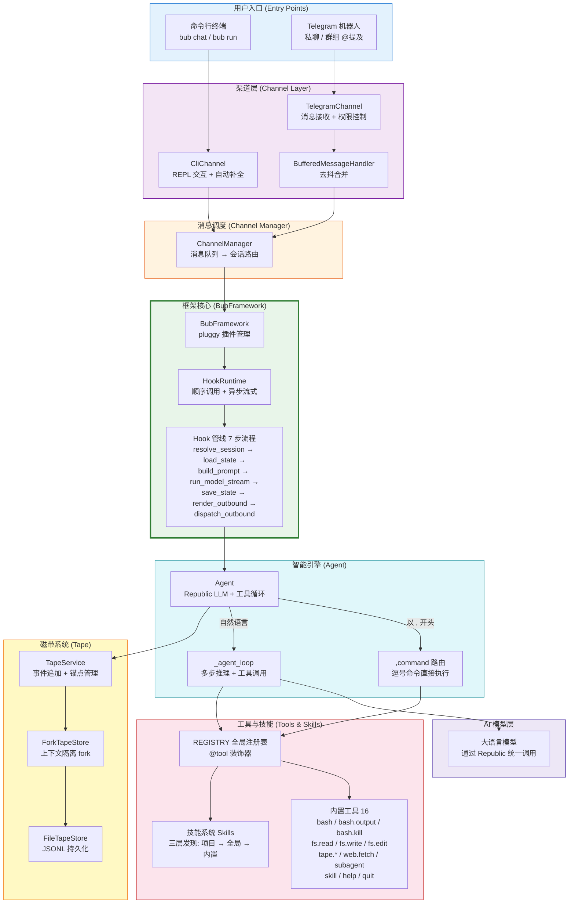
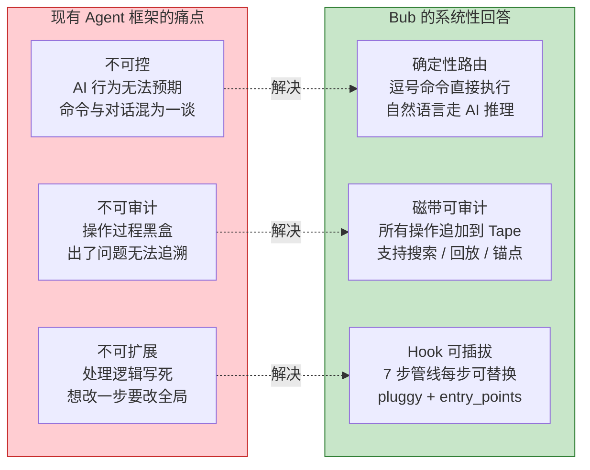
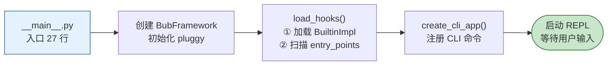
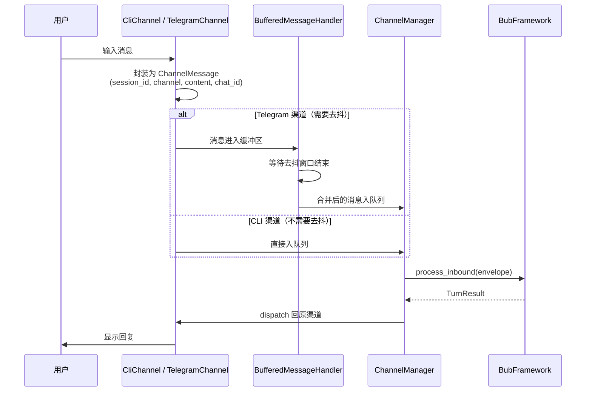
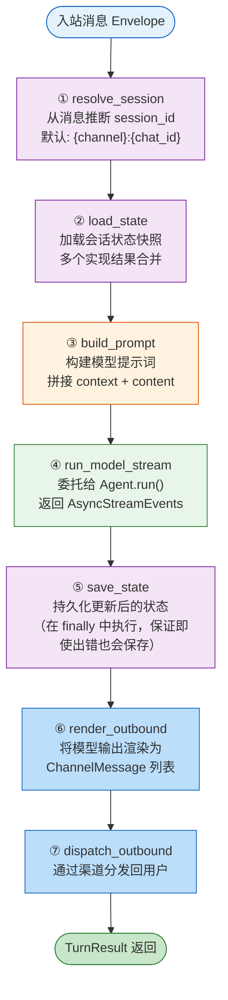
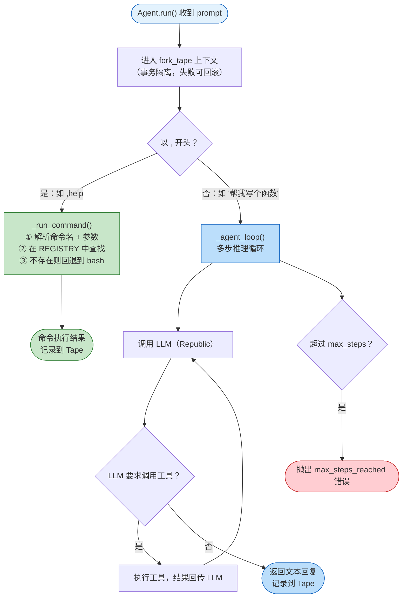
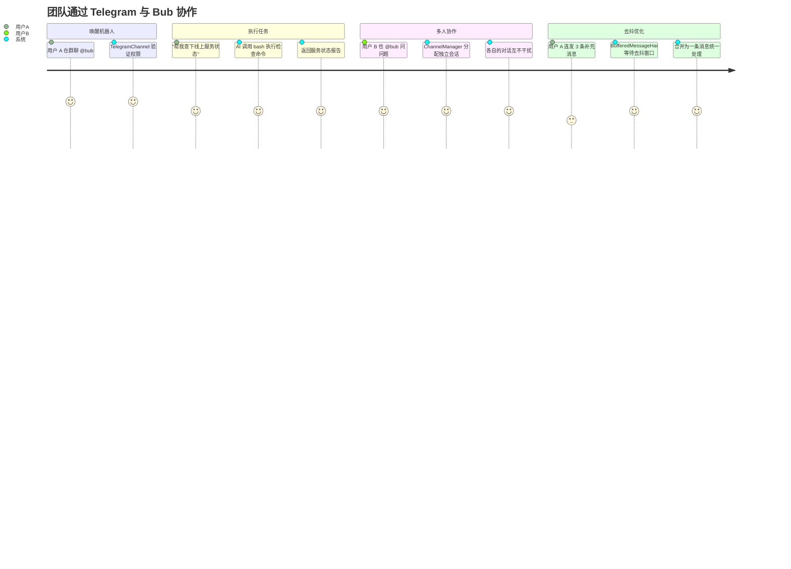
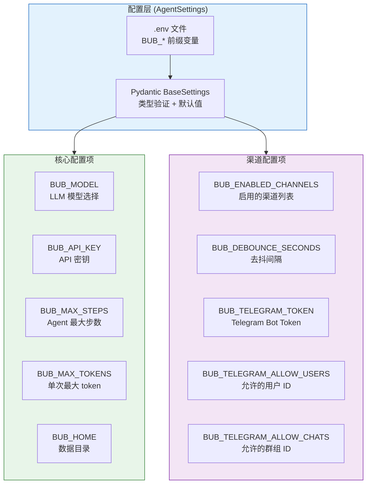

# Bub 全局业务总览

> Bub 是一个 Hook 驱动、可审计的协作式 AI Agent 框架——用户通过命令行或 Telegram 与 AI 对话，AI 能执行命令、调用工具、完成复杂任务，而所有交互都被完整记录在磁带（Tape）上，随时可追溯。

---

## 系统全景图

---

## 一、核心价值：为什么需要 Bub

### 解决的核心问题

大多数 AI Agent 框架存在三个痛点：**不可控**（行为无法预期）、**不可审计**（过程黑盒）、**不可扩展**（逻辑写死）。Bub 针对这三个痛点给出了系统性的回答。

### 五大核心价值

| 价值 | 含义 | 为什么重要 |
|------|------|-----------|
| **Hook-first 架构** | 消息生命周期的每一步都是可插拔的 Hook，第三方通过 pluggy entry_points 即可扩展 | 不需要改框架源码就能定制行为，插件失败也不会拖垮整条管线 |
| **确定性命令路由** | 只有以逗号 `,` 开头的输入才被视为命令，直接执行不经 AI；其余一律走 LLM 推理 | 用户和 AI 都遵守同一套规则，行为可预期，命令不会被 AI「误解」 |
| **磁带可审计** | 所有交互（用户输入、AI 输出、工具调用、命令执行）都追加到 Tape（JSONL 文件），支持搜索、锚点、重置 | 团队协作中可追溯每一步操作，出问题能精确定位，合规场景也有完整审计日志 |
| **渠道无关** | 同一个 Agent 引擎驱动 CLI 和 Telegram，核心逻辑与渠道完全解耦 | 增加新渠道（如 Slack、API）只需实现 Channel 接口，不用修改任何核心代码 |
| **工具与技能生态** | 16 个内置工具 + @tool 装饰器自注册 + 三层技能发现机制 | 从 shell 命令到文件操作到自定义工作流，AI 能力可无限扩展 |

---

## 二、启动到响应：一条消息的完整旅程

理解 Bub 最好的方式是跟踪一条消息从用户输入到收到回复的全过程。以下是这个旅程的四个阶段。

### 阶段一：启动与初始化

当用户执行 `bub chat` 时，系统按以下顺序引导启动：

为什么先加载 BuiltinImpl 再扫描 entry_points？因为 pluggy 的优先级机制确保**第三方插件可以覆盖内置行为**——后注册的插件如果标记为高优先级，会在 `firstresult` 模式下优先被调用。

### 阶段二：渠道接收与消息调度

用户的输入首先被渠道（Channel）接收，封装为 `ChannelMessage`，然后交给 `ChannelManager` 调度：

**去抖（Debounce）的边界情况**：Telegram 用户可能连续发送多条消息。如果每条都独立触发 AI 推理，不仅浪费算力，回复也会碎片化。`BufferedMessageHandler` 会在一个时间窗口内（默认 1 秒）累积消息，合并后一次性处理。但逗号命令（`,`开头）不参与去抖，会被立即处理——因为命令的语义是确定的，等待毫无意义。

### 阶段三：Hook 管线处理

这是 Bub 的核心——`BubFramework.process_inbound()` 将消息送入 7 步 Hook 管线：

**关键细节**：
- `save_state` 放在 `try...finally` 块中——即使模型运行失败，状态依然会被保存，避免丢失上下文。
- `run_model_stream` 如果所有实现都返回 `None`，框架不会崩溃，而是将 prompt 原样作为 model_output 回退，并通过 `on_error` 通知观察者；若只实现了同步的 `run_model`，HookRuntime 会自动包装成单事件流。
- 模型输出通过流式事件 (`AsyncStreamEvents`) 返回，`OutboundChannelRouter` 会介入 wrap 流，将 text / error 等事件实时推送至渠道（如 CLI 的 Rich Live、Telegram 的消息更新）。
- `render_outbound` 如果没有任何实现返回结果，框架会自动构造一个兜底的出站消息，确保用户始终能收到回复。

### 阶段四：Agent 智能执行

Agent 是管线第四步 `run_model` 的实际执行者。它根据输入内容做出二分决策：

**为什么用 fork_tape？** 在 Agent 执行期间，所有 Tape 写入先进入内存中的 fork 副本。如果整轮执行成功，fork 中的条目才会合并回父存储。这类似数据库事务——保证磁带记录的原子性，避免执行到一半失败留下不完整的记录。

---

## 三、五大子系统概述

### 3.1 Hook 管线与 HookRuntime

Hook 管线是 Bub 的「中枢骨架」。`hookspecs.py` 定义了 14 个 Hook 接口，`HookRuntime` 负责顺序调用与异步/同步适配。

**两种执行模式**：
- **firstresult（竞争式）**：按优先级遍历所有实现，第一个返回非 `None` 值的实现「胜出」，后续实现不再执行。适用于 `resolve_session`、`run_model_stream`、`build_tape_context` 等只需一个结果的场景。
- **累积模式**：所有实现都执行，收集全部返回值。适用于 `save_state`、`system_prompt` 等需要多方贡献的场景。

**智能参数注入**：HookRuntime 检查每个实现函数的签名，只传递它声明的参数。这意味着插件开发者只需关心自己需要的参数，不必为不关心的参数写占位符。

**集中式错误通知**：业务 Hook 执行若抛出异常会被 `process_inbound` 统一捕获，随后调用 `on_error` 观察者通知所有订阅插件，再将异常向上抛出；`on_error` 本身在 `notify_error` 中具备独立的错误吞吐能力，保证观察者相互隔离。

详见：[Hook 管线与命令路由](./02-智能路由系统.md)

### 3.2 Agent 引擎

Agent 是 Bub 的「大脑」，基于 Republic 框架驱动 LLM 多轮推理与工具调用循环。

- **命令路径**（`,` 开头）：解析命令名和参数，从 REGISTRY 查找工具执行；命令名不在注册表中则回退到 bash 工具。
- **推理路径**（自然语言）：进入 `_agent_loop`，LLM 生成回复或工具调用请求，工具执行结果回传 LLM 继续推理，直到 LLM 返回纯文本回复或达到 `max_steps` 上限。
- **系统提示词**：拼接来自 Hook 的 system_prompt + 工具描述 + 技能描述，确保 LLM 知道可用的能力。

详见：[Agent 循环与模型运行](./03-Agent循环与模型运行.md)

### 3.3 磁带记录系统

磁带（Tape）是 Bub 的「黑匣子」，采用 append-only JSONL 格式持久化所有交互。

- **FileTapeStore**：将每个会话的 Tape 存储为独立的 `.jsonl` 文件，线程安全（`TapeFile` 内部加锁），支持增量读取缓存。
- **ForkTapeStore**：基于 `contextvars` 实现上下文级 fork 隔离——执行期间写入内存 fork，完成后合并回父存储，实现类似事务的原子性。
- **TapeService**：提供高层 API，包括事件追加、锚点（Anchor）管理、搜索、重置等操作。锚点标记对话中的关键节点，后续查询可以「从某个锚点之后」开始，避免加载全量历史。

详见：[磁带记录系统](./04-磁带记录系统.md)

### 3.4 工具与技能生态

工具（Tool）和技能（Skill）是 Bub 能力扩展的两条路径。

- **工具**：通过 `@tool()` 装饰器注册到全局 `REGISTRY`。16 个内置工具涵盖 shell（bash / bash.output / bash.kill，支持后台进程）、文件操作（fs.read / fs.write / fs.edit）、磁带操作（tape.info / tape.search / tape.reset / tape.handoff / tape.anchors）、技能加载（skill）、网页抓取（web.fetch）、子代理（subagent）、帮助（help）、退出（quit）。工具名中的 `.` 会被转换为 `_` 传给 LLM（如 `fs.read` → `fs_read`），因为模型的工具调用协议通常不支持点号。
- **技能**：由 `SKILL.md`（YAML 前置元数据 + Markdown 正文）定义，通过三层发现机制加载：项目级 `.agents/skills/` → 全局 `~/.agents/skills/` → 内置 `skills/`。项目级优先级最高，可覆盖全局和内置技能。

详见：[工具与技能生态](./05-工具与技能生态.md)

### 3.5 多渠道与会话管理

渠道（Channel）是 Bub 与外部世界的接口，目前支持 CLI 和 Telegram 两个渠道。

- **CliChannel**：基于 prompt-toolkit 的交互式 REPL，支持自动补全、命令历史、Rich 渲染、Agent 模式与 Shell 模式切换（Ctrl+X）。
- **TelegramChannel**：支持私聊和群组 @提及/回复，多媒体消息处理，用户和群组级别的访问控制。
- **ChannelManager**：统一管理所有渠道的生命周期，维护消息队列，将入站消息路由到 `BubFramework.process_inbound()`，将出站消息分发回正确的渠道。
- **BufferedMessageHandler**：为 Telegram 等需要去抖的渠道提供消息缓冲合并，在活跃时间窗口内累积消息，合并后一次性处理。

详见：[多渠道与会话管理](./06-多渠道与会话管理.md)

---

## 四、典型用户旅程

### 场景一：开发者在命令行中协作

### 场景二：团队在 Telegram 中协作

---

## 五、配置与部署全景

| 维度 | 关键配置 | 默认值 | 说明 |
|------|---------|--------|------|
| 模型 | `BUB_MODEL` | `openrouter:qwen/qwen3-coder-next` | 支持 openrouter、openai 等多种 provider |
| 安全 | `BUB_API_KEY` | 无 | LLM API 密钥，必填 |
| 限制 | `BUB_MAX_STEPS` | - | 防止 Agent 无限循环的安全阀 |
| 存储 | `BUB_HOME` | `~/.bub` | Tape 文件和运行时数据的存储目录 |
| 渠道 | `BUB_ENABLED_CHANNELS` | `all` | 可指定仅启用部分渠道 |
| 去抖 | `BUB_DEBOUNCE_SECONDS` | `1.0` | Telegram 消息合并的等待窗口 |

---

## 六、技术栈与依赖关系

| 层次 | 技术选型 | 在 Bub 中的角色 |
|------|---------|----------------|
| 语言 | Python 3.12+ | 类型提示、async/await、dataclass |
| LLM 框架 | Republic | 统一 LLM 调用、Tape 存储、工具执行 |
| 插件系统 | Pluggy | Hook 规范定义、插件注册、优先级管理 |
| 配置 | Pydantic BaseSettings | 类型安全的配置加载，`.env` 文件支持 |
| CLI | Typer + prompt-toolkit + Rich | 命令注册、REPL 交互、终端美化 |
| Telegram | python-telegram-bot | 异步 Telegram Bot API |
| 包管理 | uv | 快速依赖安装与锁定 |
| 存储 | JSONL 文件 | 磁带持久化，人类可读 |
| 质量 | Ruff + Mypy + Pytest | 代码检查、类型检查、测试（含 doctest） |
| 日志 | Loguru | 结构化日志，工具调用追踪 |
| 模糊匹配 | rapidfuzz | 命令和技能名的模糊搜索 |

---

## 总结

| 关键词 | 说明 |
|--------|------|
| **Hook 管线** | 消息生命周期的 7 步处理流程，每一步都是可插拔的 Hook 接口 |
| **HookRuntime** | 安全执行层，提供故障隔离、智能参数注入、同步/异步兼容 |
| **Agent** | 智能引擎，确定性命令路由（逗号开头）+ LLM 多步推理循环 |
| **Tape** | append-only JSONL 磁带，ForkTapeStore 提供事务级隔离 |
| **REGISTRY** | 全局工具注册表，@tool 装饰器自注册，16 个内置工具 |
| **Skills** | 三层发现机制（项目 > 全局 > 内置），SKILL.md 元数据驱动 |
| **ChannelManager** | 渠道生命周期管理 + 消息调度 + 去抖合并 |
| **AgentSettings** | Pydantic BaseSettings，BUB_* 前缀，.env 文件驱动 |

---

## 下一步阅读

| 文档 | 说明 |
|------|------|
| [Hook 管线与命令路由](./02-智能路由系统.md) | 深入理解 7 步 Hook 管线、HookRuntime 的故障隔离与扩展机制 |
| [Agent 循环与模型运行](./03-Agent循环与模型运行.md) | Republic LLM + 工具循环的核心引擎，多步推理的边界条件 |
| [磁带记录系统](./04-磁带记录系统.md) | Tape 的存储架构、fork 隔离、锚点机制与审计能力 |
| [工具与技能生态](./05-工具与技能生态.md) | @tool 装饰器、REGISTRY、三层技能发现、扩展指南 |
| [多渠道与会话管理](./06-多渠道与会话管理.md) | CLI / Telegram 渠道适配、去抖机制、会话隔离 |
