# Hook 管线与命令路由

> Bub 框架的请求处理核心 —— 每条消息如何在七步 Hook 管线中被逐步处理，HookRuntime 如何顺序调度插件并把错误统一通知给观察者，以及命令路由如何在 Agent 内部精准分流。

---

## 在全局架构中的位置

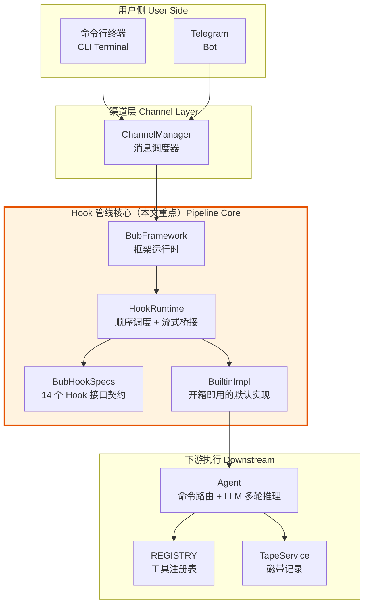

为什么把路由做成 Hook 管线而不是一组 if-else？原因有三：

1. **可替换性**：任何环节都能被第三方插件覆盖，而不是在一个巨大的函数里打补丁。
2. **可观测性**：`hook_report()` 一调用就能看到"谁注册了哪个 Hook"，调试不靠猜。
3. **渐进演进**：内置实现覆盖全部 Hook，团队可以只覆盖需要改的一两个，其余保持默认。

---

## 一、七步 Hook 管线：一条消息的完整旅程

### process_inbound 全流程

每条入站消息进入 `BubFramework.process_inbound()` 后，都会经历严格的七步管线。这不是随意的串联 —— 每一步的输出恰好是下一步的输入，形成一个闭合的数据流转链路。

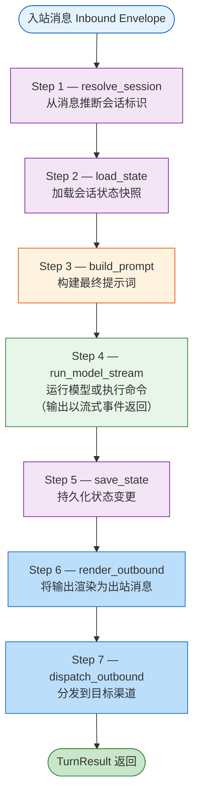

七步之间的「为什么这么排」并非偶然：

- **resolve_session 必须第一个**：后续所有步骤都需要 session_id 来定位上下文。
- **load_state 在 build_prompt 之前**：构建提示词可能需要读取历史状态（比如 context 字段）。
- **save_state 放在 run_model_stream 的 finally 块中**：无论模型运行成功还是失败，状态都必须被持久化 —— 这保证了磁带的完整性。
- **render 和 dispatch 分离**：同一份模型输出可能需要发到多个渠道（CLI 和 Telegram 同时回复），渲染和分发是独立关注点。

### 管线中的数据流转时序

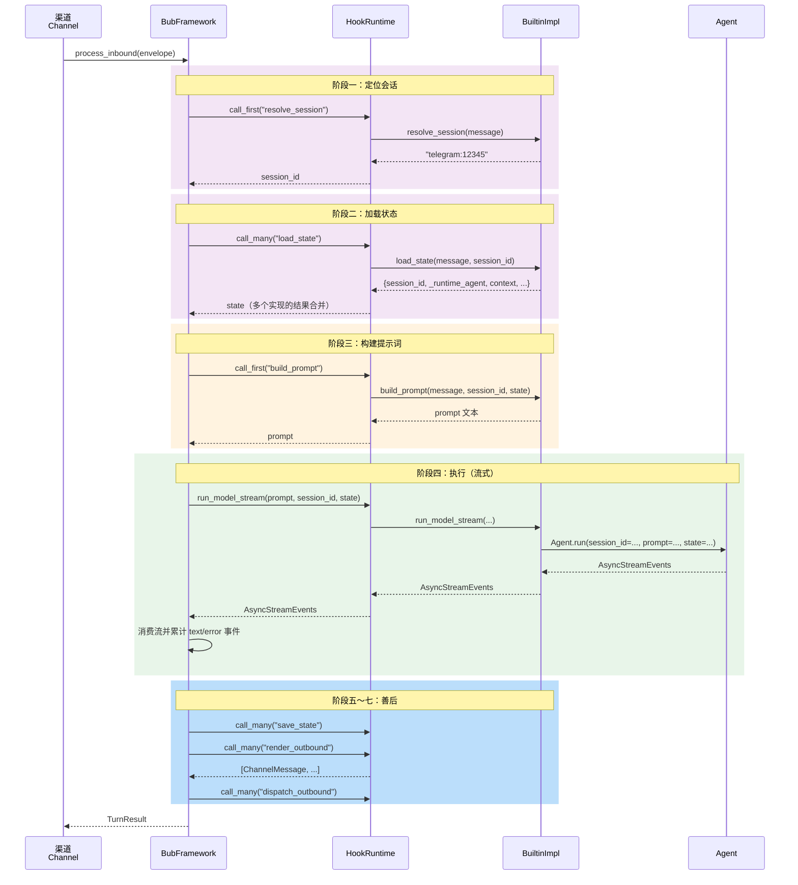

注意时序图中 `load_state` 使用的是 `call_many` 而非 `call_first` —— 框架会逆序遍历所有实现的返回值，依次合并为一份完整的 state 字典。这意味着多个插件可以各自贡献状态的不同部分，而不是「赢者通吃」。

---

## 二、HookRuntime：Hook 调度引擎

HookRuntime 是 pluggy 之上的薄调度层。它主要解决两个问题：**按声明签名注入参数**以及**异步/同步执行模型的自动适配**；同时为流式模型输出提供 `run_model_stream` 的统一入口。

### 为什么需要这一层

直接用 pluggy 的 `hook.xxx()` 调用有几个不足：

1. **调用接口僵硬** —— Hook 规范如果声明了 4 个参数，每个实现都必须全部接收，即使它只关心其中 1 个。
2. **无法桥接 async / sync** —— pluggy 不理解 awaitable 返回值；Bub 需要让同步引导路径（CLI 注册命令等）和异步请求处理路径共用同一组 Hook。
3. **流式输出需要降级** —— 插件可能只实现同步的 `run_model`，框架希望统一走 `run_model_stream` 的流式模型。

HookRuntime 通过 `_kwargs_for_impl()` 自动过滤参数、通过 `_invoke_impl_sync` / `_invoke_impl_async` 分别适配两种执行模型，并在 `run_model_stream()` 中把纯文本 `run_model` 自动包装成单事件流。错误的传播与观察由 `notify_error` 独立处理（详见第七节的错误防线）。

### 两种调用模式

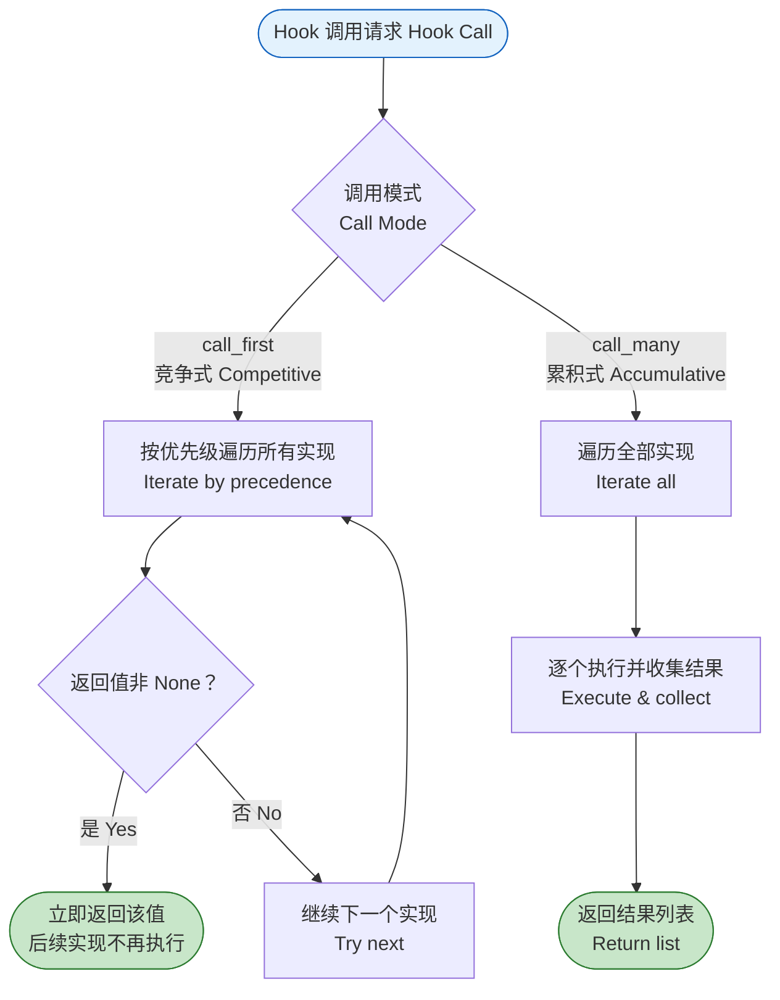

哪些 Hook 用哪种模式？背后的设计直觉是：**有且只需要一个答案的用 call_first，需要多方协作的用 call_many**。

- `resolve_session` 用 call_first —— 一条消息只有一个 session_id。
- `save_state` 用 call_many —— 多个插件可能各自需要保存不同维度的状态（内置写磁带，第三方写 Redis）。
- `system_prompt` 用 call_many —— 系统提示词由多个片段拼接而成。

### 异常传播与观察模型

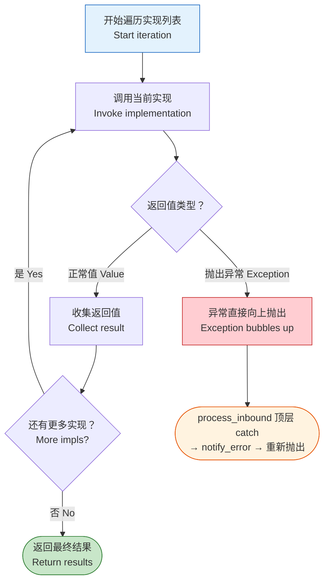

**业务 Hook 的异常不被 HookRuntime 吞掉**：当某个实现抛异常，`call_first` / `call_many` 让它一路冒泡到 `process_inbound` 的顶层 `try...except`，触发 `notify_error(stage="turn")` 将异常广播给所有 `on_error` 观察者，然后原样重新抛出。这意味着：

- **单个插件崩溃会中断当前这轮**，但磁带 `save_state`（处于 finally 块）仍会执行，上下文不会丢失。
- **`on_error` 观察者之间保持隔离**：`notify_error` 在每个观察者外面单独 try-catch，单个观察者崩溃不影响其他观察者，原始异常也不会被掩盖。
- **`_SKIP_VALUE` 仅在同步调用路径被使用**：当同步 `_invoke_impl_sync` 遇到返回 awaitable 的实现时，会打日志并返回 `_SKIP_VALUE`，让 `call_first_sync` 继续尝试下一个实现。它不是业务异常的降级通道。
- **`run_model_stream` 返回 `None` 时会降级**：若所有实现都没有给出流，框架把 prompt 原文当作 model_output 返回（见第七节第二层防线）。

### 智能参数注入

HookRuntime 通过 `_kwargs_for_impl()` 检查每个实现函数的签名（`impl.argnames`），只传递它实际声明的参数。

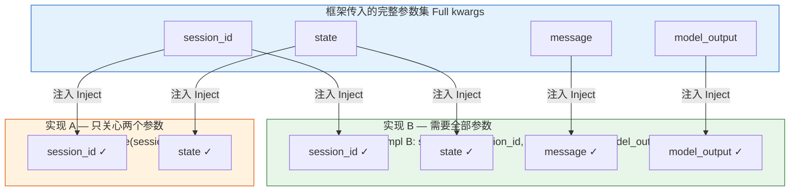

这个设计带来的好处是：**新增参数不会破坏已有插件**。假设未来 hookspec 的 `save_state` 增加一个 `turn_id` 参数，旧的插件实现不声明这个参数就不会收到它，完全不需要改代码。这是一种向前兼容的保障。

### 同步与异步兼容

HookRuntime 同时提供四组 API：

| 异步版本 | 同步版本 | 用途 |
|---------|---------|------|
| `call_first()` | `call_first_sync()` | 竞争式调用 |
| `call_many()` | `call_many_sync()` | 累积式调用 |
| `notify_error()` | `notify_error_sync()` | 错误通知 |

同步路径中遇到异步实现会怎样？**自动跳过并记录警告**，返回 `_SKIP_VALUE`。这保证了引导阶段（CLI 启动、`create_cli_app()` 注册命令）可以安全调用 Hook，即使某些插件的实现是异步的。

此外，HookRuntime 的 `run_model_stream()` 提供特殊降级：先逆序扫描已注册插件，优先触发实现了 `run_model_stream` 的插件；若只实现了纯文本的 `run_model`，则把结果自动包装成单事件 `AsyncStreamEvents`（单个 `StreamEvent("text", {"delta": result})`）。这使得同一段 Hook 代码既可以是流式也可以是一次性返回，框架上层透明处理。

---

## 三、14 个 Hook 接口：契约全览

所有 Hook 接口定义在 `hookspecs.py` 的 `BubHookSpecs` 类中，通过 pluggy 的 `@hookspec` 装饰器声明。

### 按调用模式分类

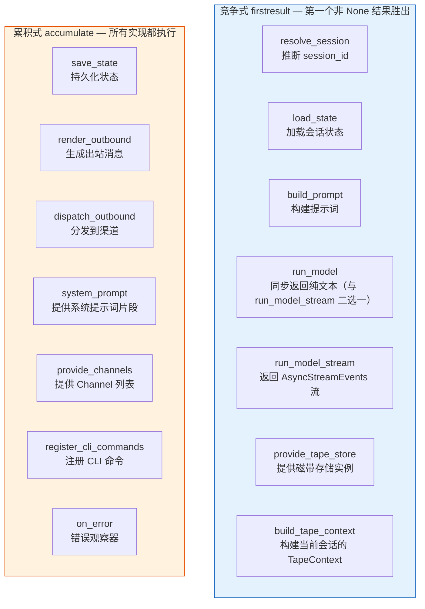

### 接口详细说明

| Hook | 模式 | 参数 | 返回值 | 职责 |
|------|------|------|--------|------|
| `resolve_session` | firstresult | `message` | `str` | 从入站消息推断会话标识 |
| `load_state` | firstresult | `message, session_id` | `State` | 加载会话状态快照 |
| `build_prompt` | firstresult | `message, session_id, state` | `str \| list[dict]` | 将消息转换为模型可消费的提示词，支持多模态 |
| `run_model` | firstresult | `prompt, session_id, state` | `str` | 一次性返回纯文本输出（与 `run_model_stream` 二选一） |
| `run_model_stream` | firstresult | `prompt, session_id, state` | `AsyncStreamEvents` | 返回流式事件（text / error / ...），主管线优先使用 |
| `save_state` | 累积 | `session_id, state, message, model_output` | `None` | 持久化状态更新 |
| `render_outbound` | 累积 | `message, session_id, state, model_output` | `list[Envelope]` | 将模型输出渲染为出站消息列表 |
| `dispatch_outbound` | 累积 | `message` | `bool` | 将单条出站消息发送到外部渠道 |
| `system_prompt` | 累积 | `prompt, state` | `str` | 提供系统提示词的一个片段 |
| `provide_channels` | 累积 | `message_handler` | `list[Channel]` | 向框架注册消息接收渠道 |
| `provide_tape_store` | firstresult | 无 | `TapeStore \| AsyncTapeStore` | 提供磁带存储后端 |
| `build_tape_context` | firstresult | 无 | `TapeContext` | 提供构建上下文消息所用的 TapeContext |
| `register_cli_commands` | 累积 | `app` | `None` | 向 Typer CLI 应用注册命令 |
| `on_error` | 累积 | `stage, error, message` | `None` | 观察框架中任何阶段的错误 |

注意 `load_state` 虽然在 hookspec 中声明为 `firstresult`，但 `process_inbound` 的实际调用使用的是 `call_many` 并逆序合并 —— 这是框架层面对 hookspec 的灵活运用，让多个插件可以各自贡献状态片段。

---

## 四、默认实现：BuiltinImpl

`BuiltinImpl` 位于 `builtin/hook_impl.py`，提供全部 Hook 的默认实现。它在框架启动时被注册为名为 `"builtin"` 的插件 —— 优先级最低，任何第三方插件的 firstresult 实现都会自动优先于它。

### 默认行为一览

```mermaid
graph TB
    subgraph bi["BuiltinImpl 默认行为 Default Behaviors"]
        direction TB
        D1["resolve_session<br/>→ channel:chat_id 格式"]
        D2["load_state<br/>→ 提取 session_id + _runtime_agent + context"]
        D3["build_prompt<br/>→ 检测逗号前缀 / 拼接 context + content"]
        D4["run_model_stream<br/>→ 返回 Agent.run() 的 AsyncStreamEvents"]
        D5["system_prompt<br/>→ DEFAULT_SYSTEM_PROMPT + AGENTS.md 内容"]
        D6["save_state<br/>→ 管理 lifespan 上下文退出"]
        D7["render_outbound<br/>→ 包装为 ChannelMessage"]
        D8["dispatch_outbound<br/>→ 日志记录 + 交由 OutboundChannelRouter"]
        D9["provide_channels<br/>→ [TelegramChannel, CliChannel]（按 BUB_ENABLED_CHANNELS 过滤）"]
        D10["provide_tape_store<br/>→ FileTapeStore"]
        D11["build_tape_context<br/>→ default_tape_context()"]
        D12["on_error<br/>→ 生成错误 ChannelMessage 分发回渠道"]
        D13["register_cli_commands<br/>→ run / chat / gateway / hooks / install / uninstall / update / login"]
    end

    style bi fill:#e8f5e9,stroke:#2e7d32
```

### build_prompt：管线中的关键转换点

`build_prompt` 是管线中最微妙的一步 —— 它不只是拼接字符串，还承担了**命令识别**的职责。这个决策直接影响下游 `run_model` 走命令路径还是 LLM 推理路径。

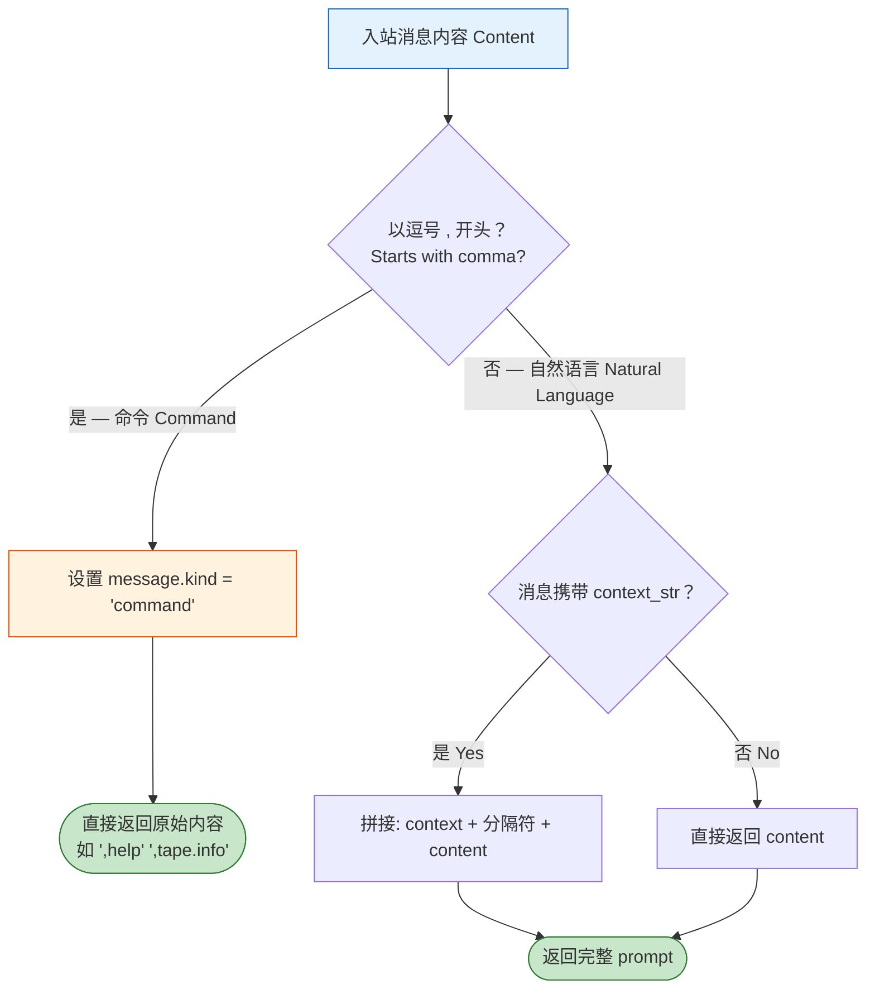

为什么命令识别在 build_prompt 而不是在 Agent 里？因为 `message.kind` 的设置需要在管线的较早阶段完成 —— 后续的 render_outbound 可能会根据 kind 做不同的渲染处理。build_prompt 是信息最充分（有 message、session_id 和 state）同时又在 run_model 之前的唯一窗口。

### on_error：错误不沉默

`on_error` 的默认实现不只是记日志 —— 它会构造一条 kind="error" 的 ChannelMessage，直接调用 dispatch_outbound 把错误信息发回给用户。这意味着：

- **用户不会因为后台异常而等待超时** —— 错误消息会主动推送。
- **错误观察器之间互不干扰** —— `notify_error` 为每个 on_error 实现独立 try-catch，一个观察器崩溃不影响其他观察器。

---

## 五、命令路由：Agent 中的逗号分流

> **读到这里你可能会问**：前四节都在讲 Hook 管线和框架层面的机制，为什么突然跳到 Agent 内部的命令路由？

答案藏在管线的 **第四步 `run_model_stream`** 里。回顾一下：当消息走过 resolve_session → load_state → build_prompt 之后，`run_model_stream` Hook 被调用——而它的默认实现 `BuiltinImpl.run_model_stream()` 做的唯一一件事，就是把执行权**委托给 `Agent.run()`**，并把得到的 `AsyncStreamEvents` 直接向上传递。

也就是说，命令路由是管线旅程中 **不可跳过的下一站**：

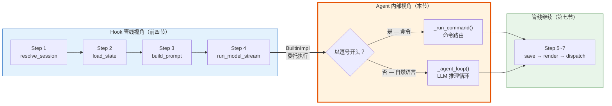

上图中加粗橙色边框的部分就是本节要展开的内容。我们从管线的"编排者"视角，**下潜到 `run_model` 内部**，看看 Agent 如何决定一条消息该走命令路径还是推理路径。至于推理路径（`_agent_loop`）的详细机制，将在[下一篇](./03-Agent循环与模型运行.md)中展开。

命令路由从早期架构中的独立模块（InputRouter / CommandDetector）下沉到了 `Agent.run()` 内部。设计哲学很明确：**管线只管消息流转，命令解析是 Agent 的内部事务**。

### 核心决策流程

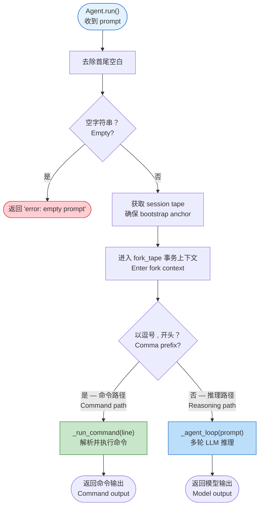

### 命令执行的内部流程

上面的"核心决策流程"图中，左分支 `_run_command()` 只是一个方框——现在我们打开这个方框，看看它内部是怎么工作的。一条以逗号开头的输入（比如 `,tape.info` 或 `,git status`）进入 `_run_command()` 后，需要经历三个关键决策：**命令名是否在 REGISTRY 中？参数怎么解析？工具是否需要运行时上下文？**

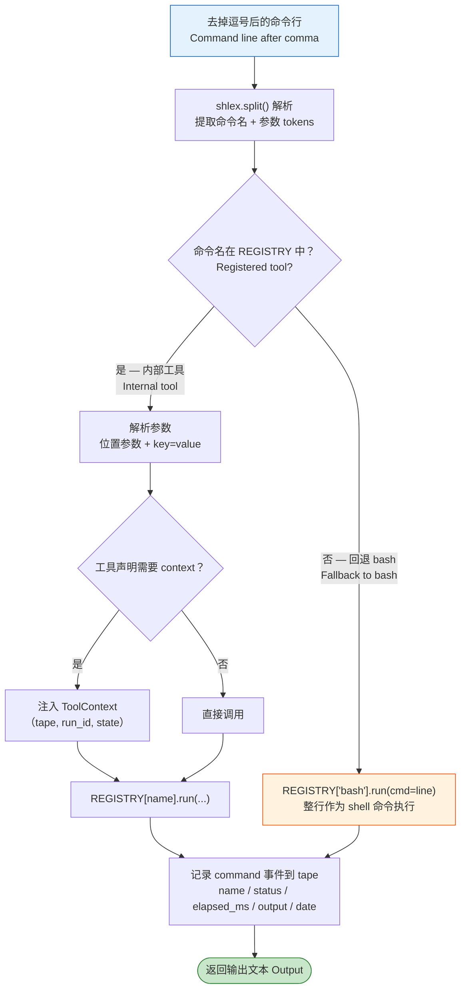

bash 回退的设计值得深思 —— 它让用户可以直接输入 `,git status`、`,ls -la` 这类 shell 命令而不需要预先注册为工具。这极大降低了日常使用的摩擦。但凡输入了一个不存在的命令名，框架不会报"命令未找到"，而是把整行当作 bash 命令执行。

### 三类输入的路由去向

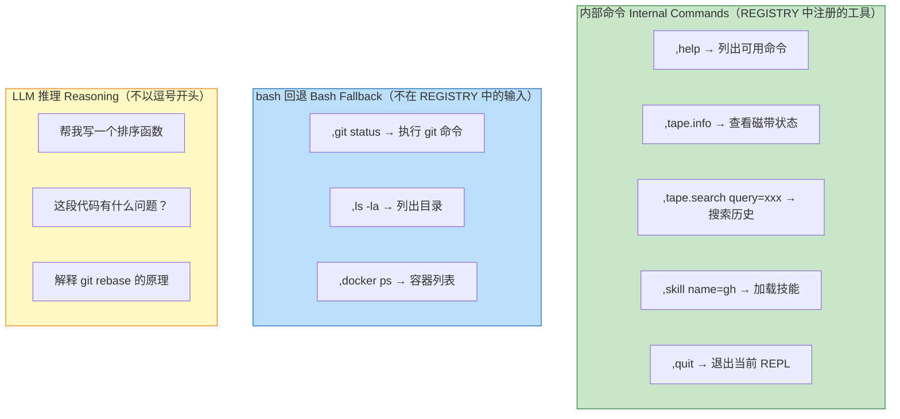

### 参数解析规则

命令的参数解析遵循简单但严格的规则：

| 参数类型 | 格式 | 示例 |
|---------|------|------|
| 位置参数 | 空格分隔的 token | `,bash ls -la` → positional: ["ls", "-la"] |
| 键值参数 | `key=value` 格式 | `,tool.describe name=bash` → kwargs: {name: "bash"} |

**关键约束**：键值参数一旦出现，后面不能再跟位置参数 —— 否则会抛出 ValueError。这个约束让解析器保持简单可预测。

---

## 六、插件加载与扩展机制

前五节我们一直在跟踪一条消息的**运行时旅程**——从入站到管线处理，再到 Agent 内部的命令路由。但有一个前提被一笔带过了：管线中的每个 Hook 背后，到底是**谁**在响应？`BuiltinImpl`？第三方插件？还是两者兼有？

这个问题的答案在框架**启动阶段**就已经确定了。管线能跑起来，靠的是启动时完成的插件注册。现在我们把时间线往前拨，看看在第一条消息到达**之前**，框架做了什么准备工作：

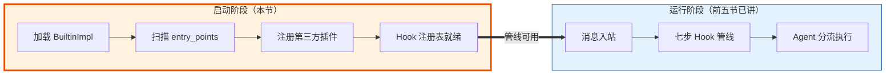

### 框架启动时的插件发现

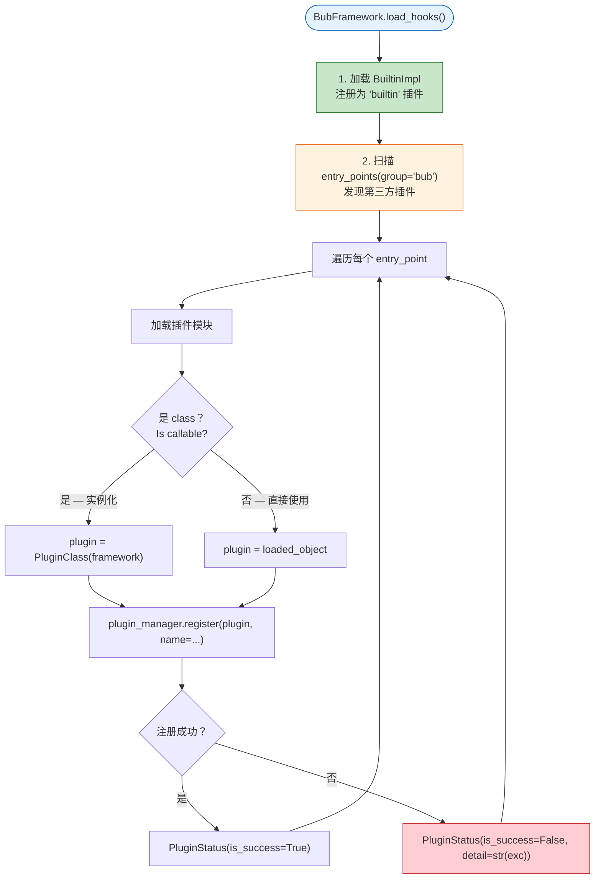

注意两个设计细节：

1. **Builtin 始终第一个加载** —— 它是所有 Hook 的兜底实现，即使所有第三方插件都加载失败，框架仍然可以正常工作。
2. **每个插件的加载结果都被记录** —— `_plugin_status` 字典记录每个插件的成功/失败状态，可通过 `hook_report()` 查看。

### 覆盖 vs 扩展：如何选择策略

| 场景 | 策略 | Hook 模式 | 示例 |
|------|------|----------|------|
| 替换 session 解析逻辑 | 覆盖 | firstresult（高优先级实现先返回） | 基于 JWT token 解析 session |
| 添加额外系统提示 | 扩展 | 累积（所有实现拼接） | 新增 RAG 上下文作为 system_prompt 片段 |
| 替换 LLM 后端 | 覆盖 | firstresult | 自定义 run_model 走本地模型 |
| 添加状态持久化 | 扩展 | 累积 | 新增 save_state 写入 Redis |
| 接入新渠道 | 扩展 | 累积 | 新增 provide_channels 返回 Slack Channel |
| 自定义错误处理 | 扩展 | 累积 | 新增 on_error 发送告警到钉钉 |

---

## 七、管线状态机与错误处理

### 状态机视角

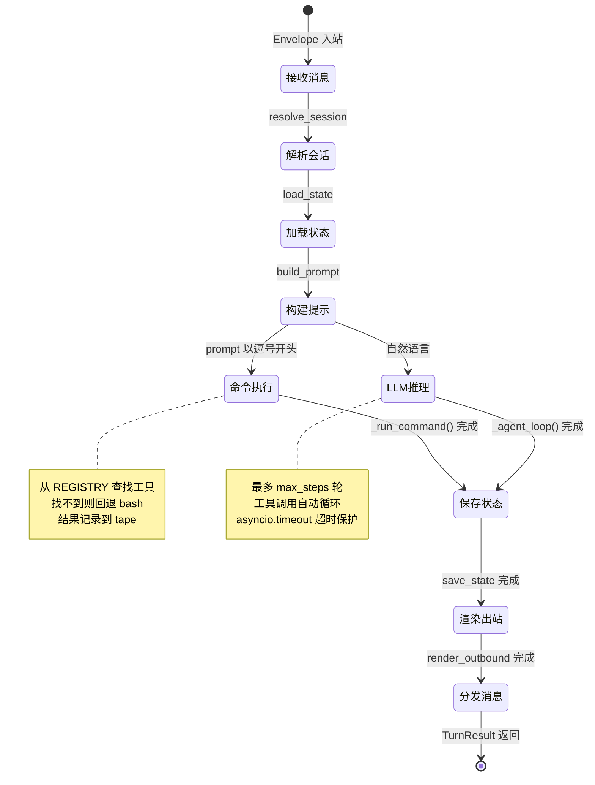

### 错误处理的三层防线

管线的错误处理不是简单的"try-catch + 打日志"，而是在几个确定的位置分工合作：

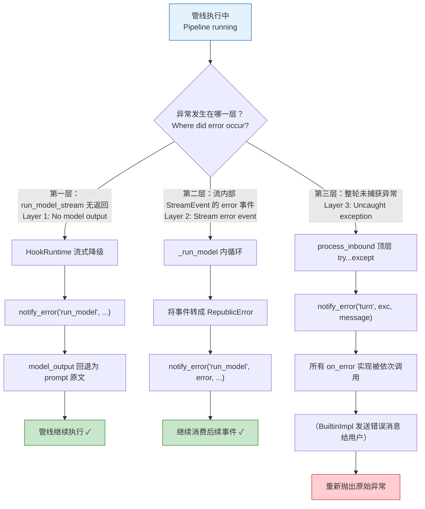

三层防线的职责切分：

- **第一层**：`run_model_stream` 对插件的实现做兜底——一个都没提供就把 prompt 原文当作输出，不让管线崩在没人响应的地方。
- **第二层**：流里出现 `kind="error"` 的事件（比如 LLM 返回错误），框架将其转成 `RepublicError` 并通知观察者，流可以继续吐后续内容。
- **第三层**：业务 Hook 真的抛出未捕获异常时（例如第三方 build_prompt 出 bug），由 `process_inbound` 的顶层 `try...except` 统一接住，广播给所有 `on_error` 实现后原样重抛——交给更上层（ChannelManager、CLI 或 gateway）决定如何处理。

注意 `on_error` 观察器本身仍然是隔离的 —— `notify_error` 在每个 on_error 实现外单独 try-catch。一个观察器崩溃不会阻止其他观察器执行，也不会掩盖原始异常。但 **业务 Hook（非 on_error）本身不再享有 per-impl 的 try-catch**：一个 `build_prompt` 或 `render_outbound` 如果抛异常，当前这轮就会失败并进入第三层防线。

---

## 八、诊断工具：hook_report

当框架行为不符合预期时，第一件事应该是检查 Hook 的实际注册情况。`hook_report()` 遍历 plugin_manager 中所有已注册的 hook，返回一个 `{hook_name: [adapter_names]}` 的字典映射。

通过 CLI 运行 `bub hooks` 命令即可查看完整报告 —— 它会显示每个 Hook 有哪些插件提供了实现，以及它们的执行顺序。这对于调试"为什么我的插件没生效"这类问题至关重要：

- 如果你的 firstresult Hook 实现没被调用，很可能是另一个更高优先级的插件先返回了结果。
- 如果你的 accumulate Hook 实现的输出被忽略，检查框架层面是否对结果做了过滤。

---

## 小结

Hook 管线是 Bub 的请求处理中枢。回顾它的核心设计决策：

1. **七步管线，步步有因** —— 每一步的位置都有明确理由，数据流转形成闭环。
2. **HookRuntime 薄而克制** —— 智能参数注入让接口演进不破坏已有实现；`run_model_stream` 统一桥接流式与同步返回；业务 Hook 的异常不被吞掉，而是交给顶层的 `notify_error` 广播。
3. **两种调用模式，各司其职** —— firstresult 用于"需要一个确定答案"的场景，accumulate 用于"多方协作"的场景。
4. **命令路由下沉到 Agent** —— 管线只管消息的生命周期流转，逗号命令的解析是 Agent 的内部实现细节。
5. **三层错误防线** —— 无实现降级、流内部 error 事件、整轮兜底 `on_error` 广播并重抛，各司其职。
6. **渐进式扩展** —— BuiltinImpl 开箱即用，第三方插件按需覆盖，entry_points 自动发现。

下一篇：[Agent 循环与模型运行](./03-Agent循环与模型运行.md)
