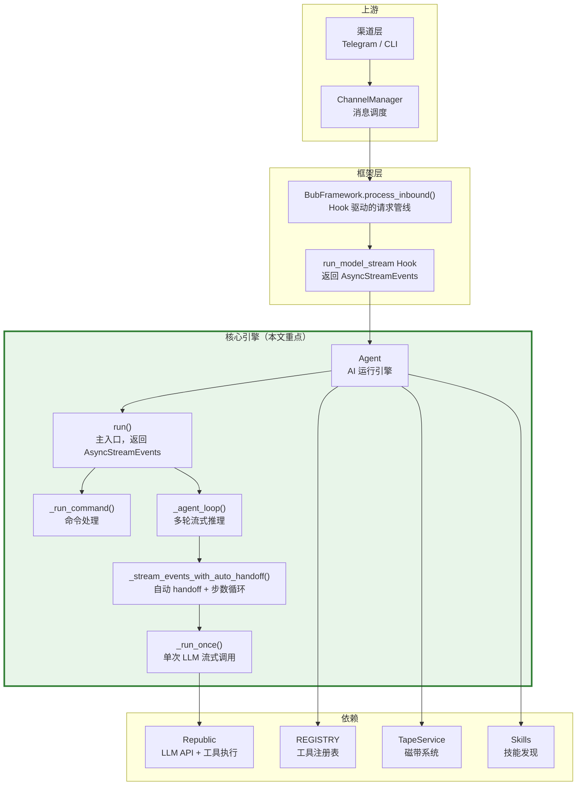
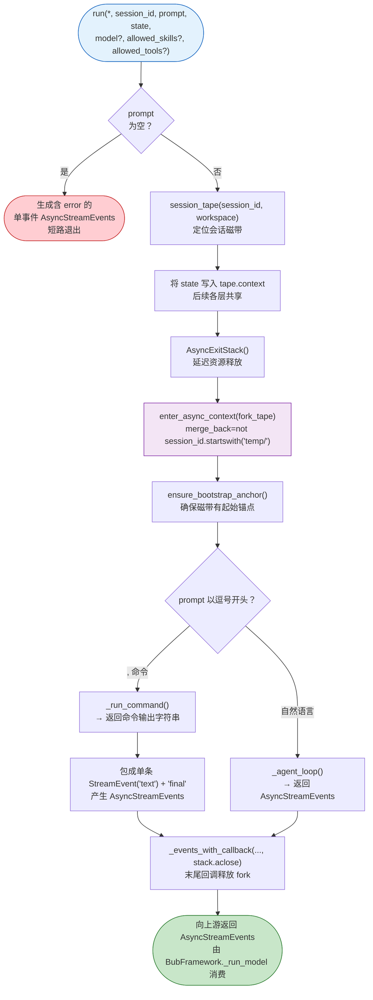
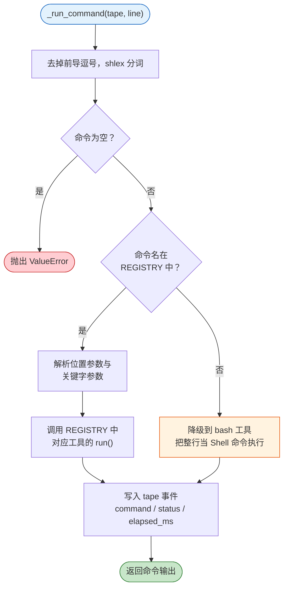
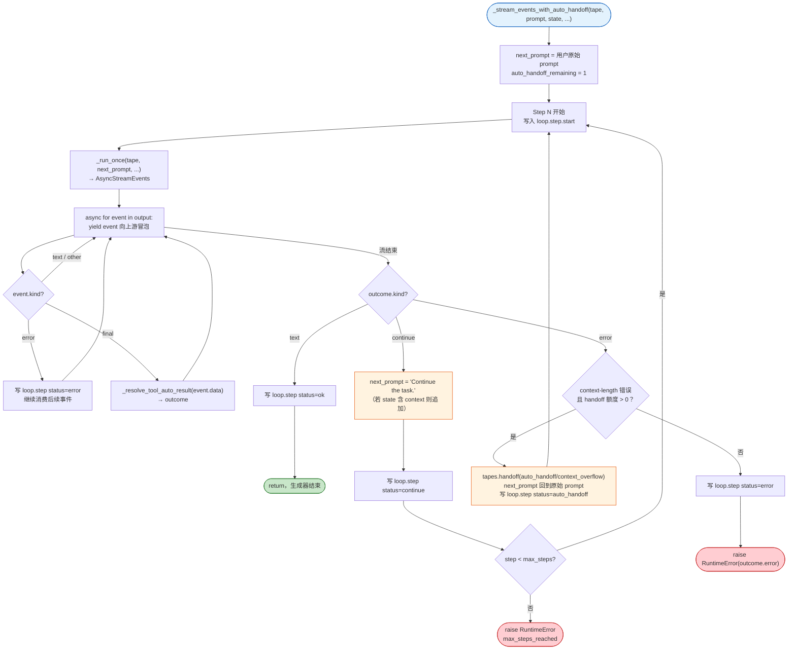
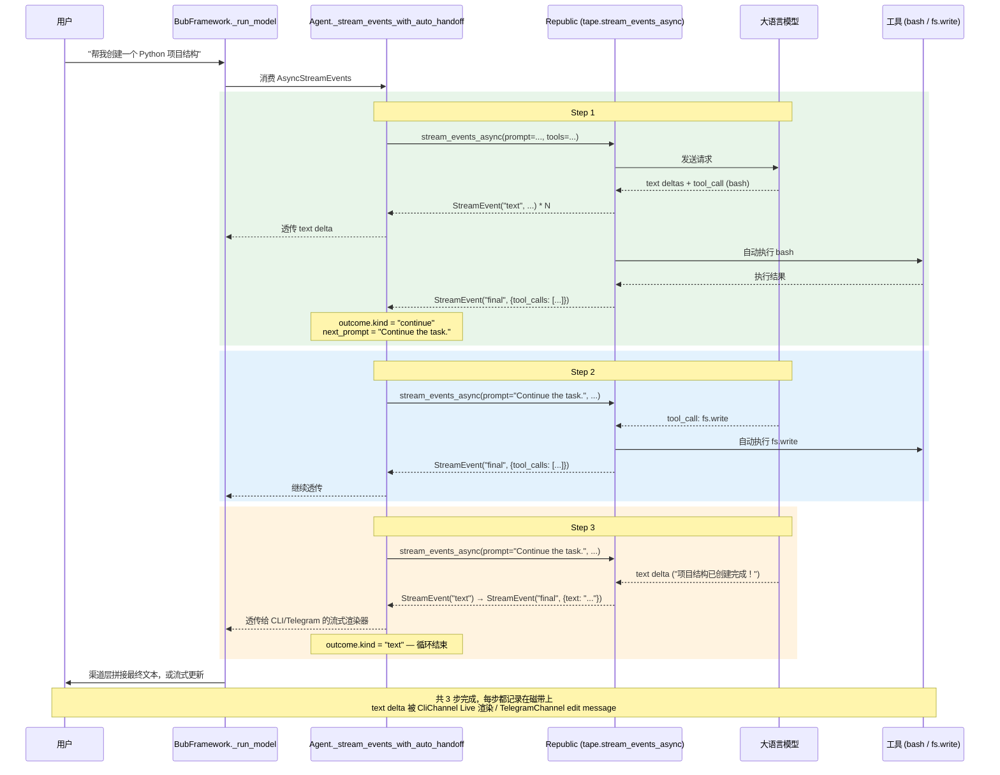
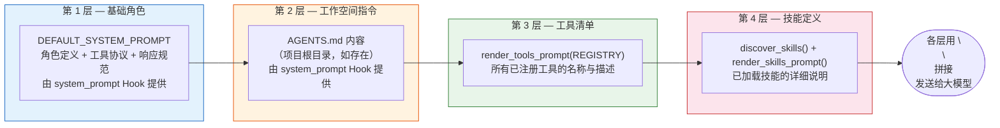
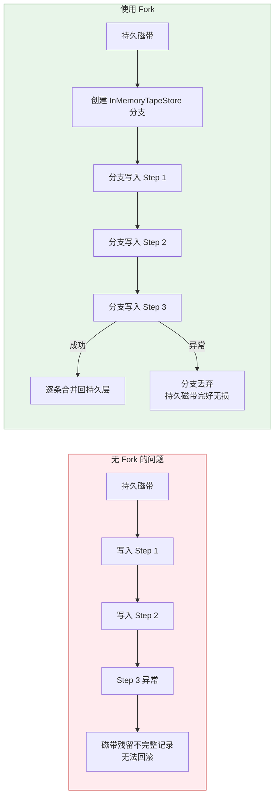
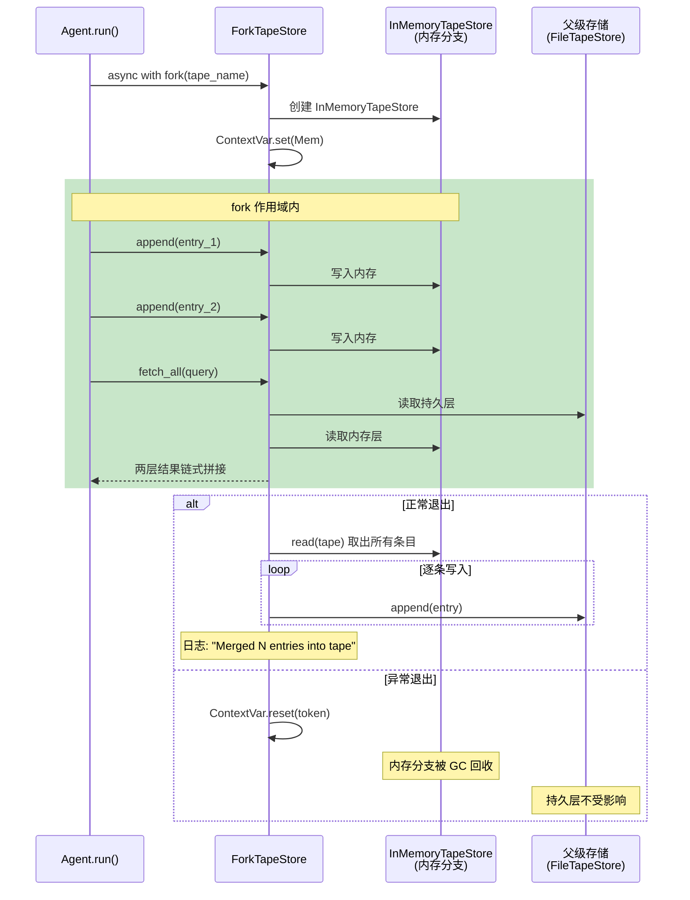
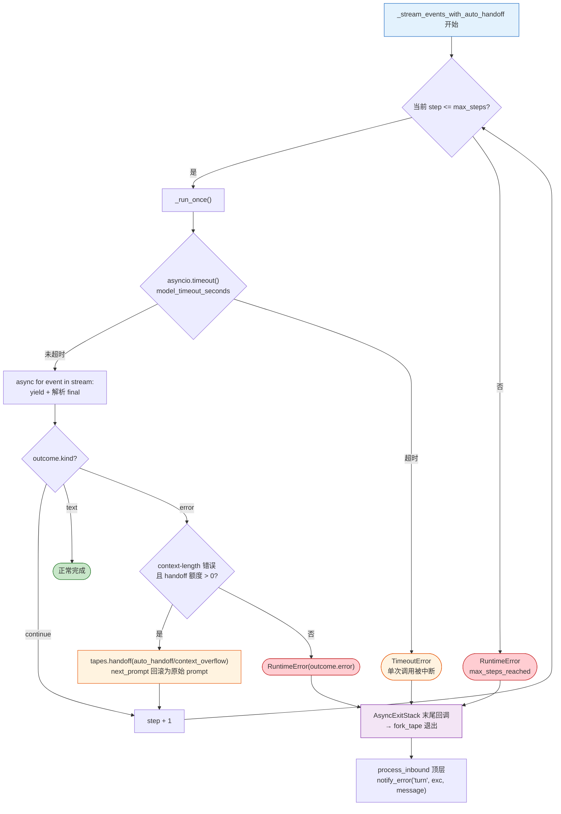
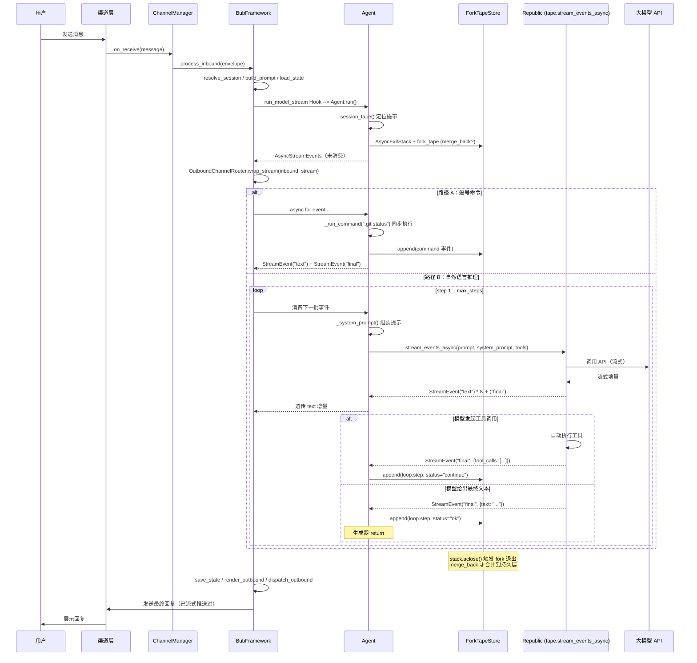

# Agent 核心引擎

> Bub 的「大脑」是怎样工作的？本文从产品经理视角，拆解 Agent 如何接收一条用户消息、决定走命令还是推理、驱动大模型多轮思考与工具调用、通过流式事件向上游输出，最终将结果安全地写回磁带并返回给用户。

---

## 在全局架构中的位置

Agent（`builtin/agent.py`）是 Bub 整个框架中唯一与大语言模型直接打交道的模块。它通过 `run_model_stream` Hook 接入 `BubFramework`，在内部完成 **命令解析 / 多轮流式推理 / 工具调用 / 上下文溢出自动 handoff / 磁带记录** 的全部工作。理解 Agent，就理解了 Bub 的核心运行逻辑。

---

## 一、run() —— 统一入口，两条路径，流式返回

所有进入 Agent 的请求都经过同一个 `run()` 方法。它做五件事情：空输入拦截、获取会话磁带、**通过 AsyncExitStack 延迟 fork 释放**、路由分发，并始终返回一个 `AsyncStreamEvents`。

### 设计要点

- **纯关键字签名**：`run(*, session_id, prompt, state, model=None, allowed_skills=None, allowed_tools=None)` —— 所有参数以关键字传入，新增参数不会破坏已有调用方。`allowed_skills` / `allowed_tools` 主要由 `subagent` 工具使用，用于收缩子代理的能力边界。
- **多模态 prompt**：参数类型是 `str | list[dict]`，列表形式对应 OpenAI 多模态 content parts（如图片 + 文本混合）。
- **确定性路由**：只有 `,` 开头才是命令，没有任何歧义。同一条规则对用户输入和 AI 输出都适用。
- **AsyncExitStack 延迟释放**：fork_tape 的上下文不能在 `run()` 返回前就退出，否则流还没消费完 fork 已合并。Agent 使用 `AsyncExitStack` 把 fork 进入事务，再把 `stack.aclose` 作为回调附加在最终流的末尾，确保 fork 的释放**与最后一条流事件同步**。
- **merge_back 语义**：默认情况下 fork 在结束时把条目合并回父磁带；但若 `session_id` 以 `"temp/"` 开头（subagent 的一次性会话），则置 `merge_back=False`，fork 被直接丢弃 —— 子代理的中间过程不污染主磁带。
- **State 透传**：`state` 字典会被挂到 `tape.context.state`，让后续的系统提示组装、上下文构建等环节都能读到渠道和会话信息。

---

## 二、_run_command() —— 逗号命令快速执行

当用户输入 `,tape.info` 或 `,git status` 这样以逗号开头的文本时，Agent 不会调用大模型，而是直接在本地执行。

### 路由策略

### 关键细节

| 行为 | 说明 |
|------|------|
| **REGISTRY 优先** | `,tape.info`、`,help` 这类已注册工具直接调用，零延迟 |
| **Bash 兜底** | `,git status`、`,ls -la` 等未注册命令降级到 `bash` 工具（`await REGISTRY["bash"].run(...)`），无需额外配置 |
| **ToolContext 注入** | 执行时构造 `ToolContext(tape=tape.name, run_id="run_command", state=tape.context.state)`；如果工具声明需要 context，会自动注入到 kwargs |
| **参数解析** | 支持 `positional` 和 `key=value` 两种格式，关键字参数不可出现在位置参数之前 |
| **计时与审计** | 无论成功还是失败，`finally` 块都会向磁带写入 `command` 事件，包含原始命令、解析出的命令名、执行状态、耗时（毫秒）和输出内容 |
| **异步工具兼容** | 若工具 `run()` 返回 awaitable，Agent 会自动 await，同步/异步工具无差别调用 |
| **异常透传** | 如果执行中出错，先标记 `status=error` 并记录，再将异常原样抛出；`run()` 的上层会把异常包装成 `error` 流事件传给框架 |

---

## 三、_agent_loop() —— 多轮流式推理的核心循环

这是 Bub 最关键的一段逻辑。当用户输入的是自然语言（不以 `,` 开头），Agent 进入多轮流式推理循环：反复调用大模型、执行工具、再调用大模型，同时把每一步的流式事件（text / final / error / tool_call 等）实时向上冒泡，直到模型认为任务完成并给出最终回复，或者触发安全边界停止。

`_agent_loop()` 本身只负责把 `loop.start` 事件写入磁带并包装好一个 `AsyncStreamEvents(iterator, state=state)`——真正的流生成发生在 `_stream_events_with_auto_handoff()` 异步生成器里。

### `final` 事件的三种结局

每一轮 `_run_once()` 返回的 `AsyncStreamEvents` 在末尾都会产出一个 `kind="final"` 的事件，`final_data` 里包含 `tool_calls` / `tool_results` / `text` 等字段。Agent 通过 `_resolve_tool_auto_result(final_data)` 将它归类为三种明确的结局：

| kind | 判定方式 | 含义 | 循环行为 |
|------|---------|------|----------|
| **text** | `final_data["text"]` 非 None 且没有 tool_calls/tool_results | 模型给出了最终文本回复 | 写 `status=ok`，生成器 return |
| **continue** | `final_data["tool_calls"]` 或 `tool_results` 非空 | 模型发起了工具调用并已被 Republic 自动执行，还需继续 | 用 `"Continue the task."` 作为下一轮 prompt（若 state 含 `context` 再追加 `[context: ...]`），继续循环 |
| **error** | 既没有 text 也没有 tool_calls/tool_results | 未知错误 | 进入 error 分支（可能走 auto-handoff 或抛出 RuntimeError） |

### 自动 handoff：上下文溢出的隐形回退

多轮循环最容易触碰的天花板是 LLM 的 context window —— 当历史 tape + 工具结果累积到一定规模，模型就会报 `context_length_exceeded` 之类的错误。Bub 提供了一次自动 handoff 的挽救机会（由 `MAX_AUTO_HANDOFF_RETRIES = 1` 控制）：

- `_is_context_length_error()` 用正则（关键字：context length、maximum context、token limit、prompt too long 等）匹配错误信息。
- 命中时调用 `tapes.handoff(tape.name, name="auto_handoff/context_overflow", state={...})`，在磁带上建立一个 handoff 锚点 —— 后续的上下文构建只会读取锚点之后的历史，相当于强制"翻篇"。
- 随后 `next_prompt` 被重置为用户最初的原始 prompt 重新入队，并写一条 `status=auto_handoff` 的 `loop.step` 供审计。
- 如果二次命中还是上下文溢出（额度为 0），才真正抛出 RuntimeError。

这让一次长对话意外膨胀时用户也能看到一次自动恢复的尝试，而不是硬失败。

### 多轮流式交互时序

下面用一个真实场景——用户要求创建 Python 项目结构——展示流式事件在多轮循环中的传播路径：

---

## 四、_run_once() 与系统提示组装

`_run_once()` 是与大模型交互的最底层方法，每次循环迭代调用一次。它的职责有四：**按 `allowed_tools` 过滤工具集 / 组装系统提示 / 调用 `tape.stream_events_async` / 超时保护**。

### 系统提示的四层叠加

Agent 每次调用大模型前，都会通过 `_system_prompt()` 动态组装一份完整的系统提示词。它分为四层，由不同来源贡献：

### 技能按需展开（Hint Activation）

默认情况下，技能只以摘要形式出现在系统提示中，节省 token。当用户在 prompt 中使用 `$skill_name` 语法（例如 `$gh`、`$web.search`）时，Agent 会通过 `HINT_RE` 正则匹配提取技能名，然后将对应技能的完整定义展开注入到系统提示里，让模型获得足够上下文来准确使用该技能。

### LLM 构建与认证策略

Agent 通过 `_build_llm(settings, tape_store, tape_context)` 构建 LLM 实例并交给 `TapeService`。关键点：

- **`api_key_resolver=openai_codex_oauth_resolver()`** —— Republic 提供的 OAuth 解析器。如果选用 OpenAI 原生且未显式配置 `api_key`，会走 Codex OAuth（通过 `bub login` 交互式登录）；其他配置下 resolver 让位给 `api_key`。
- **`fallback_models`**：按顺序尝试的候选模型列表（来自 `AgentSettings.fallback_models`），用于主模型配额/下线时自动降级。
- **`api_format` / `api_base` / `client_args`**：配合第三方兼容端点（例如 Claude via OpenRouter 兼容层、本地 vLLM、Azure OpenAI 等）使用。
- **`context=tape_context`**：把 `build_tape_context` Hook 返回的 `TapeContext` 注入 LLM，让它知道如何从磁带中抽取历史消息构造 prompt。
- **`verbose=settings.verbose`**：控制 Republic 侧的调用日志详略，便于调试。

### 上下文构建：context.py 与 build_tape_context Hook

`default_tape_context()` 为 Republic 的 Tape 提供了上下文选择函数 `_select_messages()`。这个函数遍历磁带中的所有条目，将 `message`、`tool_call`、`tool_result` 三种类型的条目转换为 OpenAI 兼容的消息格式（`role` / `content` / `tool_calls` / `tool_call_id`），供大模型在每一轮调用时读取完整的对话历史。

`default_tape_context()` 通过 `build_tape_context` Hook（`firstresult`）暴露出来 —— 这是 14 个 Hook 之一。第三方插件如果想实现完全不同的历史裁剪策略（例如"只看最近 N 条"、"按 anchor 分段"），只需注册自己的 `build_tape_context` 即可替换默认行为。

---

## 五、Fork 机制 —— 事务性磁带写入

### 为什么需要 Fork？

Agent 在一次 `run()` 过程中可能执行多步操作，如果每步直接写入持久磁带，一旦中途异常，主磁带就会残留不完整的记录。Fork 机制的核心思想：**先写到内存分支，全部完成后再一次性合并到持久层**。

### ForkTapeStore 工作原理

`ForkTapeStore`（`builtin/store.py`）基于 Python 的 `contextvars.ContextVar` 实现：

### 关键设计

- **ContextVar 隔离**：每个异步任务拥有独立的 fork 存储，天然支持并发场景下多个 Agent 同时运行而互不干扰。
- **finally 块保证**：无论成功还是异常，`ContextVar` 都会被重置；只在 `merge_back=True` 且有条目时才合并到父级。
- **merge_back 控制**：`run()` 对以 `temp/` 开头的 `session_id` 设置 `merge_back=False` —— 这是 subagent / 子代理的惯例，它们在一次性磁带上工作，结束后中间过程不合并回主磁带，只把结果作为工具输出返回。
- **AsyncExitStack 延迟退出**：fork 上下文由 `AsyncExitStack` 持有，`_events_with_callback` 在最后一条流事件被消费完之后才调用 `stack.aclose()` 触发 fork 退出——否则 fork 会在 `run()` 返回时提前合并，流里还没发完的事件就会写不进磁带。
- **读取合并**：`fetch_all()` 同时查询父级和当前 fork，将结果链式拼接返回，保证 fork 内读到的数据是完整的。

---

## 六、安全边界 —— 步数、超时与自动 handoff

Agent 循环如果失控（模型反复调用工具不收敛、API 长时间无响应、上下文越吃越大），可能消耗大量资源。Bub 设置了三道安全闸门：

### 三重防护机制

### 配置参数一览

| 参数 | 默认值 | 环境变量 | 作用 |
|------|--------|----------|------|
| `max_steps` | 50 | `BUB_MAX_STEPS` | 单次请求的最大循环步数，防止 AI 无限循环 |
| `model_timeout_seconds` | None | `BUB_MODEL_TIMEOUT_SECONDS` | 单次 LLM 流式调用的超时时间，None 表示不限制 |
| `max_tokens` | — | `BUB_MAX_TOKENS` | 单次响应的最大 token 数（由 `AgentSettings` 默认值决定） |
| `MAX_AUTO_HANDOFF_RETRIES` | 1 | — | 源码常量：单次 `_agent_loop` 内允许的自动 handoff 次数 |
| `model` | `openrouter:qwen/qwen3-coder-next` | `BUB_MODEL` | 使用的 LLM 模型 |
| `fallback_models` | `[]` | `BUB_FALLBACK_MODELS` | 主模型失败后的降级候选 |
| `api_format` / `api_base` | — | `BUB_API_FORMAT` / `BUB_API_BASE` | 非官方 OpenAI 兼容端点的自定义协议与地址 |
| `home` | `~/.bub` | `BUB_HOME` | 数据目录，磁带文件存储位置 |

所有参数通过 `AgentSettings`（Pydantic BaseSettings）加载，支持 `.env` 文件、YAML 配置、以及 `BUB_` 前缀的环境变量。

### 异常处理全景

无论哪种异常——LLM API 错误、工具执行失败、超时、达到步数上限、上下文溢出而且 handoff 额度耗尽——都遵循同一模式：

1. **流内部捕获**：`_run_once` 的流本身产生 `kind="error"` 事件时，会被写入 `loop.step status=error`，但循环不中断，继续消费后续事件。
2. **final 分类**：流末尾的 `final` 事件交给 `_resolve_tool_auto_result` 归类，决定是 text / continue / error。
3. **自动 handoff**：若是上下文溢出类错误且额度 > 0，插入 `auto_handoff/context_overflow` 锚点并重放原始 prompt，不直接抛出。
4. **硬失败才抛**：其余情况（步数上限、非上下文错误、二次溢出）通过 `raise RuntimeError(...)` 上抛；`process_inbound` 顶层捕获后 `notify_error("turn", ...)` 广播给 `on_error` 观察者并重新抛出；`BuiltinImpl.on_error` 会把错误封装成 `ChannelMessage` 推回对应渠道。
5. **AsyncExitStack 清理**：无论哪条退出路径，`stack.aclose()` 都会在最后释放 fork_tape，ContextVar 自动重置。

---

## 七、从请求到响应 —— 完整数据流

---

## 小结

Agent 是 Bub 的核心推理引擎，其设计围绕七个关键原则展开：

1. **统一入口，双路径分发，流式返回** —— `run()` 一律返回 `AsyncStreamEvents`；命令路径把输出包成单条 text+final 事件，推理路径直接转发下游流，上游（CliChannel / TelegramChannel）拿到的都是统一的事件流。
2. **多轮流式工具循环** —— 通过 Republic 的 `tape.stream_events_async()` 实现 LLM 调用与工具执行的自动化迭代，每一步的 text/final/error 事件都实时冒泡给上游，不再需要等整轮完成后再返回字符串。
3. **事务性磁带写入 + AsyncExitStack** —— Fork 机制基于 `contextvars` 实现内存分支隔离，并通过 AsyncExitStack 让 fork 在最后一条流事件被消费后才释放；`temp/` 会话可关闭 `merge_back` 供 subagent 使用。
4. **四层系统提示** —— 基础角色 + 工作空间指令 + 工具清单 + 技能定义，动态组装、按需展开，平衡信息量与 token 开销；`allowed_tools` / `allowed_skills` 可用于收缩子代理的能力域。
5. **三重安全边界** —— `max_steps` 防止无限循环，`asyncio.timeout(model_timeout_seconds)` 防止单次调用卡死，`MAX_AUTO_HANDOFF_RETRIES` 配合 `auto_handoff/context_overflow` 锚点提供一次免费的上下文溢出恢复。
6. **可插拔 TapeContext** —— `build_tape_context` Hook 允许第三方替换历史裁剪策略；`_build_llm` 通过 Codex OAuth resolver + fallback_models + api_format 适配多种 LLM 供应商。
7. **全链路审计** —— `loop.start` / `loop.step.start` / `loop.step`（ok / continue / error / auto_handoff）/ `command` 事件全部写入磁带，每一步耗时、状态、错误信息都可追溯、可搜索。

下一篇：[磁带记录系统](./04-磁带记录系统.md)
