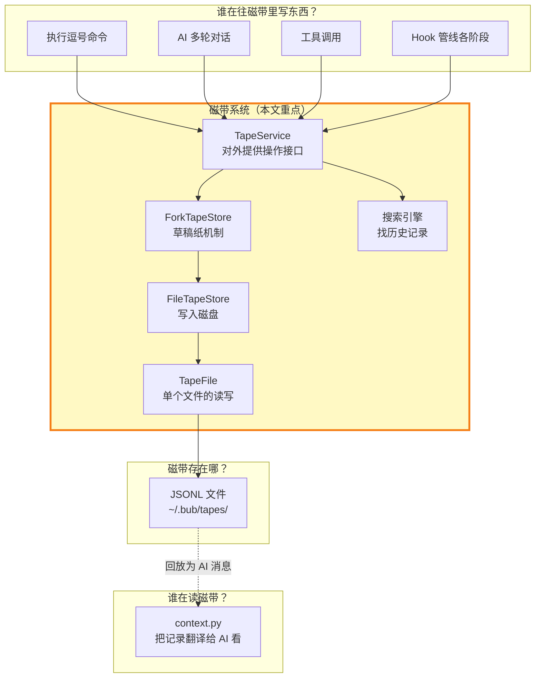
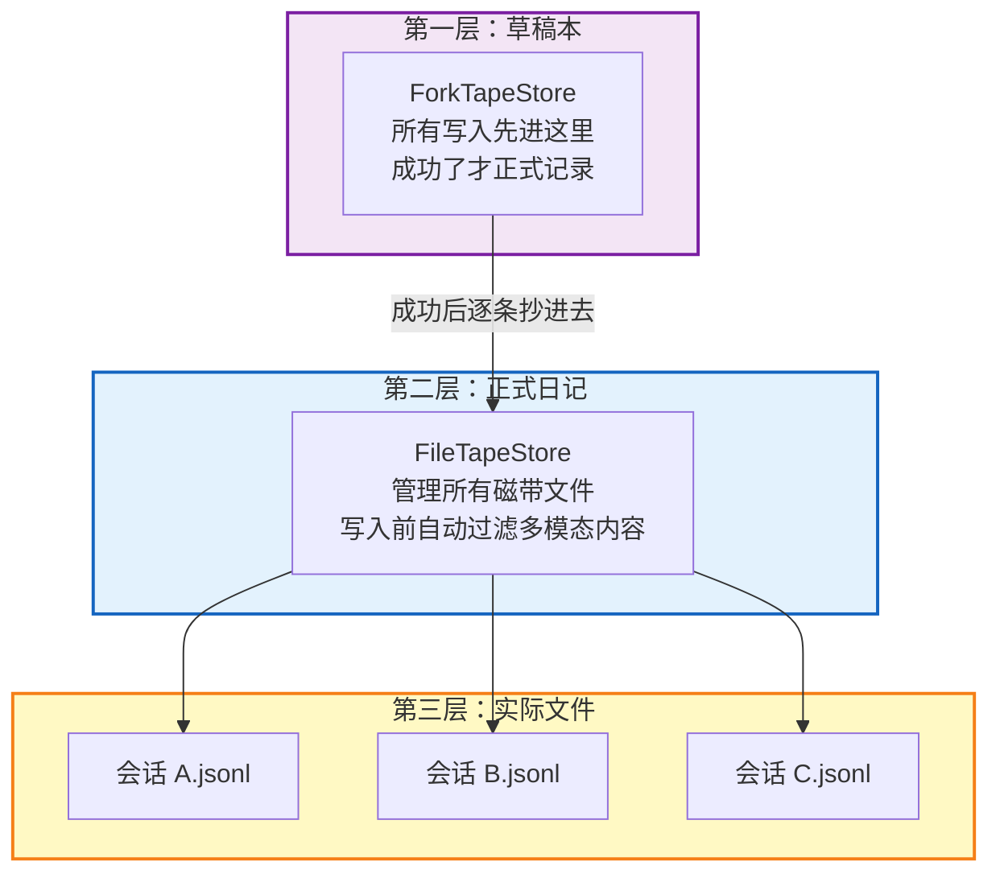
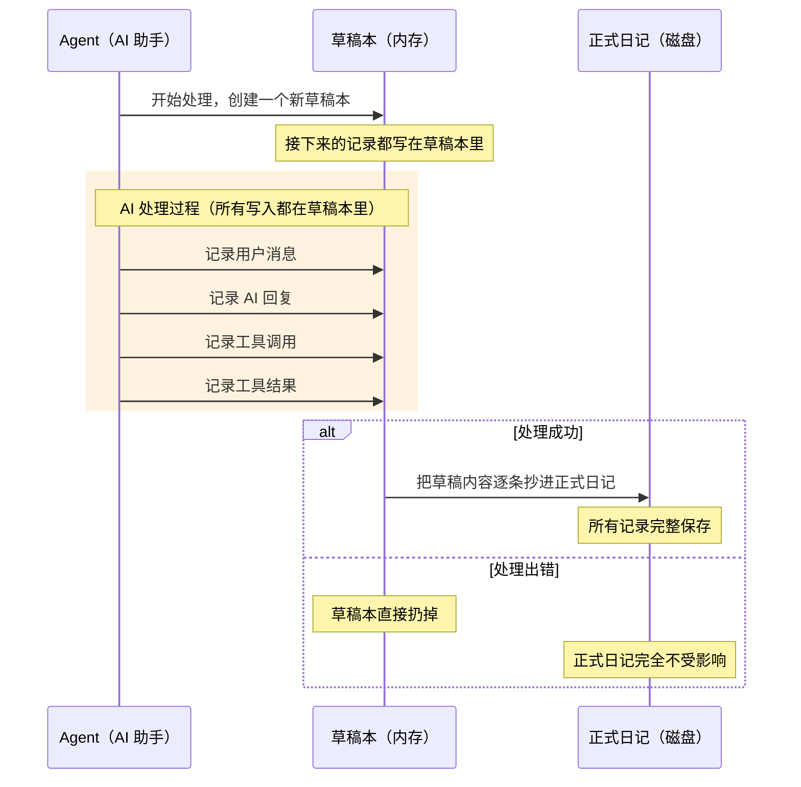
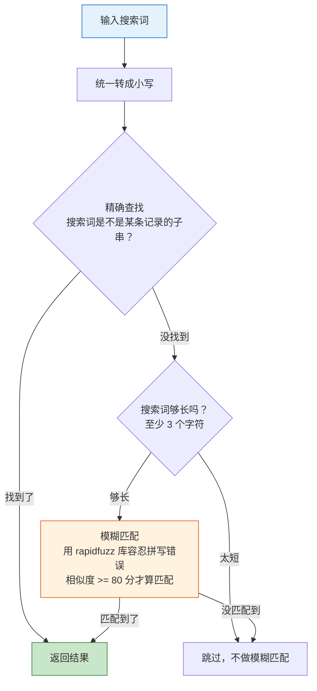

# 磁带记录系统（Tape）

> Bub 的「日记本」—— 所有对话、操作、工具调用都会被忠实记录在磁带里，只写不改，永不丢失。这篇文章带你了解这套记录系统是怎么工作的。

---

## 磁带系统在全局架构中的位置



简单来说：左边的模块负责「写日记」，磁带系统负责「保管日记」，右边的 context.py 负责「翻日记给 AI 看」。

---

## 一、为什么只写不改？

传统的聊天系统把对话历史存在内存数组里，随时可以增删改。Bub 的做法不一样——**所有记录只能追加，不能修改、不能删除**。就像用钢笔写日记，写下去就擦不掉了。

这么做有四个好处：

**历史不会被篡改。** 每条记录一旦写入就是永久的。哪怕程序出了 bug，之前的记录也不会受影响。你可以完全信任磁带上的每一条内容。

**程序崩溃也不怕。** 磁带用的是 JSONL 格式（每行一条 JSON 记录），写入时只需要在文件末尾加一行。如果写到一半程序崩了，最多丢最后那一条没写完的，前面的数据安然无恙。

**读取很快。** 磁带文件会记住"上次读到哪儿了"。下次读的时候直接从上次的位置继续，不用从头开始。一个积累了上千条记录的长会话，读起来依然很快。

**人能直接看。** JSONL 文件就是普通文本，用任何编辑器打开就能看，用 `grep` 就能搜。不需要装数据库客户端，调试的时候特别方便。

---

## 二、三层存储：草稿本、正式日记、实际文件

磁带的存储分三层，每层管一件事：



**第一层：草稿本（ForkTapeStore）。** 用户发一条消息后，AI 处理过程中产生的所有记录先写在「草稿本」里（内存中的临时存储）。处理成功并且 `merge_back=True` 时，草稿本的内容才被抄进正式日记；若 `merge_back=False`（例如 subagent 的 `temp/` 会话）或处理失败，就把草稿本扔掉，正式日记完全不受影响。这就是下一节要详细讲的「草稿纸机制」。此外 ForkTapeStore 在 `append` 时会先调用 `_redact_payload` 对条目做内容裁剪（见下一条）。

**第二层：正式日记（FileTapeStore）。** 管理 `~/.bub/tapes/` 目录下的所有磁带文件。`ForkTapeStore._redact_payload` 在条目入库前会对多模态 `content` / `prompt` 字段做一次"只保留 text parts"的裁剪 —— 图片、音频等非 text content parts 会被直接丢弃（不是替换成占位符），避免把原始二进制塞进 JSONL。

**第三层：实际文件（TapeFile）。** 每个磁带对应一个 `.jsonl` 文件，TapeFile 负责线程安全地读写这个文件。它会缓存已读内容、记住读取位置，还能检测文件是否被意外截断（`file_size < self._read_offset` 时重置缓存）。

### 磁带文件怎么命名的？

每个会话的磁带文件名由工作目录和会话 ID 的哈希值拼接而成：

```python
# src/bub/builtin/tape.py:121-124
workspace_hash = hashlib.md5(str(workspace.resolve()).encode("utf-8"), usedforsecurity=False).hexdigest()[:16]
tape_name = (
    workspace_hash + "__" + hashlib.md5(session_id.encode("utf-8"), usedforsecurity=False).hexdigest()[:16]
)
```

最终文件路径类似：`~/.bub/tapes/a1b2c3d4e5f67890__f0e1d2c3b4a59876.jsonl`

这样保证了：不同会话各有各的磁带，不同项目的同名会话也不会冲突。

---

## 三、草稿纸机制：先打草稿，写好再誊

这是磁带系统最巧妙的设计。想象一下：AI 正在帮你处理一个请求，已经写了好几条记录了，突然出错了（比如模型超时、工具执行失败）。这些写了一半的「半成品」记录怎么办？

答案很简单：**从一开始就不让它直接写入正式日记。**



### 用代码来看

整个草稿纸机制的核心就是这个 `fork` 方法：

```python
# src/bub/builtin/store.py:101-122
@contextlib.asynccontextmanager
async def fork(self, tape: str, merge_back: bool = True) -> AsyncGenerator[None, None]:
    store = InMemoryTapeStore()                       # 1. 新建一个内存草稿本
    token = current_store.set(store)                  # 2. 把「当前存储」切换到草稿本
    tape_token = current_fork_tape.set(tape)
    reset_token = current_tape_was_reset.set(False)
    try:
        yield                                         # 3. AI 开始干活，所有写入都进草稿本
    finally:
        was_reset = current_tape_was_reset.get()
        current_store.reset(token)                    # 4. 把「当前存储」切回正式日记
        current_fork_tape.reset(tape_token)
        current_tape_was_reset.reset(reset_token)
        if merge_back:                                # 5. 如果要保留结果...
            if was_reset:
                await self._parent.reset(tape)       # fork 内发生过 reset，父级也同步 reset
            entries = store.read(tape)
            if entries:
                count = len(entries)
                for entry in entries:
                    await self._parent.append(tape, entry)  # 逐条抄入正式日记
                logger.info(f'Merged {count} entries into tape "{tape}"')
```

`Agent.run()` 在调用 `fork_tape` 时，会根据 `session_id` 是否以 `temp/` 开头决定 `merge_back`：主会话 `True`（条目回流），subagent 一次性会话 `False`（条目随 fork 一起丢弃，只把子代理结果作为工具返回值）。

### 几个你可能会问的问题

**Q：为什么用 `contextvars` 而不是普通的变量？**
因为 Bub 是异步框架，多个任务可能同时跑在同一个线程上。`contextvars` 是 Python 专门为异步场景设计的，能保证每个异步任务看到自己的草稿本，互不干扰。

**Q：成功后为什么要"逐条抄"，直接批量写入不行吗？**
逐条写入是为了让正式日记的 `append` 方法能执行自己的处理逻辑——比如自动脱敏图片数据、分配记录 ID 等。每条记录都走正常流程，不留后门。

**Q：失败后不需要"回滚"吗？**
不需要。因为草稿本只存在于内存中，处理失败后 Python 的垃圾回收器会自动清理它。这比数据库的回滚更优雅——不是"做了再撤销"，而是"压根就没做"。

---

## 四、搜索：先精确找，找不到就模糊找

面对一个积累了几百条记录的会话，怎么快速找到想要的历史信息？磁带提供了两层搜索策略：



**第一层：精确查找。** 直接看搜索词是否出现在记录里。搜 "docker" 就找包含 "docker" 的记录，简单直接。

**第二层：模糊查找。** 精确找不到时启用。比如你不小心输成了 "dokcer"，模糊匹配照样能帮你找到 "docker" 相关的记录。底层用的是 `rapidfuzz` 库，只有相似度达到 80 分以上才算匹配成功。

搜索逻辑的代码很简洁：

```python
# src/bub/builtin/store.py:160-178
def _filter_entries(self, entries, query, limit):
    normalized_query = query.strip().lower()
    results, seen = [], set()

    for entry in reversed(entries):                    # 从最新的记录开始找
        payload_text = get_entry_text(entry).lower()
        if payload_text in seen:                       # 跳过重复内容
            continue
        seen.add(payload_text)

        if normalized_query in payload_text \           # 先精确找
            or self._is_fuzzy_match(normalized_query, payload_text):  # 再模糊找
            results.append(entry)
            if len(results) >= limit:                  # 够了就停
                break
    return results
```

几个设计细节：搜索**从最新记录开始**（你通常更关心近期内容），会**自动去重**（同样的内容只返回一次），默认最多返回 **20 条**结果。

---

## 五、书签（锚点）：给对话打标记

如果把磁带比作一本书，锚点（Anchor）就是书签——在关键位置插一个标记，方便以后定位。

### 书签有什么用？

**自动书签。** 每个会话开始时，`ensure_bootstrap_anchor` 会检查磁带里有没有 `anchor` 类型的条目，没有就插一个 `session/start` 书签（`state={"owner": "human"}`），标记会话的起点。

**手动书签。** 你可以随时通过 `,tape.handoff name=xxx` 命令插入书签。比如完成了一个阶段性任务、或者要交接给别人继续聊的时候，插一个书签记录当前状态。

**自动 handoff 书签。** 当 Agent 在多轮循环中检测到上下文溢出（context length exceeded），会自动插入一个 `auto_handoff/context_overflow` 书签，然后用原始 prompt 重试 —— 配合锚点截断历史，相当于让 AI 一键"翻篇"继续。

**最关键的作用：控制 AI 的记忆范围。** 插入书签后，之前的对话就不会再发送给 AI 了——`TapeQuery` 的 `_after_last` / `_after_anchor` 参数会让 fetch_all 只返回最近一个书签之后的内容。这是 Bub 管理长对话 token 消耗的核心手段。

打个比方：你跟 AI 聊了 100 条消息，在第 80 条的位置插了个书签。之后 AI 只能看到第 81-100 条消息，前面的 80 条"翻篇"了。

---

## 六、把日记翻译给 AI 看

磁带里记录了各种类型的内容，但 AI 只认 OpenAI 消息格式。`context.py` 的工作就是把磁带记录"翻译"成 AI 能理解的格式：

```python
# src/bub/builtin/context.py:18-33
def _select_messages(entries, _context):
    messages, pending_calls = [], []

    for entry in entries:
        match entry.kind:
            case "anchor":       # 书签 → 转成 assistant 消息
                _append_anchor_entry(messages, entry)
            case "message":      # 普通消息 → 直接保留
                _append_message_entry(messages, entry)
            case "tool_call":    # 工具调用 → 转成 assistant 消息 + tool_calls
                pending_calls = _append_tool_call_entry(messages, entry)
            case "tool_result":  # 工具结果 → 转成 tool 角色的消息
                _append_tool_result_entry(messages, pending_calls, entry)
                pending_calls = []
    return messages
```

翻译规则一目了然：

| 磁带记录类型 | 翻译成什么 | 说明 |
|-------------|-----------|------|
| `message` | 原样保留 | 用户说的话、AI 回的话，直接传给模型 |
| `tool_call` | assistant 消息 + tool_calls | AI 请求调用工具 |
| `tool_result` | tool 角色消息 | 工具执行的返回结果 |
| `anchor` | assistant 消息 | 书签信息，告诉 AI 这里有个标记 |
| `event` | 跳过 | 系统事件不需要让 AI 看到 |

这种选择性翻译让 AI 只看到跟对话相关的内容，不会被系统内部事件干扰。

---

## 七、磁带操作速查表

你可以通过逗号命令来操作磁带：

| 命令 | 作用 | 举例 |
|------|------|------|
| `,tape.info` | 查看磁带概况 | 总记录数、书签数、最近 token 用量等 |
| `,tape.search query=xxx` | 搜索历史记录 | `,tape.search query=docker` 找 docker 相关记录 |
| `,tape.anchors` | 查看所有书签 | 看会话的里程碑列表 |
| `,tape.handoff name=xxx` | 插入书签 | `,tape.handoff name=阶段一完成` 标记当前进度 |
| `,tape.reset` | 清空磁带 | 重新开始，之前的记录全部清除 |
| `,tape.reset archive=true` | 清空并备份 | 先把当前记录存为 `.bak` 文件，再清空 |

---

## 八、为什么不用数据库？

你可能会想：直接用 SQLite 不好吗？下面这个对比解释了为什么 JSONL 对 Bub 更合适：

| | JSONL（Bub 的选择） | SQLite |
|---|---|---|
| 透明度 | 文本文件，随时打开看 | 二进制格式，需要专门工具 |
| 实现复杂度 | 极简，追加一行就行 | 需要建表、写 SQL |
| 崩溃安全 | 天然安全，最多丢最后一条 | 需要 WAL 机制保证 |
| 适合的数据量 | 单会话数百到数千条（足够） | 更适合海量数据和复杂查询 |
| 可移植性 | 复制文件即可 | 需要考虑锁和并发 |

一句话总结：单个会话的记录量不大，JSONL 的简单和透明远比数据库的功能更有价值。如果未来需要跨会话搜索，存储层可以平滑升级，上层逻辑完全不用改。

---

## 小结

磁带系统用三个词就能概括：

1. **只写不改** —— 记录只能追加，历史永远完整，JSONL 格式随时可查
2. **先打草稿** —— 每次处理先写在草稿本里，成功才正式记录，失败就丢掉，不留半成品
3. **能搜能翻** —— 精确搜索 + 模糊容错，加上书签导航；需要时自动翻译成 AI 能读的格式

下一篇：[工具与技能生态](./05-工具与技能生态.md)
