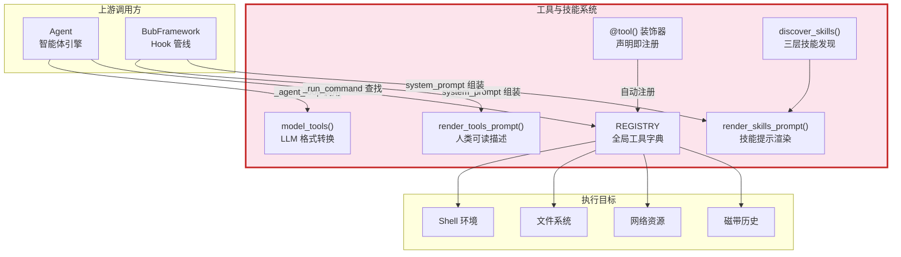
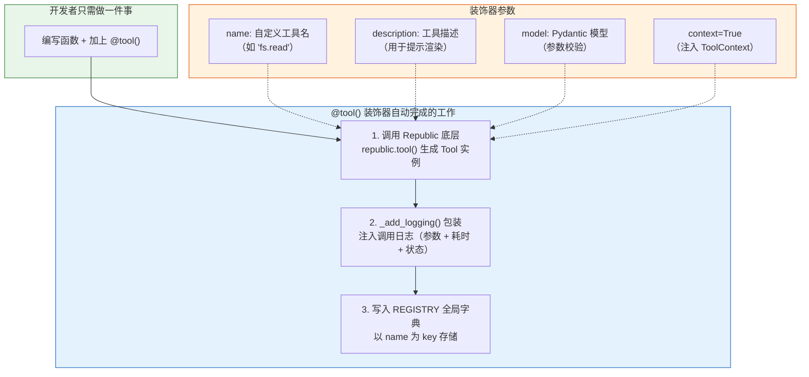
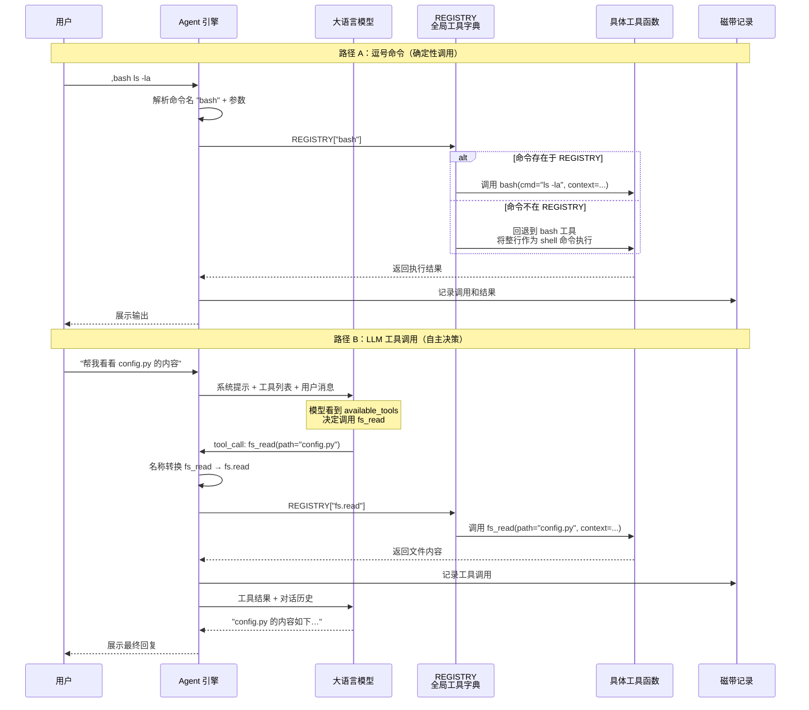
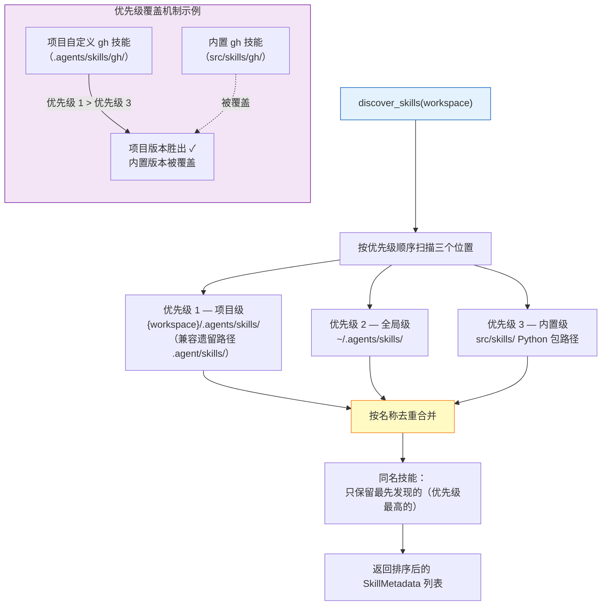

# 工具注册与技能发现 — AI 的执行力来源

> AI 不只会说话，还能执行操作。本文从产品经理视角，解析 Bub 如何通过**工具注册系统**赋予 Agent 执行能力，以及**技能发现系统**如何让 Agent 按需获取领域知识和扩展脚本。工具是 Agent 的双手，技能是 Agent 的工具箱。

---

## 在全局架构中的位置

---

## 一、@tool 装饰器：声明即注册的设计哲学

传统做法是手动维护一个工具注册表，开发者需要先写函数、再显式注册、再关联文档。Bub 用一个 `@tool()` 装饰器把这三步合为一步：**在函数定义的同时完成注册、日志包装和文档生成**。

### 装饰器注册架构

这种设计带来三个好处：

- **零样板代码**：不需要单独的注册步骤，函数定义本身就是注册行为
- **自动日志**：每次工具调用都记录参数、耗时和成功/失败状态，无需手动埋点
- **运行时上下文注入**：通过 `context=True`，工具函数可以获取当前的 tape 名称、workspace 路径、Agent 引用等运行时状态，而调用方无需感知

### ToolContext 注入机制

内置工具中大量使用 `context=True` 参数。当装饰器声明了 `context=True`，Agent 在调用工具时会自动向函数注入一个 `ToolContext` 对象，其中携带了：

| 字段 | 作用 |
|------|------|
| `tape` | 当前 tape 名称，用于磁带操作类工具 |
| `run_id` | 本次运行标识 |
| `state` | 运行时状态字典，包含 `_runtime_agent` 和 `_runtime_workspace` |

这意味着工具函数可以在**不依赖全局变量**的前提下，访问文件系统的 workspace 根目录、获取 Agent 实例以操作磁带，保持了函数签名的干净和可测试性。

---

## 二、内置工具全景

Bub 出厂自带 16 个工具，按职能分为七个族群：

| 族群 | 工具 | 核心能力 |
|------|------|----------|
| **执行** | `bash` | 在 workspace 下执行 shell 命令，默认前台同步执行；`background=true` 时进入后台，由 `shell_manager` 管理生命周期 |
| | `bash.output` | 读取后台 shell 的增量输出（支持 offset/limit 分片） |
| | `bash.kill` | 终止仍在运行的后台 shell |
| **文件** | `fs.read` | 分页读取文件（offset + limit），大文件友好 |
| | `fs.write` | 写入文件,自动创建父目录 |
| | `fs.edit` | 精确字符串替换，支持指定起始行号 |
| **技能** | `skill` | 按名称查找并加载技能内容（SKILL.md 正文），受 `allowed_skills` 白名单约束 |
| **磁带** | `tape.info` | 获取磁带统计：条目数、锚点数、上次 token 用量 |
| | `tape.search` | 关键词搜索磁带历史条目 |
| | `tape.reset` | 重置磁带，可选归档 |
| | `tape.handoff` | 创建锚点标记阶段转换 |
| | `tape.anchors` | 列出所有锚点 |
| **网络** | `web.fetch` | GET 请求获取网页内容，优先返回 Markdown 格式 |
| **子代理** | `subagent` | 以独立 session 启动一个嵌套 Agent，可限定 `allowed_tools` / `allowed_skills`；默认落在 `temp/{uuid}` 会话中，磁带不回写父上下文 |
| **生命周期** | `quit` | 通过 `OutboundChannelRouter` 通知渠道关闭当前 session |
| | `help` | 显示可用命令和使用示例 |

所有涉及文件路径的工具都通过统一的路径解析逻辑：绝对路径直接使用，相对路径则基于 workspace 根目录解析，确保不会越权访问。

---

## 三、工具调用的完整时序

Agent 调用工具有两条路径：**逗号命令**（用户或 AI 直接调用）和 **LLM 工具调用**（模型自主决策）。两条路径最终都汇入 REGISTRY。

### 双路径调用时序

### 名称转换：为什么要在点号和下划线之间切换？

内部使用点号分隔（如 `fs.read`、`tape.info`）形成清晰的命名空间层级。但大模型 API 的工具名只允许字母、数字和下划线，不支持点号。因此在传给模型之前，`model_tools()` 函数将所有点号替换为下划线；模型返回的调用结果再反向转换回来。这一切对开发者和用户都是透明的。

---

## 四、双重提示渲染

REGISTRY 中的工具和发现到的技能，需要以两种不同格式提供给模型：

| 函数 | 输出目标 | 格式 | 用途 |
|------|---------|------|------|
| `render_tools_prompt()` | 系统提示文本 | `<available_tools>` XML 块中的列表 | 让模型知道有哪些工具可用 |
| `model_tools()` | LLM API 调用参数 | Republic Tool 对象列表（含 JSON Schema） | 让模型能按 API 规范发起工具调用 |
| `render_skills_prompt()` | 系统提示文本 | `<available_skills>` XML 块中的列表 | 让模型知道有哪些技能可加载 |

三者在 Agent 的 `_system_prompt()` 方法中被组装到一起，形成模型每次推理的完整上下文。

---

## 五、技能发现系统：三层搜索与优先级覆盖

### 技能是什么？

如果说工具是单个函数级别的能力（读文件、执行命令），那么技能就是**领域级别的知识包**。一个技能包含：

- **SKILL.md**（必须）：YAML 前置元数据定义名称和描述，Markdown 正文提供详细指导
- **scripts/**（可选）：可执行脚本，用于确定性任务
- **references/**（可选）：参考文档，按需加载
- **assets/**（可选）：模板、图片等输出资源

### 三层发现流程与优先级覆盖

这套优先级覆盖机制的产品意义在于：

- **内置技能提供开箱即用的基线能力**：gh、telegram、skill-creator 三个内置技能覆盖最常见场景
- **项目级技能实现团队定制**：团队可以在项目仓库中放置 `.agents/skills/gh/`，用自己的 GitHub 工作流覆盖内置版本
- **全局技能支持个人偏好**：个人常用但不属于任何项目的技能放在 `~/.agents/skills/`，跨项目共享
- **无需重启**：每次 Agent 构建系统提示时都会重新扫描，新增或修改的技能立即生效

### 渠道标记过滤

技能的 YAML 前置元数据中可以声明 `metadata.channel` 字段。例如 Telegram 技能标记了 `channel: telegram`，这意味着它只在 Telegram 渠道的会话中被加载到上下文，CLI 用户不会看到无关的 Telegram 操作指令。通用技能不声明 channel，在所有渠道中可用。

### 渐进式加载：从摘要到全文

技能的加载分两个阶段：

1. **紧凑视图（默认）**：`render_skills_prompt()` 只输出每个技能的名称和一句描述，约 100 词，常驻系统提示中
2. **展开视图（按需）**：当模型决定需要某个技能时，调用 `skill` 工具加载完整的 SKILL.md 正文，包含详细的操作指南和脚本引用

这种设计在上下文窗口（公共资源）的利用上做了精心权衡：元数据足够让模型判断"要不要用这个技能"，而完整内容只在确认需要时才占用 token。

---

## 六、内置技能概览

| 技能 | 来源 | 渠道限制 | 核心能力 |
|------|------|---------|----------|
| **gh** | 内置 | 无 | 通过 GitHub CLI 操作仓库、Issue、PR、Release、Workflow |
| **telegram** | 内置 | telegram | 发送/编辑 Telegram 消息，支持回复和主动通知 |
| **skill-creator** | 内置 | 无 | 指导创建新技能的完整流程（初始化、编写、验证） |

---

## 七、扩展路径：如何添加新能力

### 选择工具还是技能？

| 场景 | 推荐方式 | 理由 |
|------|---------|------|
| 单一操作（如"发送邮件"） | `@tool()` 工具 | 函数级粒度，注册简单 |
| 领域知识 + 多步流程 | 技能目录 | 需要文档、脚本、资源的配合 |
| 需要覆盖默认行为 | 项目级技能 | 利用优先级覆盖内置版本 |
| 跨项目通用 | 全局技能 | 放在 `~/.agents/skills/`，所有项目可用 |

### 添加工具的极简步骤

1. 编写一个 async/sync 函数
2. 加上 `@tool(name="my.tool", description="做某件事")` 装饰器
3. 如需运行时状态，加上 `context=True` 参数
4. 函数自动出现在 REGISTRY 中，模型可以看到并调用

### 添加技能的标准步骤

1. 在搜索路径下创建目录（如 `.agents/skills/my-skill/`）
2. 编写 `SKILL.md`：YAML 前置元数据（name + description）+ Markdown 正文
3. 按需添加 `scripts/`、`references/`、`assets/`
4. 下次 Agent 构建提示时自动发现，无需重启

---

## 小结

工具与技能系统是 Bub Agent 的执行力基础：

1. **@tool() 装饰器** — 声明即注册，零样板代码，自动日志包装
2. **双重渲染** — `render_tools_prompt()` 供系统提示展示，`model_tools()` 供 LLM API 调用，各取所需
3. **三层技能发现** — 项目级 > 全局级 > 内置级，同名技能高优先级覆盖低优先级
4. **渐进式加载** — 技能摘要常驻上下文，完整内容按需展开，节约 token 预算
5. **ToolContext 注入** — 工具函数通过声明式参数获取运行时状态，无全局变量依赖

下一篇：[多渠道与会话管理](./06-多渠道与会话管理.md)
