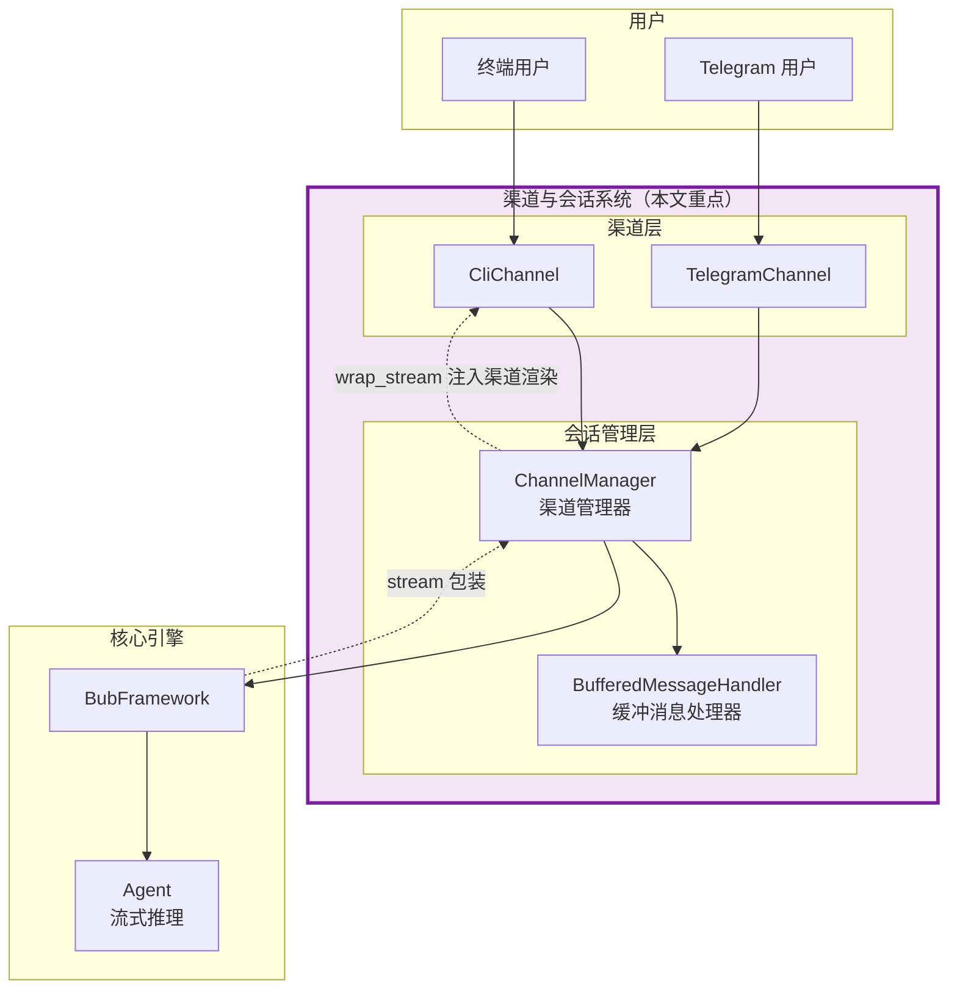
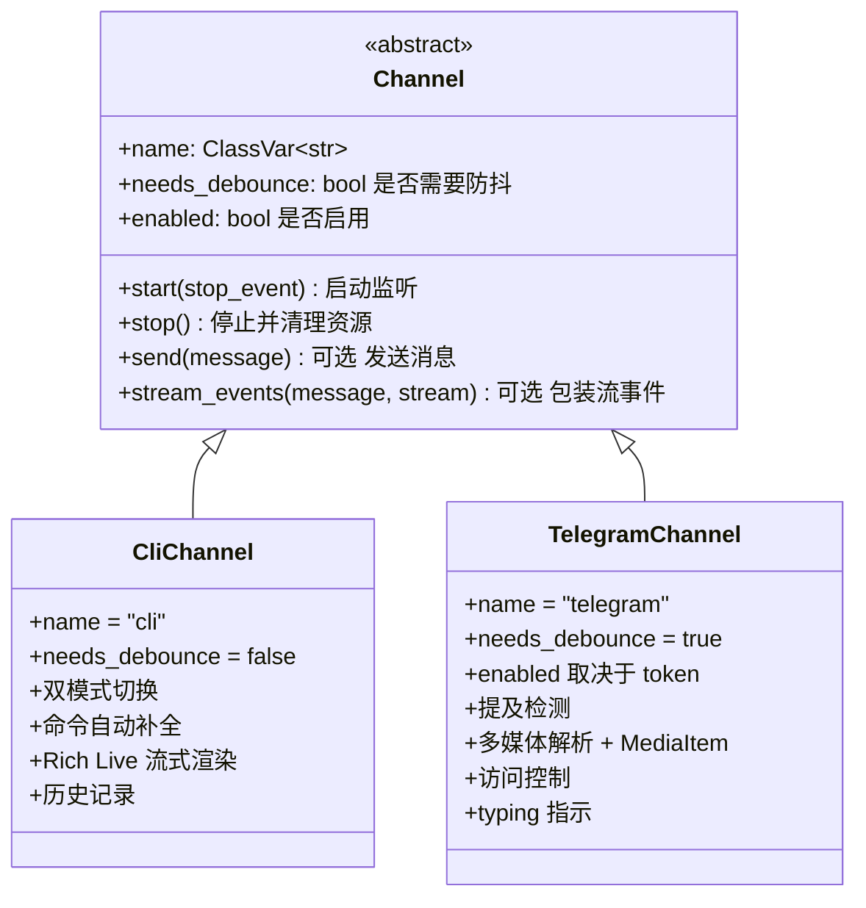
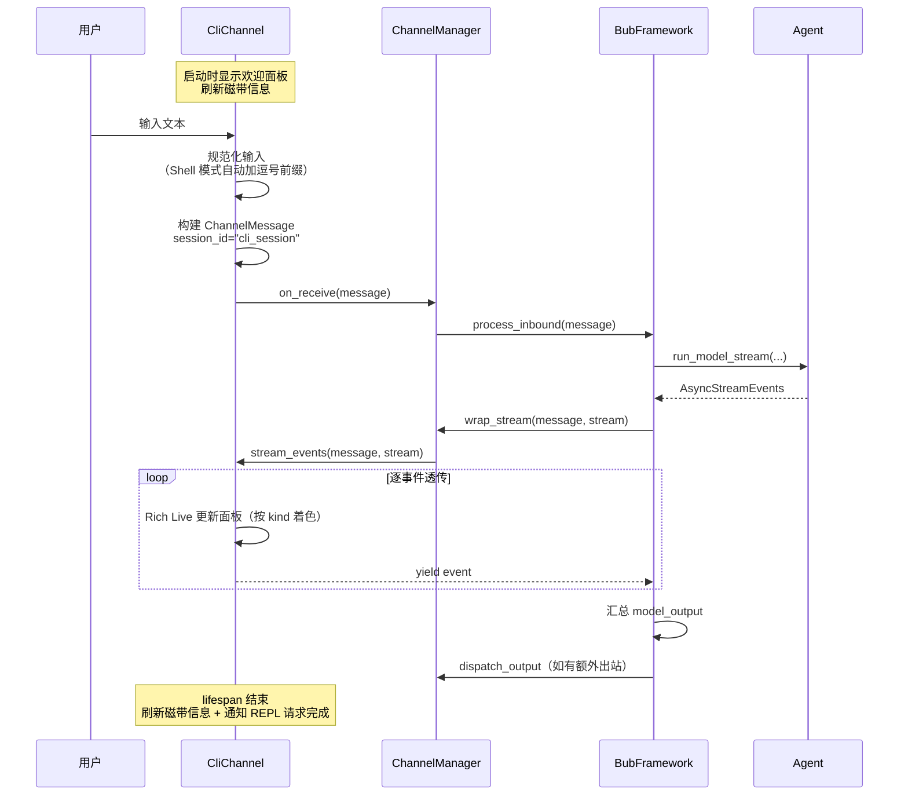
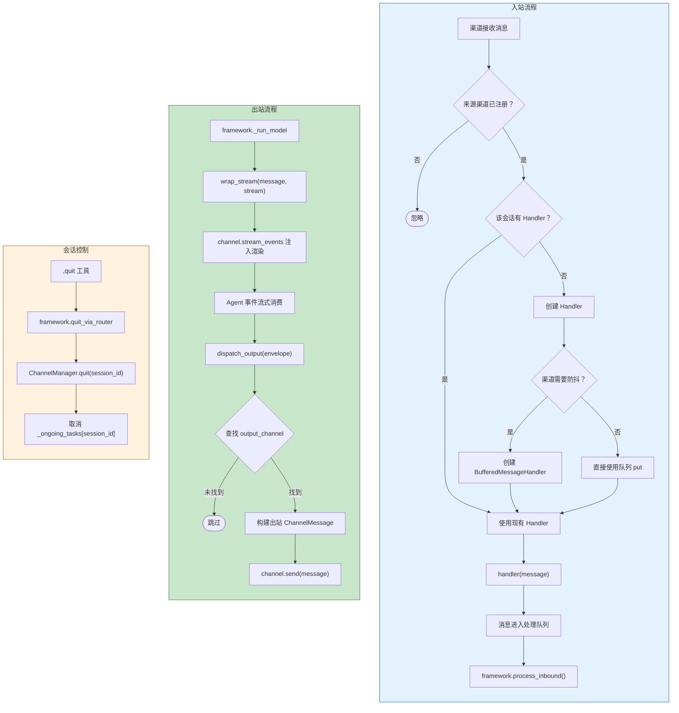
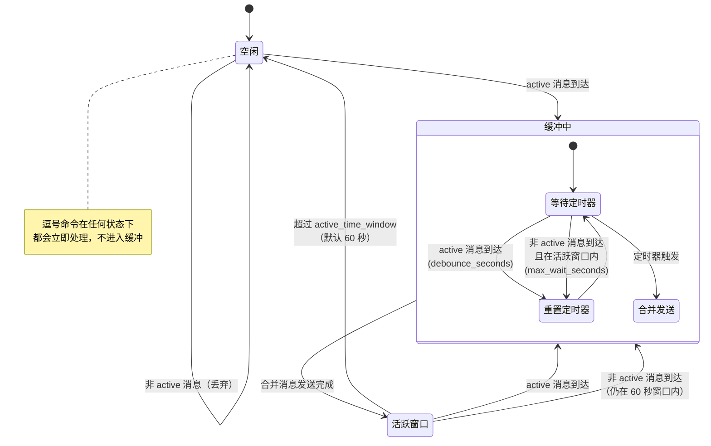
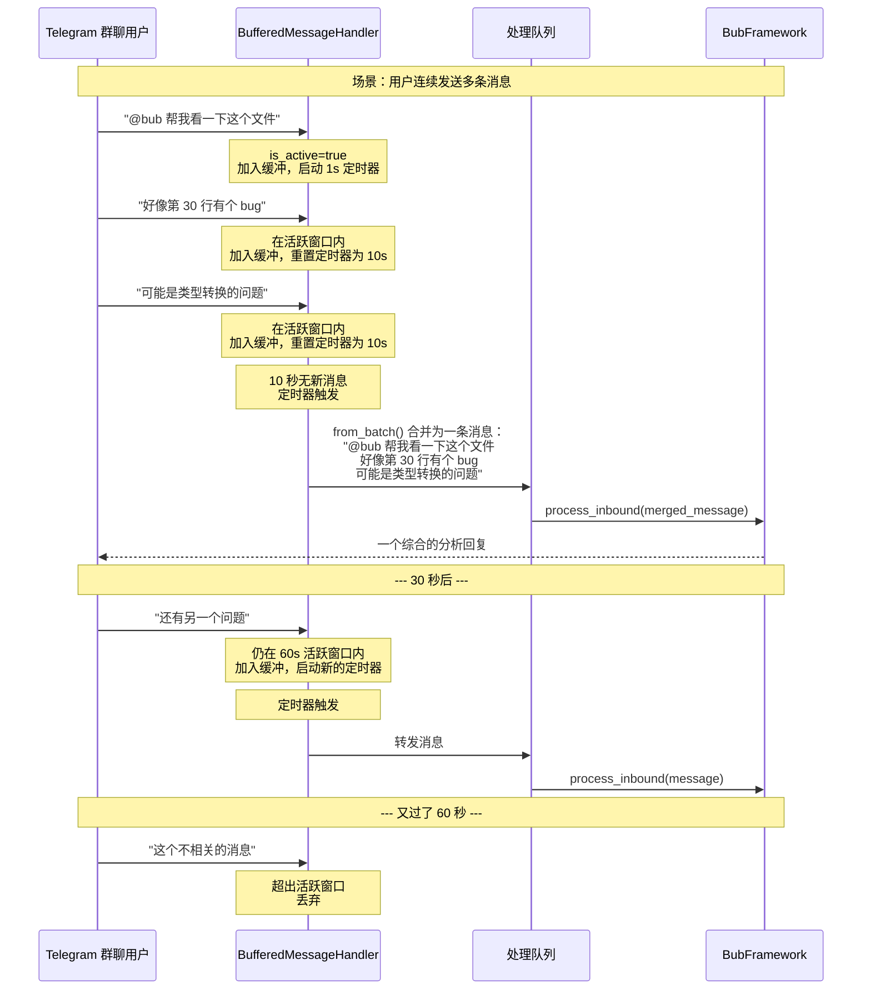

# 多渠道架构与会话管理

> 用户如何与 Bub 交互？本文从产品经理视角，剖析 Bub 的渠道中立设计、消息防抖机制、Telegram 访问控制，以及会话隔离策略。

---

## 在全局架构中的位置

渠道系统是 Bub 面向用户的"触角"。它位于用户和核心引擎之间，负责接收输入、管理会话、缓冲消息、分发响应。

---

## 一、渠道中立：一套核心逻辑，多种交互方式

Bub 的一个核心设计原则是**渠道中立** —— 无论用户通过命令行还是 Telegram 发来消息，经过渠道层的标准化之后，进入框架核心的数据格式完全一致。这意味着：

- **Agent 引擎不关心消息来源**：同一个 Agent 驱动 CLI 和 Telegram，行为完全相同。
- **工具注册表跨渠道共享**：所有渠道使用同一套工具，逗号命令的路由规则在任何渠道都一样。
- **磁带记录按会话隔离**：不同渠道、不同聊天拥有独立的历史记录，互不干扰。

这套设计依赖三个层面的抽象：统一的 Channel 接口、统一的消息载体 ChannelMessage、以及集中式的 ChannelManager。

### Channel 抽象接口

所有渠道都实现同一个抽象基类 `Channel`。接口只包含两个必须实现的方法和若干可选扩展点：

| 能力 | 必需 | 说明 |
|------|------|------|
| `name` | ✓ | 渠道的唯一标识，如 `"cli"` 或 `"telegram"` |
| `start(stop_event)` | ✓ | 启动渠道监听，接收 asyncio.Event 用于优雅关停 |
| `stop()` | ✓ | 停止渠道，释放资源，取消运行中的任务 |
| `send(message)` | 可选 | 将整条消息发送回渠道，默认空实现；适合错误回落或非流式输出 |
| `stream_events(message, stream)` | 可选 | 接收来自 Agent 的 `AsyncStreamEvents`，在透传事件的同时注入渠道自己的实时渲染逻辑 |
| `needs_debounce` | 属性 | 标记该渠道是否需要防抖处理，默认 `False` |
| `enabled` | 属性 | 根据运行时配置（如 Telegram token）决定渠道是否启用 |

接口足够小，扩展一个新渠道只需要实现这几个方法。渠道的差异性（如 Telegram 的多媒体解析、CLI 的 Live 流式渲染）全部封装在各自的实现内部，对框架核心透明。

`stream_events()` 是为流式输出专门设计的钩子：Agent 返回的是 `AsyncStreamEvents` 异步迭代器，`BubFramework._run_model` 会先把这个 stream 交给 `ChannelManager.wrap_stream()`，后者根据消息的来源渠道调用对应 `Channel.stream_events()` 进行包装，从而让 CLI 能做 Rich Live 增量渲染，而 Telegram 则可以选择直接透传或聚合后再投递。

### ChannelMessage：统一的消息载体

渠道层和框架核心之间的数据交换通过 `ChannelMessage` 完成。它是一个数据类，承载了消息的全部上下文：

| 字段 | 类型 | 作用 |
|------|------|------|
| `session_id` | str | 会话唯一标识，决定磁带和状态的隔离 |
| `channel` | str | 来源渠道名称 |
| `content` | str | 消息文本（Telegram 会把多媒体元数据 JSON 化进来） |
| `chat_id` | str | 聊天标识，默认 `"default"` |
| `is_active` | bool | 是否为主动触发（被提及），直接影响防抖策略 |
| `kind` | `"error"` / `"normal"` / `"command"` | 消息类型，决定输出渲染方式 |
| `context` | dict | 元数据，`__post_init__` 自动写入 `channel`、`chat_id`，Telegram 还会追加 sender 等字段 |
| `media` | `list[MediaItem]` | 多媒体附件，每个 MediaItem 可以按需惰性下载并转换成 data URL |
| `lifespan` | AsyncContextManager | 消息处理期间的生命周期管理 |
| `output_channel` | str | 出站目标渠道，默认等于来源渠道；设为 `"null"` 等不存在的渠道即可禁用出站分发 |

三个关键设计值得注意：

- **`from_batch()`**：将防抖后的多条消息合并为一条，`content` 按换行拼接，`media` 做列表合并，其余字段以最后一条消息为模板。
- **`MediaItem`**：多媒体不会在消息到达时就下载。每个 MediaItem 携带 `data_fetcher` 回调，直到消费方（通常是 Agent 构造多模态 prompt 时）调用 `get_url()` 才真正读取字节，超过 2MB 的文件会被自动跳过。
- **`lifespan`**：允许每个渠道在消息处理期间维护自己的状态 —— CLI 用它在请求完成后刷新磁带信息并解除 prompt 阻塞；Telegram 用它维护"正在输入..."的指示状态。

---

## 二、CLI 渠道：本地开发者的交互终端

CLI 渠道面向本地开发场景，提供一个功能完善的交互式 REPL。它不需要防抖（单用户、即时交互），但提供了丰富的交互增强。

### Agent 与 Shell 双模式

CLI 提供两种输入模式，通过 Ctrl-X 快捷键随时切换：

- **Agent 模式**（默认）：输入自然语言交给 AI 处理，以逗号开头的输入作为命令直接执行。提示符显示为 `cwd >`。
- **Shell 模式**：所有输入自动加上逗号前缀，变成命令直接执行，不经过 AI。提示符显示为 `cwd ,`。

这个设计让用户在"与 AI 对话"和"快速执行命令"之间无缝切换，不用反复手动输入逗号前缀。

### 交互增强

CLI 基于 prompt_toolkit 构建，提供以下增强功能：

- **命令自动补全**：输入逗号后自动提示所有已注册的工具名称，支持模糊匹配。
- **历史记录持久化**：按工作区隔离，每个工作区有独立的历史文件（通过工作区路径的 MD5 哈希命名），重启后历史不丢失。
- **底部工具栏**：实时显示当前时间、模式、模型名称、磁带条目数和锚点信息。
- **Rich Live 流式渲染**：CliChannel 实现了 `stream_events()`，从上游的 `AsyncStreamEvents` 中取出 `text` 事件，用 Rich 的 `Live` 组件按 delta 增量更新同一个面板，看起来就像模型在终端里打字。不同 `kind`（normal / command / error）对应不同的面板颜色，结束时交给 `CliRenderer.finish_stream()` 做收尾。
- **最小化 send()**：`CliChannel.send()` 只处理 `kind="error"` 的消息 —— 其他内容已经在 `stream_events()` 阶段渲染完毕，出站分发不再需要做任何事。

### CLI 消息流转

CLI 渠道的 `needs_debounce` 默认 `False`，消息不经过 BufferedMessageHandler，直接进入处理队列。流事件在 `BubFramework._run_model` 内部通过 `ChannelManager.wrap_stream()` 被注入渠道自己的渲染逻辑，这就是为什么 CLI 不再需要传统的"请求-响应"Panel 渲染流程。

---

## 三、Telegram 渠道：面向团队的协作入口

Telegram 渠道支持私聊和群聊两种场景，能够处理文字、图片、语音、视频、文件、贴纸等多种消息类型。与 CLI 不同，它需要处理多人并发、消息爆发、访问控制等复杂场景。

### 消息类型解析

`TelegramMessageParser` 负责将 Telegram 的各种消息格式统一解析为文本描述 + 结构化 metadata。与早期版本不同，解析时并不会立即下载媒体文件，而是把一个 `data_fetcher` 回调塞进 metadata，由 `_extract_media_items()` 挑出来转成 `MediaItem` 挂在 `ChannelMessage.media` 上 —— 真正的字节下载要等到多模态 prompt 构造阶段才会发生，并且超过 2MB 的文件会被丢弃。最终的 `content` 是一段 JSON：`{"message": 解析文本, **metadata}`，Agent 收到后既能看到正文，也能看到 sender、links、回复对象等辅助信息。

支持的消息类型包括：文字、图片（含标题）、语音、视频（含标题）、音频（含标题/演奏者/时长）、文件（含文件名/MIME 类型）、贴纸（含表情/贴纸包名）、视频留言。不支持的类型会被标记为 `[Unsupported message type]`，并由 `BubMessageFilter` 直接过滤掉。

### Telegram 访问控制

Telegram 渠道提供两层访问控制，通过环境变量配置：

**第一层：Chat 级别过滤。** 通过 `BUB_TELEGRAM_ALLOW_CHATS` 设置允许的 chat ID 白名单。不在白名单中的聊天会被直接忽略。如果不设置该变量，则不做 chat 级别限制。

**第二层：User 级别过滤。** 通过 `BUB_TELEGRAM_ALLOW_USERS` 设置允许的用户白名单，支持 user_id 和 username 两种格式。不在白名单中的用户会收到 "Access denied" 回复。如果不设置该变量，则不做用户级别限制。

两层过滤按顺序执行：先检查 chat，再检查 user。这样可以灵活组合 —— 比如允许某个群聊但限制其中的发言用户，或者不限制群聊但限制特定用户。

### 提及检测：什么时候 Bub 会响应？

Telegram 渠道通过 `BubMessageFilter` 决定一条群聊消息是否要交给 Agent 处理，同时用它的返回值作为 `ChannelMessage.is_active` 的来源：

1. **私聊**：所有非未知类型的消息直接放行，`is_active=True`。
2. **群聊 @机器人**：命中以下任一条即视为主动消息 —— 文本里出现 `@bot_username`、消息里有 `mention`/`text_mention` 实体指向机器人、或者内容中包含关键字 `"bub"`。
3. **群聊回复机器人**：`reply_to_message.from_user.id == bot.id` 也算主动。
4. **群聊非文本**：只有当"回复了机器人"时才会被接收，否则直接过滤掉。

在群聊里，被 `BubMessageFilter` 放行但既不是 @mention 也不是 reply 的消息仍会进入缓冲（`is_active=false`）。如果这时处于活跃时间窗口内（上次主动消息后 60 秒），这些消息会和主动消息一起通过 `from_batch()` 合并处理 —— 让 Bub 能够理解对话上下文，而不仅仅是被 @ 的那条消息。

值得注意的是，Telegram 构造出的 `ChannelMessage` 会把 `output_channel` 显式设为 `"null"`，因此 Agent 的回复不会经过 `ChannelManager.dispatch_output()` 自动回投 —— Telegram 的输出由 `telegram` 技能里的脚本在 Agent 内部主动发送（见第 5 章提到的技能工具）。

### "正在输入..."状态

当 Telegram 渠道开始处理消息时，会通过 `lifespan` 上下文管理器启动一个 typing 循环，每 4 秒向 Telegram API 发送一次 `typing` 状态（Telegram 的 typing 指示持续 5 秒），让用户知道机器人正在工作。处理完成后自动停止。如果同一个 chat 已有 typing 任务在运行，不会重复创建。

---

## 四、ChannelManager：渠道系统的中枢

ChannelManager 是渠道层的中心调度器，它同时扮演 `OutboundChannelRouter` 协议的实现者，连接渠道实例和框架核心。它承担四个核心职责：渠道生命周期管理、入站消息路由、出站流事件包装、出站消息分发，以及按会话粒度的 `quit` 取消。

### 渠道启动与配置

启动时，ChannelManager 从框架获取所有渠道实例，并根据 `BUB_ENABLED_CHANNELS` 配置决定启用哪些渠道：

- 设置为 `"all"` 时，启用除 CLI 之外的所有 `enabled` 渠道（CLI 需要通过 `bub chat` 单独启动）。
- 设置为逗号分隔的渠道名时，只启用指定渠道。
- `Channel.enabled` 属性进一步过滤 —— Telegram 在没有 token 时会直接判定自己不可用，不会被意外启动。

`listen_and_run()` 进入主循环之前会调用 `self.framework.bind_outbound_router(self)`，把 ChannelManager 自己注册成 BubFramework 的路由器。Framework 在 `_run_model()` 阶段就是通过这个引用拿到 `wrap_stream()` / `dispatch_output()` / `quit()` 三个方法。

### 入站消息路由

当渠道的 `on_receive` 被调用时，ChannelManager 按以下逻辑处理：

1. **验证渠道**：消息的来源渠道必须是已注册的渠道，否则忽略。
2. **获取或创建 Handler**：按 session_id 为每个会话维护独立的消息处理器。如果渠道声明需要防抖，创建 BufferedMessageHandler；否则直接将消息放入处理队列。
3. **分派给 Handler**：Handler 可能立即将消息放入队列（CLI），也可能缓冲等待合并（Telegram）。
4. **框架处理**：主循环从队列中取出消息，为每条消息创建独立的异步任务调用 `framework.process_inbound()`，并把任务记入 `self._ongoing_tasks[session_id]`，方便 `quit()` 按会话取消。

### 出站流事件包装

框架在运行模型时，会先调用 `OutboundChannelRouter.wrap_stream(message, stream)` 对原始的 `AsyncStreamEvents` 做一层包装：

1. 从消息中读取 `output_channel`（回退到来源 channel）。
2. 查不到对应渠道时直接返回原 stream。
3. 否则调用 `channel.stream_events(message, stream)`，让渠道注入自己的流式渲染逻辑（CLI 的 Rich Live、Telegram 的聚合/自定义推送等）。

这一步让"渠道特定的渲染"发生在流事件真正流动的同一条链路上，不需要框架核心知道任何渠道细节。

### 出站消息分发

模型运行完成后，框架仍会把 `render_outbound` 产生的 `ChannelMessage`（或字典信封）依次交给 `dispatch_output(message)`：

1. 从信封中提取 `output_channel`（默认等于来源渠道）。
2. 查找对应的渠道实例，找不到则返回 `False`。
3. 构造出站 `ChannelMessage`，包含 session_id、chat_id、content、context、kind 等信息。
4. 调用渠道的 `send()` 方法完成投递。

这个出站路径与 `wrap_stream` 是互补关系 —— 流式渲染处理"模型正在说话"的增量，`dispatch_output` 处理"模型说完之后"的最终封装，例如 CLI 的错误面板、或者某些特殊的 outbound 信封。

### 按会话取消：quit()

`quit(session_id)` 会把 `self._ongoing_tasks[session_id]` 内的所有正在跑的任务全部 `cancel()`，然后把对应记录从 dict 中弹出。`,quit` 这个内置工具就是通过 `framework.quit_via_router()` 间接调用它的，让 AI 或者用户可以主动结束一个渠道会话而不影响其它 session。

### 会话 ID 的来源

每个渠道用不同的方式生成 session_id，确保会话粒度合理：

| 渠道 | session_id 格式 | 含义 |
|------|----------------|------|
| CLI | `"cli_session"`（默认模板，可通过 `set_metadata` 覆盖） | 固定值，单用户场景 |
| Telegram | `"telegram:{chat_id}"` | 按聊天隔离，每个私聊/群聊独立 |

不同的 session_id 意味着独立的 Handler 实例、独立的磁带记录、独立的在途任务集合，并且在启用 fork 磁带时还对应不同的上下文本地视图。

---

## 五、防抖机制：解决消息爆发问题

### 为什么需要防抖？

在 Telegram 群聊场景中，用户经常连续发送多条消息来表达一个完整的意思。如果每条消息都独立触发一次 AI 调用，会出现三个问题：

1. **资源浪费**：N 条消息触发 N 次 LLM 调用，成本和延迟成倍增长。
2. **上下文割裂**：每次调用只看到一条消息，无法理解完整意图。
3. **体验混乱**：用户收到 N 个独立回复，而不是一个综合回答。

BufferedMessageHandler 通过缓冲和合并解决这些问题 —— 等待用户发完所有消息后，再一次性处理。

### 防抖状态机

BufferedMessageHandler 内部维护了一个基于时间窗口的状态机，根据消息的 `is_active` 标记和时间间隔决定处理策略。

关键规则：

- **逗号命令立即执行**：以 `,` 开头的消息绕过所有防抖逻辑，直接转发到处理队列。这确保了命令的即时响应性。
- **Active 消息触发缓冲**：被提及的消息加入缓冲区，启动短定时器（默认 1 秒）。如果在定时器到期前又有新消息到达，定时器重置。
- **Inactive 消息跟随合并**：在活跃时间窗口内的非提及消息也会加入缓冲区，但使用更长的等待时间（默认 10 秒），给用户更多时间发完后续消息。
- **窗口外消息丢弃**：如果从未被提及、或距上次主动消息已超过活跃窗口（默认 60 秒），非 active 消息会被直接丢弃。

### 一个典型场景

### 防抖参数配置

| 参数 | 环境变量 | 默认值 | 说明 |
|------|---------|--------|------|
| `debounce_seconds` | `BUB_DEBOUNCE_SECONDS` | 1.0 | Active 消息的防抖延迟，用户停止发送多久后触发处理 |
| `max_wait_seconds` | `BUB_MAX_WAIT_SECONDS` | 10.0 | Inactive 后续消息的最大等待时间 |
| `active_time_window` | `BUB_ACTIVE_TIME_WINDOW` | 60.0 | 活跃窗口持续时间，超过后回到空闲状态 |

---

## 六、三种运行模式

Bub 提供三种运行模式，对应不同的使用场景：

| 模式 | 命令 | 渠道 | 场景 |
|------|------|------|------|
| 交互式 REPL | `bub chat` | CliChannel | 本地开发、调试 |
| 渠道网关 | `bub gateway` | Telegram + 可选其他 | 长驻服务，面向团队 |
| 一次性执行 | `bub run "msg"` | 无渠道 | 脚本集成、CI/CD |

`bub chat` 启动 CLI 渠道的完整交互循环；`bub gateway` 启动 ChannelManager 并监听所有 enabled 渠道（默认排除 CLI）；`bub run` 跳过渠道层，直接调用 `framework.process_inbound()`。

---

## 七、跨渠道一致性与差异性

渠道中立设计保证了核心行为的一致性，同时允许各渠道保留自己的特色。

**一致的部分：**
- 同一个 Agent 引擎驱动所有渠道
- 逗号命令的检测和路由规则完全一致
- 工具注册表和技能系统跨渠道共享
- 磁带记录格式统一，按 session_id 隔离

**差异化的部分：**

| 方面 | CLI | Telegram |
|------|-----|----------|
| 防抖 | 不需要（单用户即时交互） | 需要（多人消息爆发） |
| 消息类型 | 纯文本 | 文字、图片、语音、视频、文件、贴纸（通过 `MediaItem` 惰性下载） |
| 流式输出 | 在 `stream_events()` 中用 Rich Live 增量渲染 | 默认透传 stream，实际出站由 `telegram` 技能脚本在 Agent 内部发送 |
| 非流出站 | `send()` 只处理 `kind="error"` 的回落消息 | `output_channel="null"`，禁用自动 dispatch |
| 会话标识 | 固定 `"cli_session"` | 按 chat_id 动态生成 `telegram:{chat_id}` |
| 生命周期 | 刷新磁带信息 + 通知请求完成 | 维护"正在输入..."状态 |
| 访问控制 | 无（本地运行） | Chat 白名单 + User 白名单 |
| 启用条件 | 始终可用 | `BUB_TELEGRAM_TOKEN` 不为空时 `enabled=True` |

---

## 小结

多渠道系统是 Bub 面向用户的接口层，关键设计决策：

1. **渠道中立**：Channel ABC + ChannelMessage 确保核心逻辑与渠道解耦，扩展新渠道只需实现 `start/stop` 两个必需方法，按需挂上 `send` / `stream_events` / `enabled` 即可。
2. **流式事件注入**：`OutboundChannelRouter.wrap_stream()` + `Channel.stream_events()` 让渠道能在事件流经过时注入自己的实时渲染，CLI 的 Rich Live 面板和 Telegram 的自定义发送都走这条通路。
3. **智能防抖**：BufferedMessageHandler 通过 active/inactive 标记、时间窗口和定时器，将消息爆发合并为单次处理，逗号命令始终即时响应。
4. **分层访问控制**：Telegram 渠道提供 Chat + User 两层白名单 + `enabled` 属性（token 检查），灵活组合。
5. **会话隔离与可取消**：每个渠道的每个聊天拥有独立的 Handler、磁带和在途任务集合；`quit` 工具能按 session_id 精准取消，不影响其它会话。
6. **生命周期管理**：`lifespan` 机制让每个渠道在消息处理期间维护自己的状态（typing 指示、tape 刷新），对框架核心完全透明。
7. **多模态惰性化**：`MediaItem.data_fetcher` 把下载推迟到真正需要喂给模型的时刻，避免了群聊高峰期的带宽和存储浪费。
